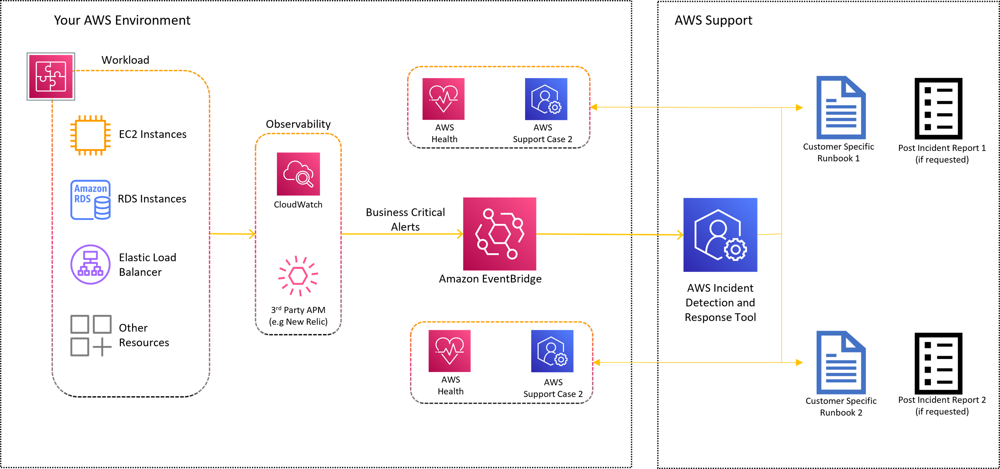

# Architecture of Incident Detection and Response

AWS Incident Detection and Response integrates with your existing environment as shown in the following graphic. The architecture includes the following services:

- Amazon EventBridge: Amazon EventBridge serves as the sole integration point between your workloads and AWS Incident Detection and Response. Alarms are ingested from your monitoring tools,
  such as Amazon CloudWatch, through Amazon EventBridge using predefined rules managed by AWS. To allow Incident Detection and Response to build and manage the EventBridge rule, you install a service-linked
  role. To learn more about these services, see
  [What is Amazon EventBridge](../../../eventbridge/latest/userguide/eb-what-is.md "../../../eventbridge/latest/userguide/eb-what-is.md") and
  [Amazon EventBridge rules](../../../eventbridge/latest/userguide/eb-rules.md "../../../eventbridge/latest/userguide/eb-rules.md"),
  [What is Amazon CloudWatch](../../../AmazonCloudWatch/latest/monitoring/WhatIsCloudWatch.md "../../../AmazonCloudWatch/latest/monitoring/WhatIsCloudWatch.md"), and
  [Using service-linked roles for AWS Health](../../../health/latest/ug/using-service-linked-roles.md "../../../health/latest/ug/using-service-linked-roles.md").
- AWS Health: AWS Health provides ongoing visibility into your resource performance and the availability of your AWS services and accounts.
  Incident Detection and Response uses AWS Health to track events on the AWS services used by your workloads and to notify you when an alert has been received from your workload.
  To learn more about AWS Health, see
  [What is AWS Health](../../../health/latest/ug/what-is-aws-health.md "../../../health/latest/ug/what-is-aws-health.md").
- AWS Systems Manager: Systems Manager provides a unified user interface for automation and task management across your AWS resources. AWS Incident Detection and Response hosts
  information about your workloads including workload architecture diagrams, alarm details and their corresponding incident management runbooks in
  AWS Systems Manager documents (for details, see
  [AWS Systems Manager Documents](../../../systems-manager/latest/userguide/sysman-ssm-docs.md "../../../systems-manager/latest/userguide/sysman-ssm-docs.md")).
  To learn more about AWS Systems Manager, see
  [What is AWS Systems Manager](../../../systems-manager/latest/userguide/what-is-systems-manager.md "../../../systems-manager/latest/userguide/what-is-systems-manager.md").
- Your specific runbooks: An incident management runbook defines the actions that AWS Incident Detection and Response performs during incident management.
  Your specific runbooks tell AWS Incident Detection and Response who to contact, how to contact them, and what information to share.

