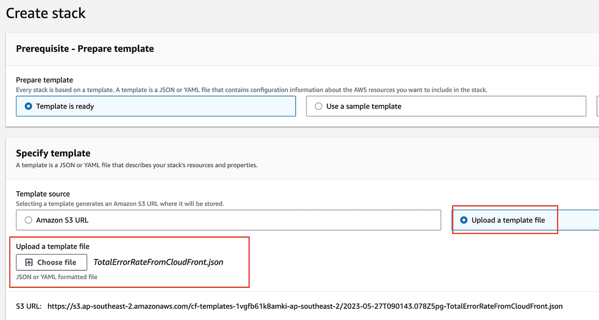
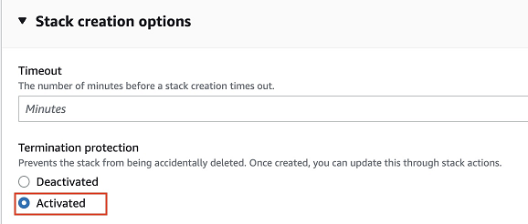
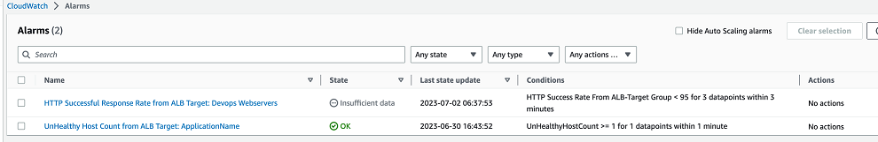

# Build CloudWatch alarms in Incident Detection and Response with CloudFormation templates

To accelerate onboarding to AWS Incident Detection and Response, and to reduce the effort needed to build alarms, AWS provides you with CloudFormation templates. These templates include optimized alarm settings for commonly onboarded services, such as Application Load Balancer, Network Load Balancer, and Amazon CloudFront.

###### Build CloudWatch alarms with CloudFormation templates

1. Download a template using the provided links:

| NameSpace                         | Metrics                                                                                                                                                 | ComparisonOperator (Threshold)   | Period | DatapointsToAlarm | TreatMissingData | Statistic | Template link                                                                                                                                                                                                                                   |
| --------------------------------- | ------------------------------------------------------------------------------------------------------------------------------------------------------- | -------------------------------- | ------ | ----------------- | ---------------- | --------- | ----------------------------------------------------------------------------------------------------------------------------------------------------------------------------------------------------------------------------------------------- |
| Application Elastic Load Balancer | (m1+m2)/(m1+m2+m3+m4)\*100 m1=HTTPCode_Target_2XX_Count m2=HTTPCode_Target_3XX_Count m3=HTTPCode_Target_4XX_Count m4=HTTPCode_Target_5XX_Count | LessThanThreshold(95)            | 60     | 3 out of 3        | missing          | Sum       | [Template](https://s3.us-east-1.amazonaws.com/aws-idr-cloudformation-nested-stacks/docs/HTTPSuccessResponseRateFromALB.json "https://s3.us-east-1.amazonaws.com/aws-idr-cloudformation-nested-stacks/docs/HTTPSuccessResponseRateFromALB.json") |
| Amazon CloudFront                 | TotalErrorRate                                                                                                                                          | GreaterThanThreshold(5)          | 60     | 3 out of 3        | notBreaching     | Average   | [Template](https://s3.us-east-1.amazonaws.com/aws-idr-cloudformation-nested-stacks/docs/TotalErrorRateFromCloudFront.json "https://s3.us-east-1.amazonaws.com/aws-idr-cloudformation-nested-stacks/docs/TotalErrorRateFromCloudFront.json")     |
| Application Elastic Load Balancer | UnHealthyHostCount                                                                                                                                      | GreaterThanOrEqualToThreshold(2) | 60     | 3 out of 3        | notBreaching     | Maximum   | [Template](https://s3.us-east-1.amazonaws.com/aws-idr-cloudformation-nested-stacks/docs/UnHealthyHostCountFromALB.json "https://s3.us-east-1.amazonaws.com/aws-idr-cloudformation-nested-stacks/docs/UnHealthyHostCountFromALB.json")           |
| Network Elastic Load Balancer     | UnHealthyHostCount                                                                                                                                      | GreaterThanOrEqualToThreshold(2) | 60     | 3 out of 3        | notBreaching     | Maximum   | [Template](https://s3.us-east-1.amazonaws.com/aws-idr-cloudformation-nested-stacks/docs/UnHealthyHostCountFromNLB.json "https://s3.us-east-1.amazonaws.com/aws-idr-cloudformation-nested-stacks/docs/UnHealthyHostCountFromNLB.json")           |

2. Review the downloaded JSON file to make sure that it meets your organization's operation and security processes.
3. Create a CloudFormation stack:

###### Note

The following steps use the standard CloudFormation stack creation process. For detailed steps, see [Creating a stack on the CloudFormation console](../../../AWSCloudFormation/latest/UserGuide/cfn-console-create-stack.md "../../../AWSCloudFormation/latest/UserGuide/cfn-console-create-stack.md").

    1. Open the AWS CloudFormation console at [https://console.aws.amazon.com/cloudformation](https://console.aws.amazon.com/cloudformation/ "https://console.aws.amazon.com/cloudformation/").
    2. Choose **Create stack**.
    3. Choose **Template is ready**, and then upload the template file from your local folder.

    The following is an example of the **Create stack** screen.

    
    4. Choose **Next**.
    5. Enter the following required information:

    	* **AlarmNameConfig** and **AlarmDescriptionConfig**: Enter a name and description for your alarm.

    	* **ThresholdConfig**: Revise the threshold value to meet your application's requirements.

    	* **DistributionIDConfig**: Make sure that the distribution ID point to the correct resources in the account that you're creating the CloudFormation stack in.
    6. Choose **Next**.
    7. Review the default values in the **PeriodConfig**, **EvalutionPeriodConfig**, and **DatapointsToAlarmConfig** fields. It's a best practice to use the default values for these fields. You can make adjustments, if needed, to meet your application's requirements.
    8. Optionally enter tags and SNS notification information as needed. It's a best practice to turn on **Termination protection**to prevent accidental deletion of the alarm. To turn on termination protection, select the **Activated** radio button, as shown in the following example:

    
    9. Choose **Next**.
    10. Review your stack settings, and then choose **Create stack**.
    11. After you create the stack, you see the alarm listed in the Amazon CloudWatch **Alarm** list, as shown in the following example:

    

4. After you create all of your alarms in the correct account and AWS
   Region, notify your Technical Account Manager (TAM). The AWS Incident Detection and Response team
   reviews the status of your new alarms, and then continues your
   onboarding.
