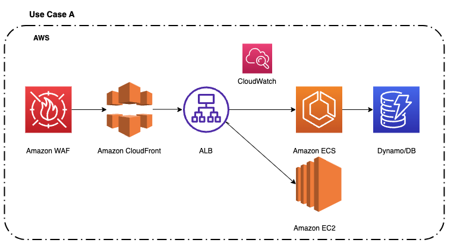
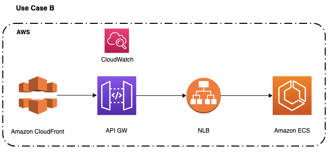
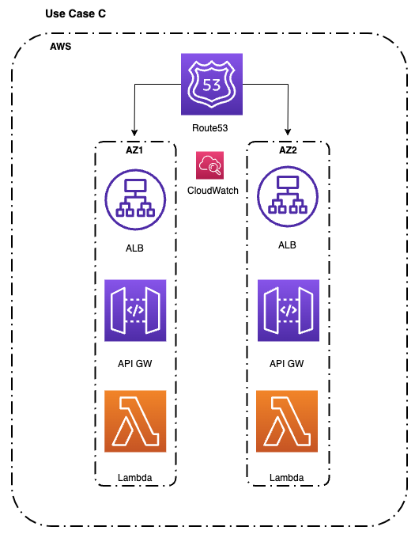
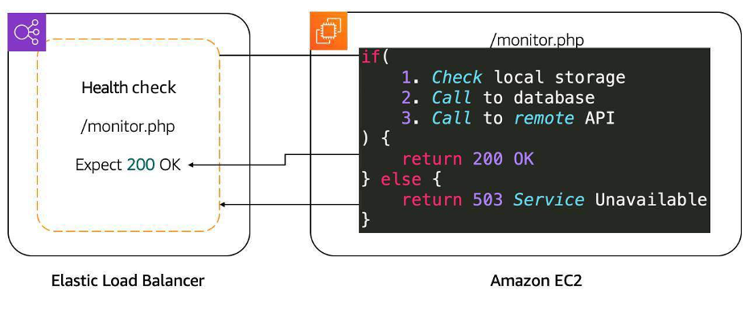

# Example use cases for CloudWatch alarms in Incident Detection and Response

The following use cases provide examples of how you can use Amazon CloudWatch alarms in
Incident Detection and Response. These examples demonstrate how CloudWatch alarms can be configured to monitor
key metrics and thresholds across various AWS services, enabling you to identify and
respond to potential issues that could impact the availability and performance of
your applications and workloads.

## Example Use Case A: Application Load Balancer

You can create the following CloudWatch alarm that signals potential workload impact. To do this, you create a metric math that alarms when successful connections drop below a certain threshold. For the available CloudWatch metrics, see [CloudWatch metrics for your Application Load Balancer](../../../elasticloadbalancing/latest/application/load-balancer-cloudwatch-metrics.md "../../../elasticloadbalancing/latest/application/load-balancer-cloudwatch-metrics.md")

**Metric:**`HTTPCode_Target_3XX_Count;HTTPCode_Target_4XX_Count;HTTPCode_Target_5XX_Count. (m1+m2)/(m1+m2+m3+m4)*100
 m1 = HTTP Code 2xx || m2 = HTTP Code 3xx || m3 = HTTP Code 4xx || m4 = HTTP Code 5xx`

**NameSpace:** AWS/ApplicationELB

**ComparisonOperator(Threshold):** Less than x (x = customer’s threshold).

**Period:** 60 seconds

**DatapointsToAlarm:** 3 out of 3

**Missing data treatment:** Treat missing data as [breaching](../../../AmazonCloudWatch/latest/monitoring/AlarmThatSendsEmail.md#alarms-and-missing-data "../../../AmazonCloudWatch/latest/monitoring/AlarmThatSendsEmail.md#alarms-and-missing-data").

**Statistic:** Sum

The following diagram shows the flow for Use Case A:

## Example Use Case B: Amazon API Gateway

You can create the following CloudWatch alarm that signals potential workload impact. To do this, you create a composite metric that alarms when there is high lantency or a high average number of 4XX errors in the API Gateway. For the available metrics, see [Amazon API Gateway dimensions and metrics](../../../apigateway/latest/developerguide/api-gateway-metrics-and-dimensions.md "../../../apigateway/latest/developerguide/api-gateway-metrics-and-dimensions.md")

**Metric:**`compositeAlarmAPI Gateway (ALARM(error4XXMetricApiGatewayAlarm)) OR (AALARM(latencyMetricApiGatewayAlarm))`

**NameSpace:** AWS/API Gateway

**ComparisonOperator(Threshold):** Greater than (x or y customer's thresholds)

**Period:** 60 seconds

**DatapointsToAlarm:** 1 out of 1

**Missing data treatment:** Treat missing data as [not breaching](../../../AmazonCloudWatch/latest/monitoring/AlarmThatSendsEmail.md#alarms-and-missing-data "../../../AmazonCloudWatch/latest/monitoring/AlarmThatSendsEmail.md#alarms-and-missing-data").

**Statistic:**

The following diagram shows the flow for Use Case B:

## Example Use Case C: Amazon Route 53

You can monitor your resources by creating Route 53 health checks that use CloudWatch to collect and process raw data into readable, near real-time metrics. You can create the following CloudWatch alarm that signals potential workload impact. You can use the CloudWatch metrics to create an alarm that triggers when it breaches the established threshold. For the available CloudWatch metrics, see [CloudWatch metrics for Route 53 health checks](../../../Route53/latest/DeveloperGuide/monitoring-cloudwatch.md#cloudwatch-metrics "../../../Route53/latest/DeveloperGuide/monitoring-cloudwatch.md#cloudwatch-metrics")

**Metric:**`R53-HC-Success`

**NameSpace:** AWS/Route 53

**Threshold HealthCheckStatus:** HealthCheckStatus < x for 3 datapoints within 3 minutes (being x customer's threshold)

**Period:** 1 minute

**DatapointsToAlarm:** 3 out of 3

**Missing data treatment:** Treat missing data as [breaching](../../../AmazonCloudWatch/latest/monitoring/AlarmThatSendsEmail.md#alarms-and-missing-data "../../../AmazonCloudWatch/latest/monitoring/AlarmThatSendsEmail.md#alarms-and-missing-data").

**Statistic:** Minimum

The following diagram shows the flow for Use Case C:

## Example Use Case D: Monitor a workload with a custom app

It's critical that you take the time to define an appropriate health check in
this scenario. If you only verify that an application's port is open, then you
haven't verified that the application is working. Additionally, making a call to
the home page of an application is not necessarily the correct way to determine
if the app is working. For instance, if an application depends on both a database and
Amazon Simple Storage Service (Amazon S3), then the health check must validate all of the elements. One way to do
that is to create a monitoring webpage, such as **/monitor**. The monitoring webpage makes a call to the database to
make sure that it can connect and get data. And, the monitoring webpage makes a
call to Amazon S3. Then, you point the health check on the load balancer to the
**/monitor** page.

The following diagram shows the flow for Use Case D:

