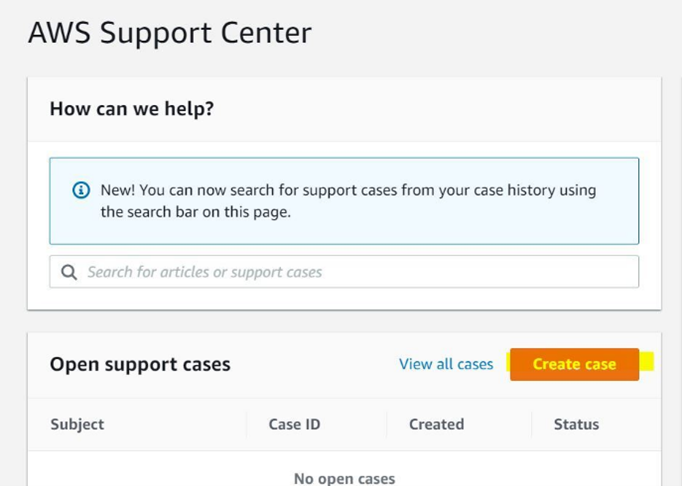

# Subscribe a workload to Incident Detection and Response

Create a support case for each workload that you want to subscribe to AWS Incident Detection and Response.

- For single-account workloads: Submit from either the workload's account or your payer account.
- For multi-account workloads: Submit from your payer account and list all account IDs.

###### Important

Submitting a support case from the wrong account to subscribe a workload to Incident Detection and Response might cause delays and require additional information.

To subscribe a workload, complete the following steps:

1. Open the [AWS Support Center](https://console.aws.amazon.com/support/home#/ "https://console.aws.amazon.com/support/home#/"), and then select **Create case**. You can only subscribe workloads from accounts that are enrolled in Enterprise Support. The following example shows the Support Center Console.

 2. To complete the support case form, enter the following information:

    * Select **Technical support**.
    * For **Service**, choose **Incident Detection and Response**.
    * For **Category**, choose **Onboard New Workload**.
    * For **Severity**, choose **General guidance**.

3. Enter a **Subject** for this change. For example, you might enter _[Onboard] AWS Incident Detection and Response - `workload_name`_.
4. Enter a **Description** for this change. For example, you might enter _This request is to onboard a workload to AWS Incident Detection and Response_.

Make sure that you include the following information in your request:

    * **Workload name:** Your workload name
    * **Account ID(s):** ID1, ID2, ID3, and so on. These are the accounts that you want to onboard to AWS Incident Detection and Response
    * **Language:** For a list of languages supported by Incident Detection and Response, see [Region availability for Incident Detection and Response](idr-availability.md "idr-availability.md").

5. In the **Additional contacts - optional** section, enter any email IDs that you want to receive correspondence about this request.

The following is an example of the **Addtional contacts - optional** section.

###### Important

Failure to add email IDs in the **Additional contacts - optional** section might delay the AWS Incident Detection and Response onboarding process. 6. Choose **Submit**.

After you submit the request, you can add additional emails from your organization. To add emails, reply to the case, and then add the email IDs in the **Additional contacts - optional** section.

The following is an example of the **Reply** button and the **Additional contacts - optional** section.

After you create a support case for the subscription request, keep the following two documents ready to proceed with the workload onboarding process:

- AWS workload architecture diagram.
- [Workload onboarding and alarm ingestion questionnaires in Incident Detection and Response](idr-gs-questionnaire.md "idr-gs-questionnaire.md"): Complete all information in the questionnaire that's related to the workload that you're onboarding. If you have multiple workloads to be onboarded, then create a new onboarding questionnaire for each workload. If you have questions about completing the onboarding questionnaire, then contact your Technical Account Manager (TAM).

###### Note

DO NOT attach these two documents to the case using the **Attach files** option. The AWS Incident Detection and Response team will reply to the case with an Amazon Simple Storage Service uploader link for you to upload the documents.

For information on how to create a case with AWS Incident Detection and Response to request changes to an existing onboarded workload, see [Request changes to an onboarded workload in Incident Detection and Response](idr-workloads-change-request.md "idr-workloads-change-request.md"). For information on how to offboard a workload, see [Offboard a workload from Incident Detection and Response](idr-workloads-offboard.md "idr-workloads-offboard.md").
