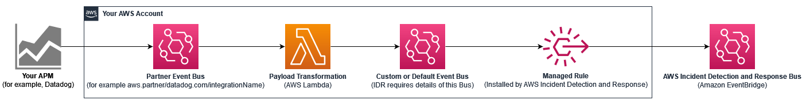

# Ingest alarms from APMs that have direct integration with Amazon EventBridge

The following illustration shows the process for sending notifications to
AWS Incident Detection and Response from Application Performance Monitoring (APM) tools that have direct
integration with Amazon EventBridge, such as Datadog and Splunk. For a complete list of APMs
that have direct integration with EventBridge, see [Amazon EventBridge integrations](https://aws.amazon.com/eventbridge/integrations "https://aws.amazon.com/eventbridge/integrations").

Use the following steps to set up integration with AWS Incident Detection and Response. Before performing these steps, verify that the AWS service-linked role (SLR) `AWSServiceRoleForHealth_EventProcessor`, is [installed](idr-gs-access-prov.md "idr-gs-access-prov.md") in your accounts.

###### Set up integration with AWS Incident Detection and Response

You must complete the following steps for each AWS account and AWS Region. Alerts must come from the AWS account and AWS Region where the application resources reside.

1. Set up each of your APMs as Amazon EventBridge partner event sources (for example, `aws.partner/my_apm/integrationName`). For guidelines on setting up your APM as an event source, see [Receiving events from a SaaS partner with Amazon EventBridge](../../../eventbridge/latest/userguide/eb-saas.md "../../../eventbridge/latest/userguide/eb-saas.md"). This creates a partner event bus in your account.
2. Do one of the following:
   - (Recommended method) Create a custom EventBridge event bus. AWS Incident Detection and Response installs a managed rule (`AWSHealthEventProcessorEventSource-DO-NOT-DELETE`) bus through the `AWSServiceRoleForHealth_EventProcessor` SLR. The rule source is the custom event bus. The rule destination is AWS Incident Detection and Response. The rule matches the pattern for ingesting 3rd party APM events.
   - (Alternative method) Use the default event bus instead of a custom event bus. The default event bus requires the managed rule to send APM alerts to AWS Incident Detection and Response.

3. Create an [AWS Lambda](../../../lambda/latest/dg/welcome.md "../../../lambda/latest/dg/welcome.md") function (for example, `My_APM-AWSIncidentDetectionResponse-LambdaFunction`) to transform your partner event bus events. The transformed events matches the managed rule `AWSHealthEventProcessorEventSource-DO-NOT-DELETE`.
   1. Transformed events include a unique AWS Incident Detection and Response identifier, and sets the source and detail type of the event to the required values. The pattern matches the managed rule.
   2. Set the target of the Lambda function to either the custom event bus created in Step 2 (Recommended method) or to your default event bus.

4. Create an EventBridge rule and define the event patterns that match the list of events that you want to push to AWS Incident Detection and Response. The source of the rule is the partner event bus that you define in step 1 (for example, aws.partner/my_apm/integrationName). The target of the rule is the Lambda function that you define in step 3 (for example, `My_APM-AWSIncidentDetectionResponse-LambdaFunction`). For guidlines on defining your EventBridge rule, see [Amazon EventBridge rules](../../../eventbridge/latest/userguide/eb-rules.md "../../../eventbridge/latest/userguide/eb-rules.md").
   For examples on how to set up a partner event bus integration for use with AWS Incident Detection and Response, see [Example: Integrate notifications
   from Datadog and Splunk](example_integrating_notifications.md "example_integrating_notifications.md").
