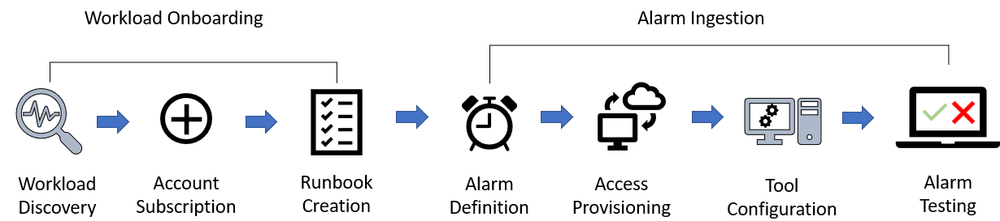
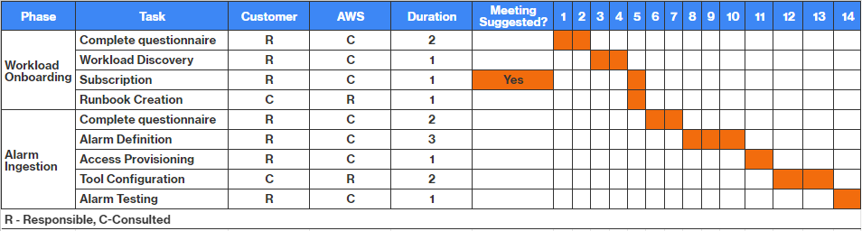

# Onboarding to Incident Detection and Response

AWS works with you to onboard your workload and alarms to AWS Incident Detection and Response. You provide key
information to AWS about your workload and the alarms you'd like to onboard by using
the [Incident Detection and Response Customer Command Line Interface (CLI) tool](https://github.com/awslabs/CLI-for-AWS-Incident-Detection-and-Response "https://github.com/awslabs/CLI-for-AWS-Incident-Detection-and-Response"), or in the [Workload onboarding and alarm ingestion questionnaires in Incident Detection and Response](idr-gs-questionnaire.md "idr-gs-questionnaire.md").

The following diagram shows the flow for workload onboarding and alarm ingestion in
Incident Detection and Response:

## Workload onboarding

During workload onboarding, AWS works with you to understand your workload and
how to support you during incidents. You provide key
information about your workload that assists with impact mitigation.

**Key outputs:**

- General workload information
- Architecture details including diagrams
- Runbook Information
- Customer-initiated incidents

## Alarm ingestion

AWS works with you to onboard your alarms. AWS Incident Detection and Response can ingest alarms from
Amazon CloudWatch and third-party application performance monitoring (APM) tools through
Amazon EventBridge. Onboarding alarms allows for proactive incident detection and automated
engagement. For more information, see [Ingest alarms from APMs that have direct integration with
Amazon EventBridge](idr-gs-ingest_alarms_from_apm_to_eventbridge.md "idr-gs-ingest_alarms_from_apm_to_eventbridge.md").

**Key outputs:**

- Alarm matrix

The following table lists the steps required to onboard a workload to AWS Incident Detection and Response.
This table shows example durations of each task. The actual dates for each task are
defined based on the availability of your team and schedule.

