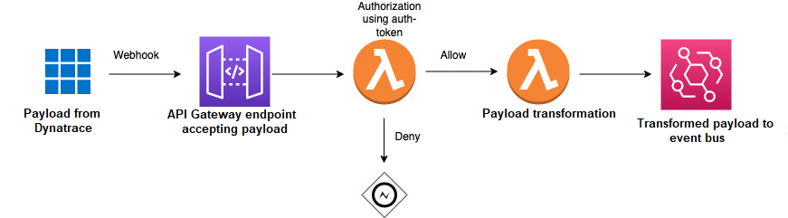

# Use webhooks to ingest alarms from APMs without direct integration with Amazon EventBridge

AWS Incident Detection and Response supports using webhooks for alarm ingestion from third party APMs that don't have direct integration with Amazon EventBridge.

For a list of APMs with direct integrations with Amazon EventBridge, see [Amazon EventBridge integrations](https://aws.amazon.com/eventbridge/integrations/ "https://aws.amazon.com/eventbridge/integrations/").

Use the following steps to set up integration with AWS Incident Detection and Response. Before performing these steps, verify that the AWS Managed Rule, _AWSHealthEventProcessorEventSource-DO-NOT-DELETE_, is installed in your accounts

###### Ingest events using webhooks

1. Define an Amazon API Gateway to accept the payload from your APM.
2. Define an AWS Lambda function for authorization using an authentication token, as displayed in the preceding illustration.
3. Define a second Lambda function to transform and append the AWS Incident Detection and Response identifier to your payload. You can also use this function to filter for the events that you want to send to AWS Incident Detection and Response.
4. Set up your APM to send notifications to the URL generated from the API Gateway.
