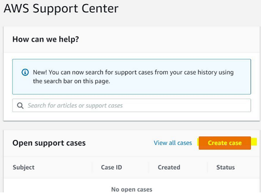
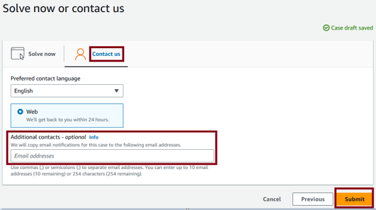
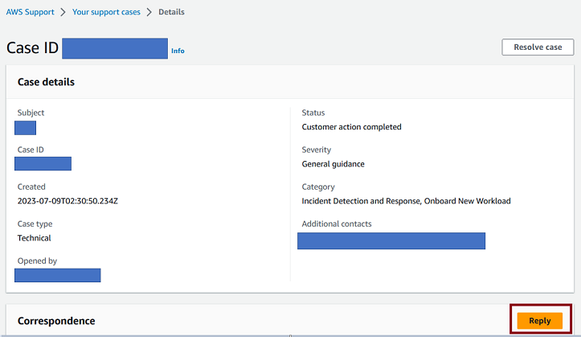
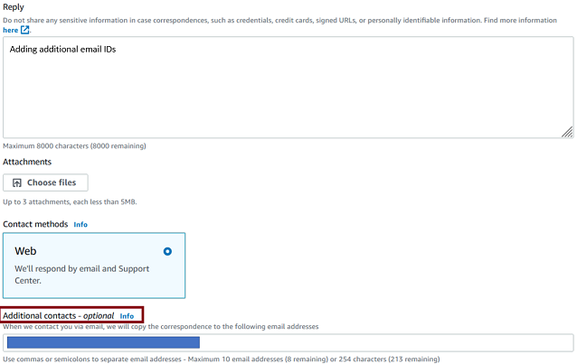

# Request changes to an onboarded workload in Incident Detection and Response

To request changes to an onboarded workload, complete the following steps to create a support case with AWS Incident Detection and Response.

1. Go to the [AWS Support Center](https://console.aws.amazon.com/support/home#/ "https://console.aws.amazon.com/support/home#/"), and then select **Create case**, as shown in the following example:

 2. Choose **Technical**. 3. For **Service**, choose **Incident Detection and Response**. 4. For **Category**, choose **Workload change request**. 5. For **Severity**, choose **General Guidance**. 6. Enter a **Subject** for this change. For example:

AWS Incident Detection and Response - `workload_name` 7. Enter a **Description** for this change. For example, enter "This request is for changes to an existing workload onboarded into AWS Incident Detection and Response". Make sure that you include the following information in your request:

    * **Workload name:** Your workload name.
    * **Account ID(s):** ID1, ID2, ID3, and so on.
    * **Change details:** Enter the details for your requested change.

8. In the **Additional contacts - optional** section, enter any email IDs that you want to receive correspondence about this change.

The following is an example of the **Additional contacts - optional** section.

###### Important

Failure to add email IDs in the **Additional contacts - optional** section might delay the change process. 9. Choose **Submit**.

After you submit the change request, you can add additional emails from your organization. To add emails, choose **Reply** in **Case details**, as shown in the following example:

Then, add the email IDs in the **Additional contacts - optional** section.

The following is an example of the **Reply** page showing where you can enter additional emails.

