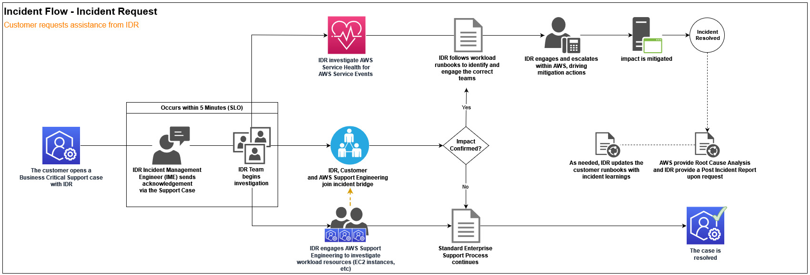
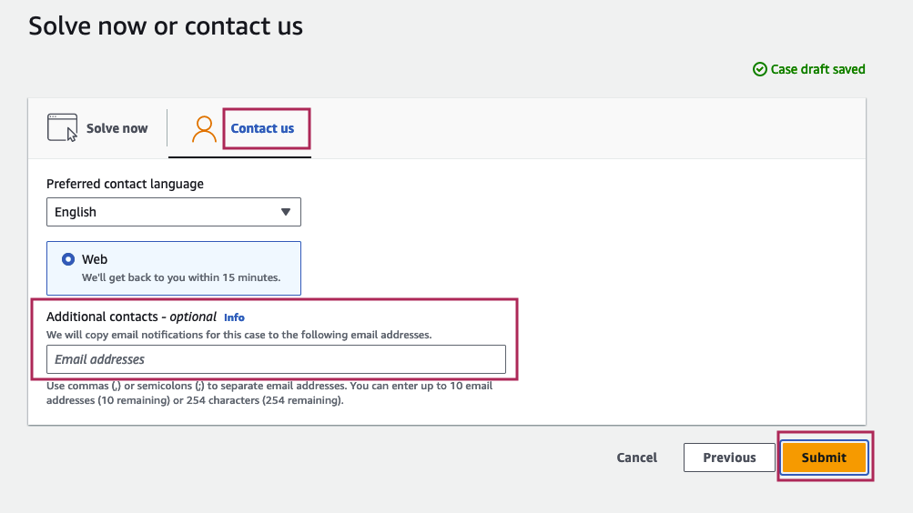
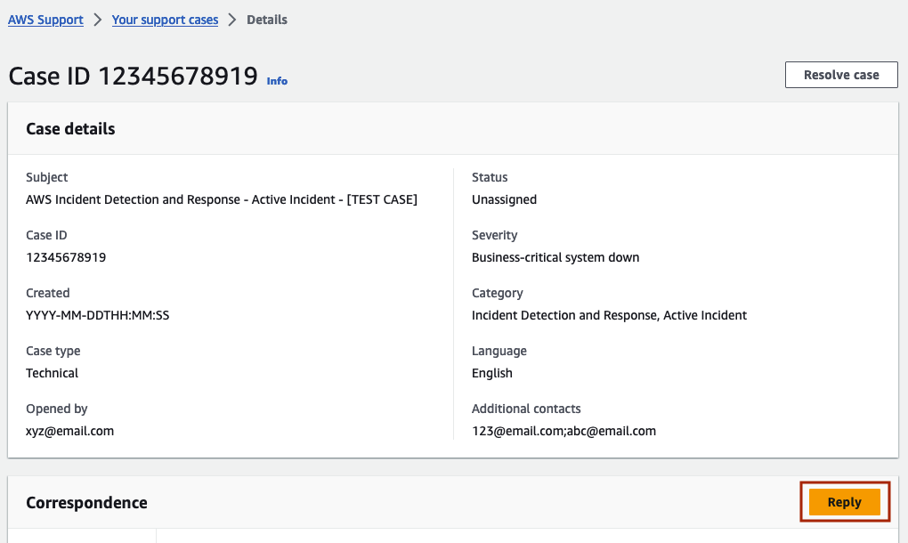
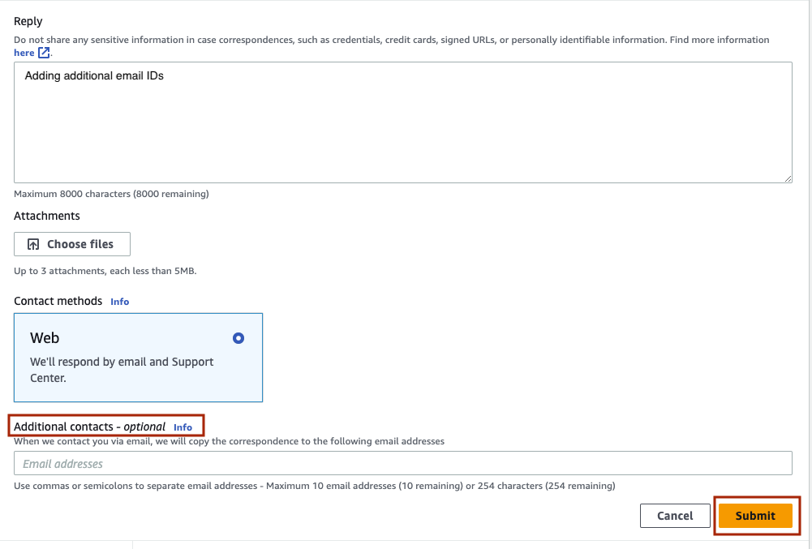
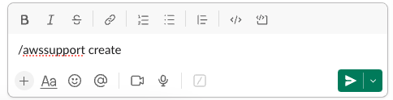
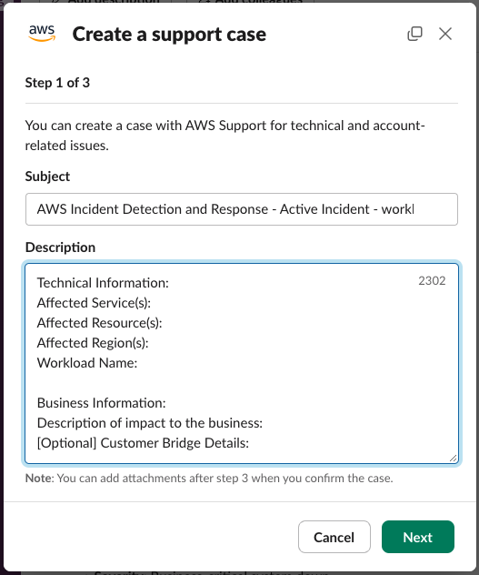
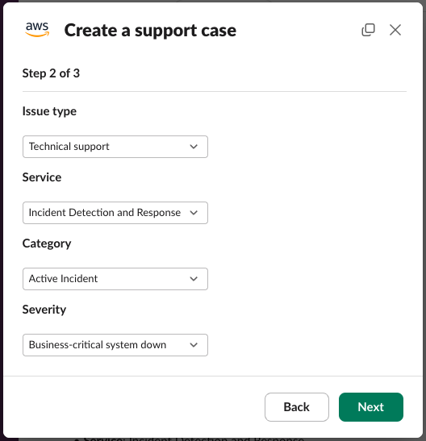
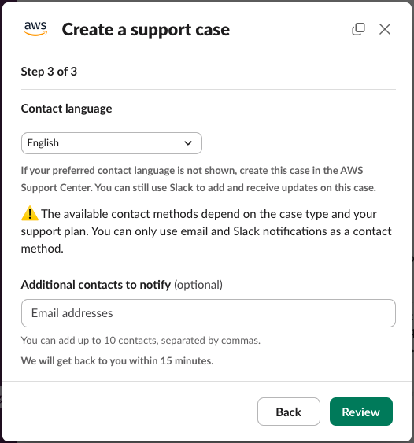
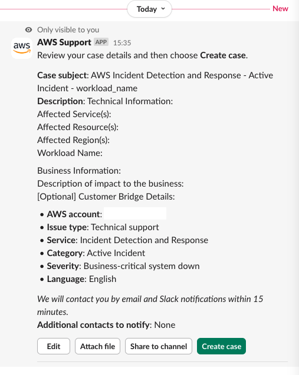
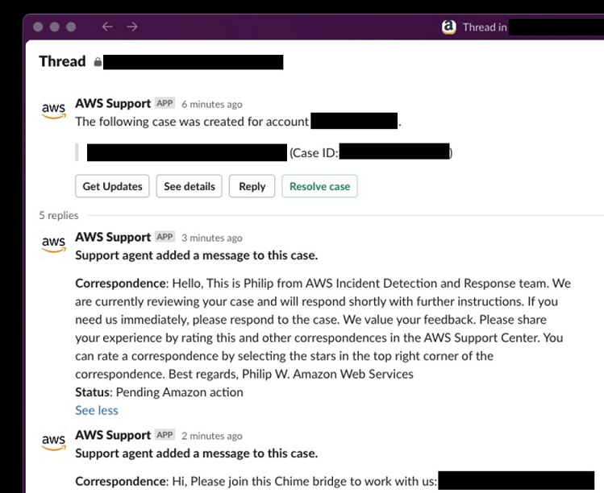

# Request an Incident Response

If a critical incident occurs on your workload that isn't detected by alarms
monitored by AWS Incident Detection and Response, you can create a support case to request an Incident
Response. You can request an Incident Response for any workload that's subscribed to
AWS Incident Detection and Response, including workloads in the process of onboarding, using the AWS Support Center Console, AWS Support API, or AWS Support App in Slack.

The following diagram illustrates the end-to-end workflow for an AWS customer requesting
incident assistance from the Incident Detection and Response team, detailing the
steps from the initial request through investigation, mitigation, and resolution.


To request an Incident Response for an incident that's actively impacting your
workload, create an Support case. After the support case is raised, AWS Incident Detection and Response engages
you on a conference bridge with the AWS experts required to accelerate the recovery of
your workload.

## Request an Incident Response using the

AWS Support Center Console

1. Open the [AWS Support Center Console](https://console.aws.amazon.com/support/home#/ "https://console.aws.amazon.com/support/home#/"), and then choose **Create case**.
2. Choose **Technical**.
3. For **Service**, choose **Incident Detection and Response**.
4. For **Category**, choose **Active Incident**.
5. For **Severity**, choose **Business-critical system down**.
6. Enter a **Subject** for this incident.
   For example:

AWS Incident Detection and Response - Active Incident - workload_name 7. Enter the **Problem Description** for
this incident. Add the following details:

    * **Technical Information:**


     Workload Name


    Affected AWS Resource ARN(s)
    * **Business Information:**


    Description of impact to the business


    [Optional] Customer Bridge Details

8. To help us engage AWS experts faster, provide the following details:
   - Impacted AWS service
   - Additional Service(s) / Other Impacted
   - Impacted AWS Region

9. In the **Additional contacts** section,
   enter any email addresses that you want to receive correspondences about
   this incident.

The following illustration shows the console screen with the **Additional contacts** field highlighted.

 10. Choose **Submit**.

After submitting an Incident Response request, you can add additional
email addresses from your organization. To add additional addresses,
reply to the case, and then add the email addresses in the **Additional contacts** section.

The following illustration shows the **Case details** screen with the **Reply** button highlighted.



The following illustration shows the case Reply with the **Additional contacts** field and **Submit** button highlighted.

 11. AWS Incident Detection and Response acknowledges your case within five minutes and engages you
on a conference bridge with the appropriate AWS experts.

## Request an Incident Response using the AWS Support API

You can use the AWS Support API to programmatically create support cases. For more information, see [About the AWS Support API](../../../awssupport/latest/user/about-support-api.md "../../../awssupport/latest/user/about-support-api.md") in the _AWS Support User Guide_.

## Request an Incident Response using the AWS Support App in Slack

To use the AWS Support App in Slack to request an Incident Response, complete the following steps:

1. Open the Slack channel that you configured the AWS Support App in Slack in.
2. Enter the following command:

```
/awssupport create
```

 3. Enter a **Subject** for this incident. For
example, enter **AWS Incident Detection and Response - Active Incident -
workload_name**. 4. Enter the **Problem Description** for this
incident. Add the following details:

**Technical Information:**

Affected Service(s):

Affected Resource(s):

Affected Region(s):

Workload Name:

**Business Information:**

Description of impact to the business:

[Optional] Customer Bridge Details: 5. Choose **Next**.

 6. For **Issue Type**, choose **Technical support.** 7. For **Service**, choose **Incident Detection and Response**. 8. For **Category**, choose **Active Incident**. 9. For **Severity**, choose **Business-critical system down**.

 10. Optionally enter up to 10 additional contacts in the **Additional contacts to notify** field, separated by commas. These additional contacts receive copies of
email correspondence about this incident.

 11. Choose **Review**. 12. A new message that is only visible to you appears in the Slack channel. Review the case details, then choose **Create case**.

 13. Your Case ID is provided in a new message from the AWS Support App in Slack. 14. Incident Detection and Response acknowledges your case within 5 minutes and engages you on a
conference bridge with the appropriate AWS experts. 15. Correspondence from Incident Detection and Response is updated in the case thread.


