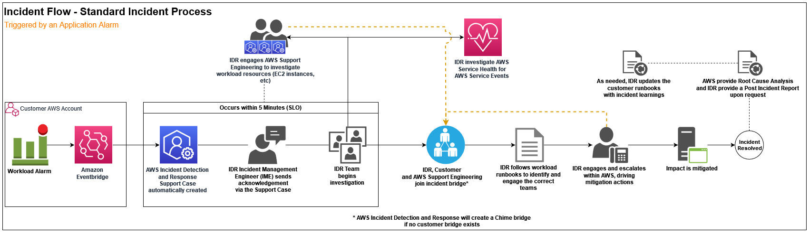

# Incident management with Incident Detection and Response

AWS Incident Detection and Response offers you 24 hours a day, 7 days a week proactive monitoring and incident management delivered by a
designated team of incident managers. The following diagram outlines the standard incident management
process when an application alarm triggers an incident, including alarm generation, AWS
Incident Manager engagement, incident resolution, and post-incident review.



1. **Alarm generation**: Alarms triggered on your workloads are pushed through Amazon EventBridge to AWS Incident Detection and Response.
   AWS Incident Detection and Response automatically pulls up the runbook associated with your alarm and notifies an incident manager. If a critical incident occurs on your workload that isn't detected by alarms monitored by AWS Incident Detection and Response, then you can create a support case to request an Incident Response. For more information on requesting an Incident Response, see [Request an Incident Response](inbound-incident-idr.md "inbound-incident-idr.md").
2. **AWS Incident Manager engagement**: The incident manager responds to the alarm and engages you on a conference call or as otherwise specified in the runbook. The incident manager verifies the health of the AWS services to determine if the alarm is related to issues with AWS services used by the workload and advises on the status of the underlying services. If required, the incident manager then creates a case on your behalf and engages the right AWS experts for support. Because AWS Incident Detection and Response monitors AWS services specifically for your applications, AWS Incident Detection and Response might determine that the incident is related to an AWS service issue before an AWS service event is declared. In this scenario, the incident manager advises you on the status of the AWS service, triggers the AWS service event incident management workflow, and follows up with the service team on resolution. The information provided gives you the opportunity to implement your recovery plans or workarounds early to mitigate the impact of the AWS service event.
3. **Incident resolution**: The incident manager coordinates the incident across the required AWS teams and makes sure that you
   remain engaged with the right AWS experts until the incident is mitigated or resolved.
4. **Post Incident Review** (if requested): After an incident, AWS Incident Detection and Response can perform a post incident review at your
   request and generate a Post Incident Report. The Post Incident Report includes a description of the issue, the impact, which teams were engaged,
   and workarounds or actions taken to mitigate or resolve the incident. The Post Incident Report might contain information that can be used to reduce the likelihood of incident recurrence, or to improve the management of a future occurrence of a similar incident. The Post Incident Report isn't a Root Cause Analysis (RCA). You can request a RCA in addition to the Post Incident Report. An example of a Post Incident Report is provided in the following section.

###### Important

The following report template is an example only.

```
**Post \*\* Incident \*\* Report \*\* Template**
**Post Incident Report** - 0000000123
**Customer**: Example Customer
**AWS Support case ID(s)**: 0000000000
**Customer internal case ID (if provided)**: 1234567890
**Incident start**: 2023-02-04T03:25:00 UTC
**Incident resolved**: 2023-02-04T04:27:00 UTC
**Total Incident time**: 1:02:00 s
**Source Alarm ARN**: arn:aws:cloudwatch:us-east-1:000000000000:alarm:alarm-prod-workload-impaired-useast1-P95

**Problem Statement**:
Outlines impact to end users and operational infrastructure impact.
 Starting at 2023-02-04T03:25:00 UTC, the customer experienced a large scale outage of their workload that lasted one hour and two minutes and spanning across all Availability Zones where the application is deployed. During impact, end users were unable to connect to the workload's Application Load Balancers (ALBs) which service inbound communications to the application.

**Incident Summary**:

Summary of the incident in chronological order and steps taken by AWS Incident Managers to direct the incident to a path to mitigation.
  At 2023-02-04T03:25:00 UTC, the workload impairments alarm triggered a critical incident for the workload. AWS Incident Detection and Response Managers responded to the alarm, checking AWS service health and steps outlined in the workload’s runbook.
  At 2023-02-04T03:28:00 UTC, ** per the runbook, the alarm had not recovered and the Incident Management team sent the engagement email to the customer’s Site Reliability Team (SRE) team, created a troubleshooting bridge, and an Support support case on behalf of the customer.
  At 2023-02-04T03:32:00 UTC, ** the customer’s SRE team, and Support Engineering joined the bridge. The Incident Manager confirmed there was no on-going AWS impact to services the workload depends on. The investigation shifted to the specific resources in the customer account.
  At 2023-02-04T03:45:00 UTC, the Cloud Support Engineer discovered a sudden increase in traffic volume was causing a drop in connections. The customer confirmed this ALB was newly provisioned to handle an increase in workload traffic for an on-going promotional event.
  At 2023-02-04T03:56:00 UTC, the customer instituted back off and retry logic. The Incident Manager worked with the Cloud Support Engineer to raise an escalation a higher support level to quickly scale the ALB per the runbook.
  At 2023-02-04T04:05:00 UTC, ALB support team initiates scaling activities. The back-off/retry logic yields mild recovery but timeouts are still being seen for some clients.
 By 2023-02-04T04:15:00 UTC, scaling activities complete and metrics/alarms return to pre-incident levels. Connection timeouts subside.
  At 2023-02-04T04:27:00 UTC, per the runbook the call was spun down, after 10 minutes of recovery monitoring. Full mitigation is agreed upon between AWS and the customer.

**Mitigation**:
Describes what was done to mitigate the issue. NOTE: this is not a Root Cause Analysis (RCA).
  Back-off and retries yielded mild recovery. Full mitigation happened after escalation to ALB support team (per runbook) to scale the newly provisioned ALB.

**Follow up action items (if any)**:
Action items to be reviewed with your Technical Account Manager (TAM), if required.
Review alarm thresholds to engage AWS Incident Detection and Response closer to the time of impact.
Work with AWS Support and TAM team to ensure newly created ALBs are pre-scaled to accommodate expected spikes in workload traffic.
```

###### Topics

- [Provision access to AWS Support Center Console for application teams](idr-inc-mgmt-access-provision.md "idr-inc-mgmt-access-provision.md")
- [Request an Incident Response](inbound-incident-idr.md "inbound-incident-idr.md")
- [Manage Incident Detection and Response support cases with the AWS Support App in Slack](aws-support-app-slack.md "aws-support-app-slack.md")
