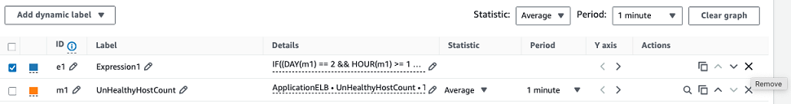
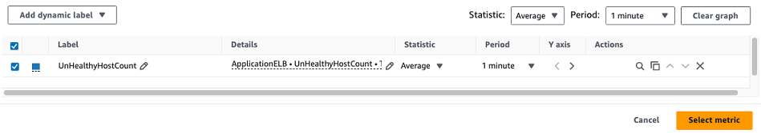

# Tutorial: Remove a metric math function to un-suppress an alarm

If you suppress a CloudWatch alarm for a one-time activity, remove the metric math function from the alarm after the activity completes to resume regular monitoring of the alarm. To suppress the alarm on a regular schedule, for example, if you have a scheduled weekly patching routine that results in instance reboots on the same day and time each week, then leave the metric math function in place.

The following tutorial walks you through how to remove a metric math function to un-suppress a CloudWatch alarm

1. Sign in to the AWS Management Console and open the CloudWatch console at [https://console.aws.amazon.com/cloudwatch/](https://console.aws.amazon.com/cloudwatch/ "https://console.aws.amazon.com/cloudwatch/").
2. Choose **Alarms**, and then locate the alarm that you want to add the metric math function to.
3. In the metric math section, choose **Edit**.
4. To remove the suppression from the alarm, select the **x** button next to the metric math expression.

 5. Select the metric to resume monitoring of the real metric. then choose **Select metric**.

 6. Choose **Skip to Preview and create**. 7. Validate that the alarm is configured as expected, then choose **Update alarm to save the change**.
