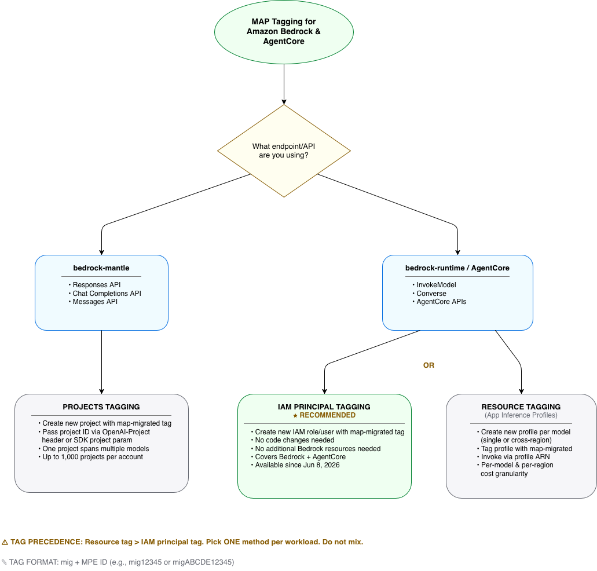
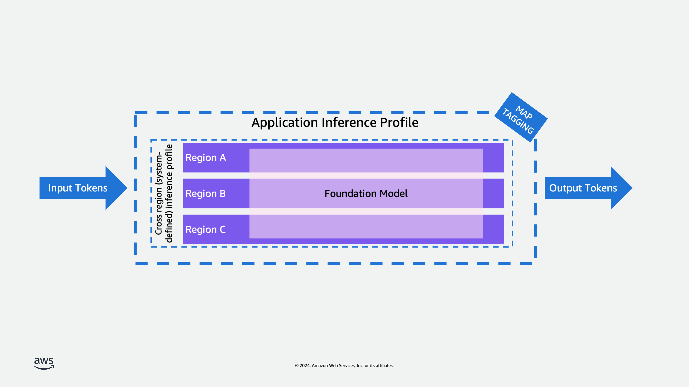

# Amazon Bedrock MAP Tagging using the AWS CLI

This guide explains how to tag Amazon Bedrock and Amazon Bedrock AgentCore workloads to
report MAP spend and generate any appropriate incentives using the AWS CLI.



The flowchart shows how to choose a tagging method. If you use the bedrock-mantle endpoint
(Responses API, Chat Completions API, or Messages API), use Projects tagging. If you use
bedrock-runtime or AgentCore (InvokeModel, Converse, AgentCore APIs), choose either IAM
principal tagging (recommended) or resource tagging with application inference profiles.

There are three methods to tag your Amazon Bedrock workloads for MAP:

- **IAM principal tagging (recommended)** —
  Tag the IAM role used to invoke Bedrock APIs with `map-migrated`.
  This is the simplest approach and requires no changes to your application code or
  additional Bedrock resources. This method is only available effective
  June 8, 2026.
- **Resource tagging (application inference profiles)** —
  Create an application inference profile, tag it with `map-migrated`, and
  invoke models through the profile. This method provides per-model and per-region
  cost granularity but requires creating and managing additional Bedrock resources.
- **Projects tagging (bedrock-mantle endpoint)** —
  Create an Amazon Bedrock project, tag it with `map-migrated`, and pass
  the project ID in your API calls to the bedrock-mantle endpoint. This method is
  available for the Responses API, Chat Completions API, and Messages API.

###### Important

If both a resource tag and an IAM principal tag are present, the resource tag
takes precedence for MAP spend. Therefore, select only one method to tag Amazon Bedrock
and Amazon Bedrock AgentCore workloads.

## IAM principal tagging (recommended)

Tag the IAM principal (role or user) used for Amazon Bedrock or Amazon Bedrock AgentCore API calls with the
`map-migrated` tag. This approach uses IAM principal cost allocation tags,
which allows MAP spend tracking without requiring you to create and manage
application inference profiles or change your application code.

### Prerequisites

1. Must have AWS Migration Program Engagement number (MPE ID number),
   also known as your project number, in your Migration Plan.
2. Create a new IAM principal (user or role) dedicated to your Amazon
   Bedrock or Amazon Bedrock AgentCore workloads initiated and deployed during
   the MAP Credit Period.
3. Enable IAM principal cost allocation tags in your AWS Billing and Cost
   Management console. For more information, see
   [IAM principal cost allocation tags](../../../awsaccountbilling/latest/aboutv2/iam-principal-cost-allocation.md "../../../awsaccountbilling/latest/aboutv2/iam-principal-cost-allocation.md")
   in the _AWS Billing User Guide_.
4. Activate the `map-migrated` tag as a cost allocation tag (CAT)
   in the Billing console under
   **Cost allocation tags**. Cost allocation tags
   are available for both resource tags and IAM principal tags.
5. Your role must have permission to tag IAM principals. If your role has the
   IAMFullAccess AWS-managed policy attached, you can skip this step.
   Otherwise, ensure your role has `iam:TagRole` and
   `iam:ListRoleTags` permissions (for tagging roles) or
   `iam:TagUser` and `iam:ListUserTags` permissions
   (for tagging users).

### Tagging your IAM role

Tag the IAM role that is used to invoke Amazon Bedrock or AgentCore APIs with the
`map-migrated` tag and your MPE ID.

1. Identify the IAM role used for your Bedrock API calls. This is the role
   assumed by your application or service when invoking Bedrock models.
2. Use the AWS CLI to apply the `map-migrated` tag to the role:

```
$ aws iam tag-role --role-name `MyBedrockRole` --tags "Key=map-migrated,Value=mig`YOUR_MPE_ID`"
```

Replace `MyBedrockRole` with the name of your IAM role
and `YOUR_MPE_ID` with your MPE ID. 3. Verify the tag was applied correctly:

```
$ aws iam list-role-tags --role-name `MyBedrockRole`
```

The output should show the `map-migrated` tag:

```
{
  "Tags": [
    {
      "Key": "map-migrated",
      "Value": "mig123456789"
    }
  ]
}
```

Once the IAM role is tagged, all Amazon Bedrock and AgentCore API calls made using
that role will be tracked for MAP spend. The
`iamPrincipal/map-migrated` tag will appear in your Cost and Usage Report
(CUR) data for eligible billing lines.

###### Tagging IAM Users

If your application calls Amazon Bedrock using an IAM user rather than an
IAM role, tag the user instead:

```
$ aws iam tag-user --user-name `MyBedrockUser` --tags "Key=map-migrated,Value=mig`YOUR_MPE_ID`"
```

Verify with:

```
$ aws iam list-user-tags --user-name `MyBedrockUser`
```

MAP spend tracking recognizes the `map-migrated` tag on any IAM
principal that appears on an eligible billing line.

### Important considerations

- **Supported principal types**: Both IAM
  roles and IAM users are supported. Tag whichever principal your application
  uses to invoke Amazon Bedrock APIs.
- **Supported services**: IAM principal
  tagging for MAP is only recognized for Amazon Bedrock and Amazon Bedrock
  AgentCore billing lines. Other AWS services are not eligible for MAP
  credit via IAM principal tags.
- **Tag precedence**: If both a
  resource-level `map-migrated` tag (for example, on an
  application inference profile) and an IAM principal `map-migrated`
  tag are present, the resource tag takes precedence for MAP spend reporting.
- **Resource exclusion**: If the IAM role was
  in use before start of your MAP migration, the associated spend will be
  excluded from MAP spend.
- **Tag value format**: Use the same tag value
  format as resource tags: `mig` followed by your MPE ID (for
  example, `mig12345` or `migABCDE12345`).

## Resource tagging (application inference profiles)

If you need per-model or per-region cost granularity, you can create application inference
profiles and tag them with `map-migrated`. This approach requires creating
Bedrock resources and updating your application to invoke models through the tagged profile.

### Introducing inference profiles



Inference profiles are a resource of Amazon Bedrock that enable model invocation and cost management.

An inference profile serves as a configuration container that specifies both a foundation model
and its associated AWS regions for model invocation. Using inference profiles organizations can
effectively manage their model invocations across multiple regions, helping to distribute
workload and prevent performance bottlenecks. They play a crucial role in cost management and
resource tracking, as they can be tagged with cost allocation tags to monitor
usage and expenses across different regions.

Amazon Bedrock offers the following types of inference profiles:

**Cross-region (system-defined) inference profiles**:
Inference profiles that are predefined
in Amazon Bedrock and include multiple Regions to which requests for a model can be
routed.

**Application inference profiles**:
Inference profiles that a user creates to track costs and
model usage. You can create an inference profile that routes model invocation requests to
one Region or to multiple Regions.

Currently you can only create an inference profile using the Amazon Bedrock API.

A key feature of inference profiles is their integration with cost allocation tags - organizations
can apply cost allocation tags to application inference profiles to track and manage expenses.
When invoking models through Bedrock, users must specify a profile which contains the region
and model specifications. This profile-based approach represents an evolution from the previous
direct model ARN invocation method, providing better resource management and cost tracking
capabilities. Specifically, application inference profiles support MAP tagging functionality,
enabling organizations to track migration progress and resource utilization within the MAP
program framework.

Amazon Bedrock offers significant cost advantages for customers with predictable foundation
model inference patterns. When used appropriately, provisioned throughput can deliver
substantial cost savings compared to on-demand pricing, making it an economical choice for
consistent workload volumes. This pricing model is particularly beneficial for customers who
can forecast their model inference needs and maintain steady utilization levels. For example,
enterprises running regular batch processing jobs, customer service applications with predictable
chat volumes, or content generation workflows with consistent throughput requirements can
optimize their costs by choosing provisioned capacity. While on-demand mode provides
flexibility for variable workloads, provisioned capacity in Bedrock enables customers to
optimize their AI/ML spending by committing to a specific throughput level. This approach not
only helps reduce operational costs but also ensures reliable performance for applications that
require consistent model access, though customers need to carefully plan their capacity
requirements to maximize the cost benefits.

### Prerequisites

To implement MAP tagging with Bedrock inference profiles, you'll need to follow a structured
process that involves creating and tagging application inference profiles. Here's how it works:

1. Must have AWS Migration Program Engagement number (MPE ID number),
   also known as your project number, in your Migration Plan.
2. Customers must gain access to supported foundation models only by using the Amazon
   Bedrock Console or API.
3. If using volume-based discounts (such as Provisioned Throughput for supported
   foundation models), these must be purchased only using the Amazon Bedrock Console or
   API.
4. Create new inference profiles dedicated to your Amazon Bedrock or
   Amazon Bedrock AgentCore workloads initiated and deployed during the MAP
   Credit Period.
5. Your role must have access to the inference profile API actions. If your role has
   the AmazonBedrockFullAccess AWS-managed policy attached, you can skip this
   step. Otherwise, follow the steps at Creating IAM policies and create the
   following policy, which allows a role to do inference profile-related actions and
   run model inference using all foundation models and inference profiles.

```
{
  "Version": "2012-10-17",
  "Statement": [
    {
      "Effect": "Allow",
      "Action": [
        "bedrock:InvokeModel*",
        "bedrock:CreateInferenceProfile"
      ],
      "Resource": [
        "arn:aws:bedrock:*::foundation-model/*",
        "arn:aws:bedrock:*:*:inference-profile/*",
        "arn:aws:bedrock:*:*:application-inference-profile/*"
      ]
    },
    {
      "Effect": "Allow",
      "Action": [
        "bedrock:GetInferenceProfile",
        "bedrock:ListInferenceProfiles",
        "bedrock:DeleteInferenceProfile",
        "bedrock:TagResource",
        "bedrock:UntagResource",
        "bedrock:ListTagsForResource"
      ],
      "Resource": [
        "arn:aws:bedrock:*:*:inference-profile/*",
        "arn:aws:bedrock:*:*:application-inference-profile/*"
      ]
    }
  ]
}
```

### Using the CLI

Now create an application inference profile using the AWS CLI. This profile will serve as the
foundation for your model invocations and cost tracking. The process typically involves the
following steps:

1. Download and install the latest version of the AWS CLI.
2. Create the application inference profile with specific parameters.
3. Create an application inference profile: Open a new terminal on a machine that has the
   AWS CLI installed and configured and run the following CLI command:

```
$ aws bedrock create-inference-profile \
  --inference-profile-name "myappinferenceprofile" \
  --model-source "copyFrom=arn:aws:bedrock:us-east-1:123456789123:inference-profile/us.amazon.nova-pro-v1:0"
```

Enter a new name for the application inference profile and define a model source. The profile is
created using a copy of the system inference profile using the "copyFrom" parameter. In this
case I am using the Amazon Nova Pro system inference profile using its ARN.
The model source is composed using the format:

```
arn:aws:bedrock:`region`:`accountID`:inference-profile/`inferenceProfileId`
```

Replace the placeholders for your selected region where the new application inference profile
will be created in and add your account ID. Select your preferred system inference profile ID
from the list of available system inference profiles.
The CLI output shows the created inference profile ARN and status as active.

```
{
"inferenceProfileArn": "arn:aws:bedrock:us-east-1:123456789123:application-inference-profile/k1c3lwu20lem",
"status": "ACTIVE"
}
```

The inferenceProfileArn that can be used in other inference profile-related actions and that
can be used with model invocation and Amazon Bedrock resources. 4. Once the profile is created, obtain its ARN and use it to apply the "map-migrated" tag to
it. This is done using the AWS tagging API. 5. Use the bedrock tag-resource CLI command to tag the created inference profile with the
map-migrated tag and the value of your MAP ID following the tagging
guidelines.

```
$ aws bedrock tag-resource --resource-arn "arn:aws:bedrock:us-east-1:123456789123:application-inference-profile/k1c3lwu20lem" --tags "key=map-migrated,value=mig123456789"
```

For the –resource-arn, Use the generated ARN from previous step. Add the -–tags parameter
using the key value pair as shown above replace the value to your corresponding MAP
ID with the prefix of "mig". 6. You can list and update inference profiles and their review their tags.
To confirm that the application inference profile is correctly tagged, you can list
application profiles using the following CLI command:

```
$ aws bedrock list-inference-profiles --type-equals "APPLICATION"
```

This will list all application inference profiles showing the ARN, profile name and ID for each.

```
{
  "inferenceProfileSummaries": [
    {
      "inferenceProfileName": "myappinferenceprofile",
      "createdAt": "2025-01-14T21:21:54.414544+00:00",
      "updatedAt": "2025-01-14T21:21:54.414544+00:00",
      "inferenceProfileArn": "arn:aws:bedrock:us-east-1:123456789123:application-inference-profile/k1c3lwu20lem",
      "models": [
        {
          "modelArn": "arn:aws:bedrock:us-east-1::foundation-model/amazon.nova-pro-v1:0"
        },
        {
          "modelArn": "arn:aws:bedrock:us-west-2::foundation-model/amazon.nova-pro-v1:0"
        },
        {
          "modelArn": "arn:aws:bedrock:us-east-2::foundation-model/amazon.nova-pro-v1:0"
        }
      ],
      "inferenceProfileId": "k1c3lwu20lem",
      "status": "ACTIVE",
      "type": "APPLICATION"
    }
  ]
}
```

If you know the inference Profile ID you can get the specific profile details using the CLI command:

```
$ aws bedrock get-inference-profile --inference-profile-identifier "k1c3lwu20lem"
```

```
{
  "inferenceProfileName": "myappinferenceprofile",
  "createdAt": "2025-01-14T21:21:54.414544+00:00",
  "updatedAt": "2025-01-14T21:21:54.414544+00:00",
  "inferenceProfileArn": "arn:aws:bedrock:us-east-1:123456789123:application-inference-profile/k1c3lwu20lem",
  "models": [
    {
      "modelArn": "arn:aws:bedrock:us-east-1::foundation-model/amazon.nova-pro-v1:0"
    },
    {
      "modelArn": "arn:aws:bedrock:us-west-2::foundation-model/amazon.nova-pro-v1:0"
    },
    {
      "modelArn": "arn:aws:bedrock:us-east-2::foundation-model/amazon.nova-pro-v1:0"
    }
  ],
  "inferenceProfileId": "k1c3lwu20lem",
  "status": "ACTIVE",
  "type": "APPLICATION"
}

```

Using the ARN of the corresponding profile, use the following CLI command to list the resource tags:

```
$ aws bedrock list-tags-for-resource \
  --resource-arn "arn:aws:bedrock:us-east-1:123456789123:application-inference-profile/k1c3lwu20lem"
```

The output will list tags associated with the profile.

```
{
  "tags": [
    {
      "key": "map-migrated",
      "value": "mig123456789"
    }
  ]
}

```

This tagging structure enables several important capabilities including
proper cost allocation tracking for MAP program requirements,
clear identification of migrated workloads,
and simplified resource management and monitoring.

The "map-migrated" tag serves as an identifier that helps track your migration progress and
ensures proper attribution of resource usage within the MAP program framework. All subsequent
model invocations using this tagged profile will be properly tracked and accounted for in your
MAP metrics.

To create an application inference profile for one Region, specify a foundation model. Usage and
costs for requests made to that Region with that model will be tracked.

To create an application inference profile for multiple Regions, specify a cross region (system-defined)
inference profile. The inference profile will route requests to the Regions defined in the
cross region (system-defined) inference profile that you choose. Usage and costs for requests
made to the Regions in the inference profile will be tracked.

## Projects tagging (bedrock-mantle endpoint)

If you use the Amazon Bedrock APIs on the bedrock-mantle endpoint (Responses API, Chat
Completions API, or Messages API), you can use Amazon Bedrock Projects to attribute MAP
spend to specific workloads. A project is a logical boundary that represents a workload,
such as an application, environment, or experiment. You tag the project with
`map-migrated` and pass the project ID in your API calls. AWS Cost Explorer
and AWS Cost and Usage Reports (CUR 2.0) then track these costs.

###### Note

Projects tagging is available for the APIs on the bedrock-mantle endpoint
(Responses API, Chat Completions API, and Messages API). If you use the native
Bedrock runtime APIs (`InvokeModel` / `Converse`), use the
IAM principal tagging or resource tagging (application inference profiles) methods
described earlier in this guide.

### Prerequisites

- You must have an AWS Migration Program Engagement number (MPE ID number),
  also known as your project number, in your Migration Plan.
- You must have access to Amazon Bedrock with an API key for the
  bedrock-mantle endpoint. For more information, see
  [Getting
  started with Amazon Bedrock](../../../bedrock/latest/userguide/getting-started.md "../../../bedrock/latest/userguide/getting-started.md").
- You must have IAM permissions for Amazon Bedrock Projects, inference, and
  tagging. You can attach the AWS managed policy
  `AmazonBedrockMantleFullAccess`. For production, implement least
  privilege policies.
- Activate the `map-migrated` tag as a cost allocation tag (CAT)
  in the Billing console under
  **Cost allocation tags**.

### Step 1: Create a project with the map-migrated tag

Create an Amazon Bedrock project and include the `map-migrated` tag with your MPE
ID in the project's tag set. You can add additional cost allocation tags (such as
`Application`, `Environment`, or `Team`) to further
segment your costs.

Use `curl` to call the Projects API on the bedrock-mantle endpoint:

```
$ curl -X POST "$OPENAI_BASE_URL/organization/projects" \
    -H "Authorization: Bearer $OPENAI_API_KEY" \
    -H "Content-Type: application/json" \
    -d '{
      "name": "MyMigratedApp-Prod",
      "tags": {
        "map-migrated": "mig`YOUR_MPE_ID`",
        "Application": "MyMigratedApp",
        "Environment": "Production",
        "Team": "PlatformEngineering",
        "CostCenter": "CC-2002"
      }
    }'
```

Replace `YOUR_MPE_ID` with your MPE ID. Set the environment
variables before running:

```
$ export OPENAI_BASE_URL="https://bedrock-mantle.us-east-1.api.aws/openai/v1"
$ export OPENAI_API_KEY="`YOUR-BEDROCK-API-KEY`"
```

The command returns the project details, including the project ID and ARN:

```
{
  "id": "proj_abc123",
  "arn": "arn:aws:bedrock-mantle:us-east-1:`YOUR-ACCOUNT-ID`:project/proj_abc123"
}
```

Save the project ID — you will use it to associate inference requests in the next
step.

### Step 2: Associate inference requests with the project

Pass the project ID when making inference calls. Amazon Bedrock attributes all
costs incurred through the project to your MAP migration.

**Using curl (Responses API):**

```
$ curl -X POST "$OPENAI_BASE_URL/responses" \
    -H "Authorization: Bearer $OPENAI_API_KEY" \
    -H "Content-Type: application/json" \
    -H "OpenAI-Project: proj_abc123" \
    -d '{
      "model": "openai.gpt-5.6-luna",
      "input": "Summarize the key findings from our migration assessment."
    }'
```

**Using curl (Chat Completions API):**

```
$ curl -X POST "$OPENAI_BASE_URL/chat/completions" \
    -H "Authorization: Bearer $OPENAI_API_KEY" \
    -H "Content-Type: application/json" \
    -H "OpenAI-Project: proj_abc123" \
    -d '{
      "model": "openai.gpt-5.6-luna",
      "messages": [{"role": "user", "content": "Summarize the key findings from our migration assessment."}]
    }'
```

**Using the OpenAI Python SDK:**

```
from openai import OpenAI

client = OpenAI(
    base_url="https://bedrock-mantle.us-east-1.api.aws/openai/v1",
    project="proj_abc123",  # ID returned when you created the project
)

response = client.responses.create(
    model="openai.gpt-5.6-luna",
    input="Summarize the key findings from our migration assessment."
)
print(response.output_text)
```

To maintain clean cost attribution, always specify a project ID in your API calls
rather than relying on the default project.
