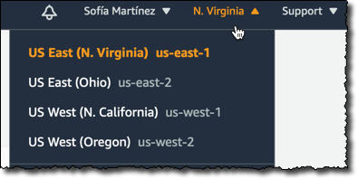
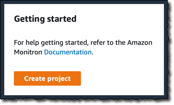
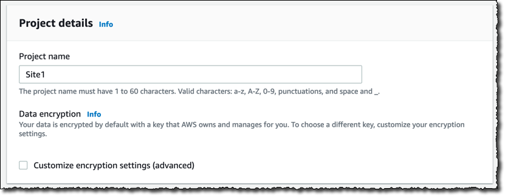
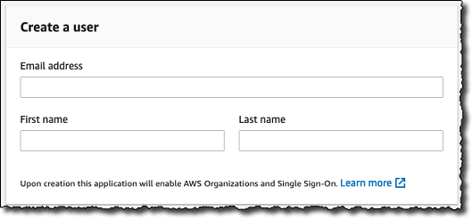
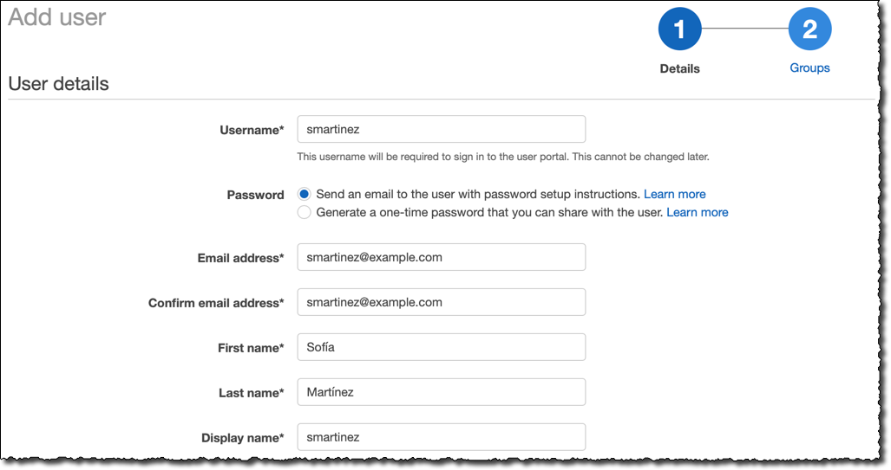
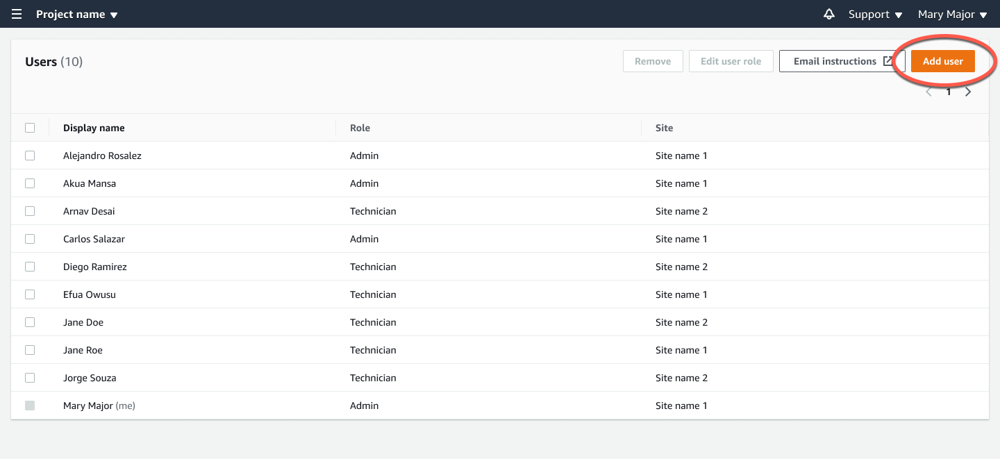
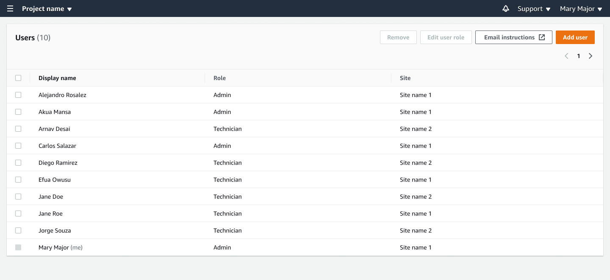
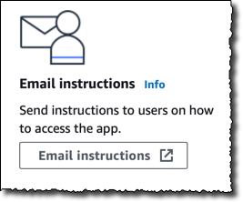

Amazon Monitron is no longer open to new customers. Existing customers can
continue to use the service as normal. For capabilities similar to Amazon
Monitron, see our [blog post](https://aws.amazon.com/blogs/machine-learning/maintain-access-and-consider-alternatives-for-amazon-monitron "https://aws.amazon.com/blogs/machine-learning/maintain-access-and-consider-alternatives-for-amazon-monitron").

# Setting up a project

The first step with Amazon Monitron is to set up your project in the Amazon Monitron console. A project is
where your team sets up gateways, assets, and sensors in the Amazon Monitron mobile app.

###### Topics

- [Step 1: Create an account](#ags-signup "#ags-signup")
- [Step 2: Create a project](#gsg-projects "#gsg-projects")
- [Step 3: Create admin users](#ags-project-admin "#ags-project-admin")
- [Step 4: (optional) Add Amazon Monitron users to your project](#gsg-sso "#gsg-sso")
- [Step 5: Invite users to your project](#gsg-invite "#gsg-invite")

## Step 1: Create an account

### Sign up for an AWS account

If you do not have an AWS account, complete the following steps to create one.

###### To sign up for an AWS account

1. Open [https://portal.aws.amazon.com/billing/signup](https://portal.aws.amazon.com/billing/signup "https://portal.aws.amazon.com/billing/signup").
2. Follow the online instructions.

Part of the sign-up procedure involves receiving a phone call or text message and entering
a verification code on the phone keypad.

When you sign up for an AWS account, an _AWS account root user_ is created. The root user has access to all AWS services
and resources in the account. As a security best practice, assign administrative access to a user, and use only the root user to perform [tasks that require root user access](../../../IAM/latest/UserGuide/id_root-user.md#root-user-tasks "../../../IAM/latest/UserGuide/id_root-user.md#root-user-tasks").

AWS sends you a confirmation email after the sign-up process is
complete. At any time, you can view your current account activity and manage your account by
going to [https://aws.amazon.com/](https://aws.amazon.com/ "https://aws.amazon.com/") and choosing **My
Account**.

### Create a user with administrative access

After you sign up for an AWS account, secure your AWS account root user, enable AWS IAM Identity Center, and create an administrative user so that you
don't use the root user for everyday tasks.

###### Secure your AWS account root user

1. Sign in to the [AWS Management Console](https://console.aws.amazon.com/ "https://console.aws.amazon.com/") as the account owner by choosing **Root user** and entering your AWS account email address. On the next page, enter your password.

For help signing in by using root user, see [Signing in as the root user](../../../signin/latest/userguide/console-sign-in-tutorials.md#introduction-to-root-user-sign-in-tutorial "../../../signin/latest/userguide/console-sign-in-tutorials.md#introduction-to-root-user-sign-in-tutorial") in the _AWS Sign-In User Guide_. 2. Turn on multi-factor authentication (MFA) for your root user.

For instructions, see [Enable a virtual MFA device for your AWS account root user (console)](../../../IAM/latest/UserGuide/enable-virt-mfa-for-root.md "../../../IAM/latest/UserGuide/enable-virt-mfa-for-root.md") in the _IAM User Guide_.

###### Create a user with administrative access

1. Enable IAM Identity Center.

For instructions, see [Enabling
AWS IAM Identity Center](../../../singlesignon/latest/userguide/get-set-up-for-idc.md "../../../singlesignon/latest/userguide/get-set-up-for-idc.md") in the
_AWS IAM Identity Center User Guide_. 2. In IAM Identity Center, grant administrative access to a user.

For a tutorial about using the IAM Identity Center directory as your identity source, see [Configure user access with the default IAM Identity Center directory](../../../singlesignon/latest/userguide/quick-start-default-idc.md "../../../singlesignon/latest/userguide/quick-start-default-idc.md") in the
_AWS IAM Identity Center User Guide_.

###### Sign in as the user with administrative access

- To sign in with your IAM Identity Center user, use the sign-in URL that was sent to your email address when you created the IAM Identity Center user.

For help signing in using an IAM Identity Center user, see [Signing in to the AWS access portal](../../../signin/latest/userguide/iam-id-center-sign-in-tutorial.md "../../../signin/latest/userguide/iam-id-center-sign-in-tutorial.md") in the _AWS Sign-In User Guide_.

###### Assign access to additional users

1. In IAM Identity Center, create a permission set that follows the best practice of applying least-privilege permissions.

For instructions, see [Create a permission set](../../../singlesignon/latest/userguide/get-started-create-a-permission-set.md "../../../singlesignon/latest/userguide/get-started-create-a-permission-set.md") in the _AWS IAM Identity Center User Guide_. 2. Assign users to a group, and then assign single sign-on access to the group.

For instructions, see [Add groups](../../../singlesignon/latest/userguide/addgroups.md "../../../singlesignon/latest/userguide/addgroups.md") in the _AWS IAM Identity Center User Guide_.

###### Important

Amazon Monitron supports all IAM Identity Center regions except opt-in and government
regions. For a list of supported regions, see [Understanding SSO requirements](../user-guide/mu-adding-user.md#sso-requirements "../user-guide/mu-adding-user.md#sso-requirements").

## Step 2: Create a project

Now that you've signed in to the AWS Management Console, you can use the Amazon Monitron console to
create your project.

###### To create a project

1. Choose the AWS Region that you want to use in the Region selector. Amazon Monitron is
   available only in the US East (N. Virginia), Europe (Ireland), and
   Asia Pacific (Sydney) Regions.

 2. Open the Amazon Monitron console at [https://console.aws.amazon.com/monitron](https://console.aws.amazon.com/monitron/ "https://console.aws.amazon.com/monitron/"). 3. Choose **Create project**.

 4. Under **Project Details**, for **Project
name**, enter a name for the project. 5. (Optional) Under **Data encryption**, you can check
**Custom encryption settings (advanced)** if you have an
AWS KMS key in AWS Key Management Service. Amazon Monitron encrypts all data at rest and in transit.
If you don't provide your own CMK, your data is encrypted by a CMK that
Amazon Monitron owns and manages.

For more information about encryption for your project, see [KMS and Data Encryption in Amazon Monitron](../user-guide/data-protection.md#data-encryption "../user-guide/data-protection.md#data-encryption"). 6. (Optional) To add a tag to the project, enter a key-value pair under
**Tags** and then choose **Add
tag**.

For more information about tags, see [Tags in
Amazon Monitron](../user-guide/tagging.md "../user-guide/tagging.md"). 7. Choose **Next** to create the project.

When you create your first project, the owner of the AWS account will get an email
from _AWS Organizations_. No action needs to be taken based on this
email.

## Step 3: Create admin users

Give access to one or more people in your organization (such as reliability managers)
as _admin users_. An _admin
user_ is a person who belongs to an Amazon Monitron project and who can add other
users to the project.

When you add an admin user, Amazon Monitron creates an account for that user in AWS IAM Identity Center. IAM Identity Center
is a service that helps you manage SSO access to AWS accounts and applications in your
organization. Amazon Monitron uses IAM Identity Center to authenticate users for the Amazon Monitron mobile app.

If you haven't enabled IAM Identity Center in your AWS account, Amazon Monitron enables it for you when you
create your first Amazon Monitron admin user. If you are already using IAM Identity Center in your account, then
your IAM Identity Center users are shown in the Amazon Monitron console.

Complete the steps in this section to add yourself to your project as an admin user.
Repeat them for each additional admin user that you want to create.

###### To create an admin user

Unless you already use IAM Identity Center in your AWS account, use Amazon Monitron to create admin
users. If these users are already in IAM Identity Center, you can skip creating the users, and you
are ready to assign the admin role to them.

1. Open the Amazon Monitron console at [https://console.aws.amazon.com/monitron](https://console.aws.amazon.com/monitron/ "https://console.aws.amazon.com/monitron/").
2. On the **Add project admin user** page, choose
   **Create user**.
3. In the **Create user** section, enter the admin user's email
   address and name.

 4. Choose **Create user**.

Amazon Monitron creates a user in IAM Identity Center. IAM Identity Center sends the user an email that contains a
link to activate the account. The link is valid for up to seven days. Within
this time, each user must open the email and accept the invitation.

###### To assign the admin role to the admin users

1. On the **Add project admin user** page, select the checkbox
   for each admin user that you created.
2. Choose **Add**.

You can add admin users to your project even if those people have not yet
accepted the invitations to their IAM Identity Center accounts.

## Step 4: (optional) Add Amazon Monitron users to your project

In addition to admin users, you can also add users who lack admin permissions. For
example, these users might be technicians who only use the Amazon Monitron mobile app to monitor
assets, acknowledge notifications and enter closure codes.

For users who are not admin users:

- You use IAM Identity Center, not Amazon Monitron, to create their user accounts.
- You use the Amazon Monitron mobile app to add the users to projects, not the Amazon Monitron
  console.

The following steps are not required if all of your users are admin users.

###### To add users to IAM Identity Center

If your users already have accounts in IAM Identity Center in your AWS account, you can skip
these steps. You are ready to add the users to your project in the mobile app.
Otherwise, add your users to IAM Identity Center by completing the following steps.

1. Open the AWS IAM Identity Center console at [https://console.aws.amazon.com/singlesignon/](https://console.aws.amazon.com/singlesignon/ "https://console.aws.amazon.com/singlesignon/").
2. In the IAM Identity Center console, choose **Users**.
3. Repeat the following steps for each user that will access your project in the
   Amazon Monitron mobile app.
   1. On the **Users** page choose **Add
      user**.
   2. In the **User details** section, provide the username
      and contact information. Leave **Password** set to
      **Send an email to the user with password setup
      instructions**.

    3. Choose **Next: Groups**. 4. Choose **Add user**. IAM Identity Center sends the user an email
   that contains a link to activate the IAM Identity Center user. The link is valid for
   up to seven days. Each user must open the email and accept the
   invitation before accessing your project in the Amazon Monitron mobile app.

4. Log into the Amazon Monitron mobile app on your smartphone.
5. Navigate to the project or site that you want to add a user to, and
   then to the **Users** list.
6. Choose **Add user**.

 4. Enter a user name.

Amazon Monitron searches the user directory for the user. 5. Choose the user from the list. 6. Choose the role that you want to assign the user:
**Admin**, **Technician**, or
**Viewer**. 7. Choose **Add**.

The new user appears on the **Users** list. 8. Send the new user an email invitation with a link for accessing the
project and downloading the Amazon Monitron mobile app. For more information,
see [Sending an
email invitation](../user-guide/resending-email.md "../user-guide/resending-email.md").

1. Select **Users** from the navigation pane.
2. Choose **Add user**.

 3. Enter a user name.

Amazon Monitron searches the user directory for the user. 4. Choose the user from the list. 5. Choose the role that you want to assign the user:
**Admin**, **Technician**, or
**Read only**. 6. Choose **Add**.

The new user appears on the **Users** list. 7. Send the new user an email invitation with a link for accessing the
project and downloading the Amazon Monitron mobile app. For more information,
see [Sending an
email invitation](../user-guide/resending-email.md "../user-guide/resending-email.md").

## Step 5: Invite users to your project

Invite the users you've added to your Amazon Monitron project.

1. Open the Amazon Monitron console at [https://console.aws.amazon.com/monitron](https://console.aws.amazon.com/monitron/ "https://console.aws.amazon.com/monitron/").
2. In the navigation pane, choose **Projects**.
3. On the **Projects** page, choose your project name to open
   its details page.
4. Repeat the following steps for each user that you want to invite.
   1. Under **How it works**, choose **Email
      instructions**.

   

   Your email client opens a draft that contains an invitation to your
   Amazon Monitron project. It contains both a link to download the Amazon Monitron mobile app
   from the Google Play Store and a link to open the project. 2. Email this message to the user.
