Amazon Monitron is no longer open to new customers. Existing customers can
continue to use the service as normal. For capabilities similar to Amazon
Monitron, see our [blog post](https://aws.amazon.com/blogs/machine-learning/maintain-access-and-consider-alternatives-for-amazon-monitron "https://aws.amazon.com/blogs/machine-learning/maintain-access-and-consider-alternatives-for-amazon-monitron").

# Adding assets and installing devices

Once you've created a project, you or reliability managers and technicians from your team can
use the Amazon Monitron mobile app to add gateways, create assets and pair sensors to them, and start
monitoring your equipment. Only smartphones using Android 8.0+ or iOS 14+ with Near Field
Communication (NFC) and Bluetooth are supported by Amazon Monitron.

Your IT manager or reliability manager will generate an email describing how to log in for
the first time and connect to your project and send this to you. Once you've logged in for the
first time, you can follow the steps to add gateways and install devices.

###### Topics

- [Step 1: Add a Gateway](#gs-adding-gateway "#gs-adding-gateway")
- [Step 2: Adding Assets](#gsg-assets "#gsg-assets")
- [Step 3: Attach Sensors](#gsg-sensors "#gsg-sensors")

## Step 1: Add a Gateway

In Amazon Monitron, sensors collect data from machines and pass it to gateways, which transmit the
data to the AWS Cloud and thus to Amazon Monitron for analysis. These gateways are usually mounted on
the wall of a factory within 20 to 30 meters from the sensor and connect to the AWS Cloud using
the local Wi-Fi network.

Before adding a gateway, make sure that Bluetooth is turned on for your smartphone.

To add a Wi-Fi gateway

1. Choose the menu icon (☰), and then choose **Getting
   Started**.

 2. Choose **Add gateway**.

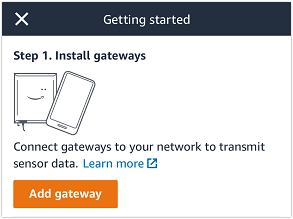 3. In your factory, position your gateway in the location that works best for
communicating with your sensors.

The best place to mount your gateway is higher than the sensors and no more than 20 to
30 meters away. For more information about locating gateways, see [Where to Install Your Gateway](../user-guide/installing-gateway.md#where-gateway "../user-guide/installing-gateway.md#where-gateway") in the _Amazon Monitron User Guide_. 4. Plug the gateway in and make sure that the LED lights on the top alternatively blink
yellow and blue.

 5. Push the button on the side of the gateway to put it into commissioning mode. The
lights will start blinking rapidly. 6. In the mobile app, choose **Next**. 7. Choose **Add gateway**.

Amazon Monitron searches for the gateway, which can take a few moments. When it finds it, the
gateway appears in the gateway list.

If it can't find the gateway, see [Setting Up
Gateways](../user-guide/gateways.md "../user-guide/gateways.md") in the _Amazon Monitron User Guide_ for possible
solutions. 8. When you see the new gateway in the list, choose it.

It can take a few moments for Amazon Monitron to connect to the new gateway.

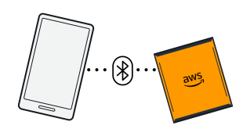 9. After it connects to the gateway, Amazon Monitron scans for Wi-Fi networks. Choose the Wi-Fi
network that you want to use. 10. Enter your Wi-Fi password, and then choose **Connect**.

It can take a few minutes for the gateway to be commissioned.

To add an Ethernet gateway

1. If Bluetooth isn't already turned on for your smartphone, turn it on.
2. Position your gateway in the location that works best for communicating with your
   sensors.

The best place to mount your gateway is higher than the sensors and no more than 20 to
30 meters away. 3. Plug in the gateway and make sure the network light (yellow) and the Bluetooth light
(blue) on the front of your gateway are blinking alternatively. 4. Push the **Config** button on the gateway to put it into commissioning
mode. the Bluetooth and network LED lights will start flashing rapidly.

 5. Open the mobile app on your smartphone. 6. On the **Getting started** page or the **Gateways**
page, choose **Add gateway**.

Amazon Monitron scans for the gateway. This can take a few moments. when Amazon Monitron finds the
gateway, it displays it in the gateway list. 7. Choose the gateway.

It can take a few moments for Amazon Monitron to connect to the new gateway.

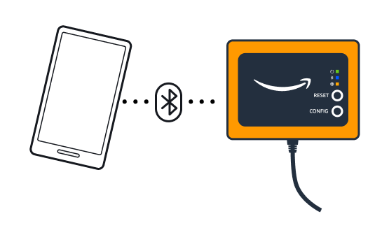 8. After it connects to the gateway, Amazon Monitron will provide two options for you to
configure the network connection for your gateway.

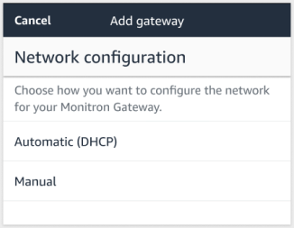 9. Choose your network configuation.

It can take a few minutes for the gateway to be commissioned and to connect to the
network.

    1. If you choose automatic (DHCP), Amazon Monitron will automatically configure the network to
     connect the gateway.
    2. If you choose **manual**, enter your IP address, subnet mask,
     router, preferred DNS server, and alternate DNS server (optional) information. then choose
     **connect**.

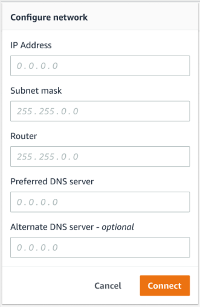

## Step 2: Adding Assets

In Amazon Monitron, the machines you monitor are known as _assets_. Assets are
usually individual machines, but they can also be specific sections of equipment. Assets are
paired to sensors, which directly monitor temperature and vibration to check for potential
failures.

###### To add an asset

1. On the **Getting Started** page, choose **Add asset**.

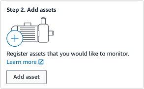 2. For **Asset name**, enter a name for the asset that you want to create. 3. For **Machine class**, choose the machine class of the asset.

Asset machine class is based on ISO 20816 Standards. For more information about machine
classes, see [Assets](../user-guide/assets-chapter.md "../user-guide/assets-chapter.md").

###### Note

Asset machine class is based on ISO 20816 Standards. Amazon Monitron administrators can also create
custom machine asset classes for all positions within a project. For more information about
machine classes and customizing them, see [Assets](../user-guide/assets-chapter.md "../user-guide/assets-chapter.md").

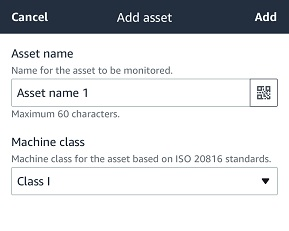 4. Choose **Add**.

When you've added your first asset, it's displayed on the **Assets list**
page.

## Step 3: Attach Sensors

Assets are paired to sensors, which directly monitor an asset's health. You place each
sensor on the asset in a position that you want to monitor. You can place one or more sensors on
each asset. Each sensor takes vibration and temperature measurements at the position to which it
is paired and sends it to the AWS Cloud for analysis of machine health using the gateway.

### Where to Place Sensors

When placing a sensor, choose a location where it can accurately detect the machine's
temperature or vibration.

To achieve the greatest accuracy:

- Mount the sensor directly onto the housing of the target component.
- Minimize the length of the vibration transmission path, the distance between the source
  of vibration and sensor.
- Avoid mounting the sensor in a location that can oscillate due to natural frequencies,
  such as sheet metal covers.

Vibration will attenuate up to 30-36"/75-90 cm) from the source. Attributes of the
vibration transmission path length that can reduce the transmission path length include:

- The number of mounting surfaces, causing signal reflection
- Materials such as rubber and plastic that can absorb vibration

The following examples show where to place sensors. For more information and examples, see
[Where to Place Your Sensors](../user-guide/as-sensor-positions.md#as-where-sensors "../user-guide/as-sensor-positions.md#as-where-sensors") in the _Amazon Monitron User Guide_.

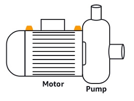

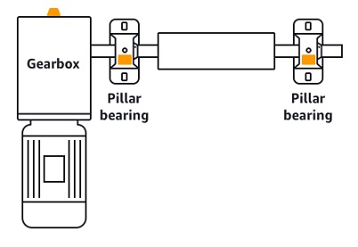

### How to Place Sensors

When you've decided where to place a sensor on an asset, make sure that a minimum of
one-third of the sensor base is fixed to the asset. The sensors can pick up vibration and
temperature measurements across the entire base of the sensor, but it's important to have the
asset target area centered as much as possible on the sensor as shown in the following image.

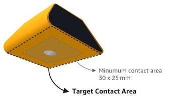

Attach the sensor with an industrial adhesive. We recommend a cyanoacrylate-type epoxy. For
additional information about attaching the sensor to your asset, see [How
to Place the Sensors](../user-guide/as-sensor-positions1.md#as-how-sensors "../user-guide/as-sensor-positions1.md#as-how-sensors") in the _Amazon Monitron User's Guide_.

###### Warning

Amazon Monitron sensors can be attached to the equipment using industrial adhesive. We suggest you
check the surface before selecting the adhesive. For surfaces up to 5 mm roughness/gaps, you
can select an adhesive that fills the gap, such as LOCTITE® 3090. For flat surfaces (<0.1mm
roughness), you can select a more generic adhesive, such as LOCTITE® 454. Always check and
follow the processing guidelines outlined by the adhesive vendor.

For more information about safely using the adhesive, see [Loctite 454 Technical Information](https://www.henkel-adhesives.com/us/en/product/instant-adhesives/loctite_454.html "https://www.henkel-adhesives.com/us/en/product/instant-adhesives/loctite_454.html") or [Loctite 3090 Technical Information](https://www.henkel-adhesives.com/us/en/product/instant-adhesives/loctite_3090.html "https://www.henkel-adhesives.com/us/en/product/instant-adhesives/loctite_3090.html"), as appropriate.

###### To attach the Amazon Monitron sensor

1. Apply a thin layer of the adhesive on the bottom of the sensor, maximizing the contact
   area.
2. Hold the sensor to the mounting location on the machine part, pressing firmly for the
   length of time specified by the adhesive instructions.

### Step 4: Pairing Sensors to an Asset

Each sensor that you pair to an asset has a designated position and is set to monitor a
specific part of the asset. For example, a sensor set up to monitor bearings on a conveyor belt
might have the position of Left bearing 1 with a position type of Bearing.

Amazon Monitron uses Near Field Communications (NFC), a short-range (4 cm or less) wireless
technology for communication between two electronic devices. To use Amazon Monitron, you need an iOS or
Android 8.0+ smartphone with NFC installed natively.

###### Important

The equipment that you want to monitor must be in a healthy state before you pair it to a
sensor. Amazon Monitron must establish a baseline for the equipment based on its normal state so that it
can later determine abnormalities.

###### To pair a sensor with an asset

1. Attach your sensor in the correct position, as described in [Step 3: Attach Sensors](#gsg-sensors "#gsg-sensors") . You can also attach the sensor after pairing it to the asset
   in this step 4.
2. Make sure that the NFC feature on your smartphone is on and functioning.
3. From the **Assets** list, choose the asset that you just created.
4. Choose **Pair sensor**.
5. For **Position name**, provide a name for the sensor position.
6. Choose the **Type of position** that best fits the location that you're
   going to monitor:
   - Bearing
   - Compressor
   - Fan
   - Gearbox
   - Motor
   - Pump
   - Other

###### Note

After you pair the sensor, you can't change the position type. 7. Hold your phone close to the sensor to register it. A progress bar shows when
registration is complete.

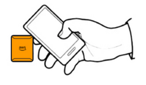

It can take a few moments for the sensor to be commissioned. If you have trouble pairing
the sensor, see [Pairing Your Sensor](../user-guide/as-sensor-positions1.md#as-add-sensors "../user-guide/as-sensor-positions1.md#as-add-sensors") for more information.

###### Tip

If your smartphone fails to detect the sensor, try holding it so that the NFC antenna is
close to the sensor. For iPhone models, the antenna is located at the top edge of the device.
For Android models, the antenna location varies. The following resources might help you
locate the NFC antenna on an Android device:

    * [NFC detection area
     (Samsung)](https://www.samsung.com/hk_en/nfc-support/#devicelist "https://www.samsung.com/hk_en/nfc-support/#devicelist")
    * [Pixel phone hardware
     diagram](https://support.google.com/pixelphone/answer/7157629 "https://support.google.com/pixelphone/answer/7157629")

On the **Assets** page, the sensor is now paired to the asset and is
identified by its position.
