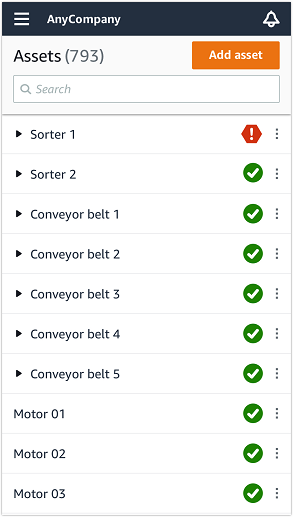
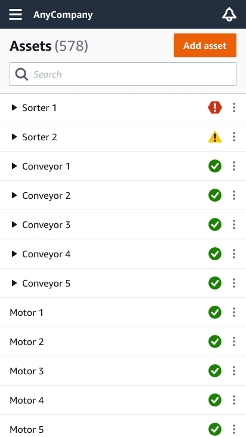
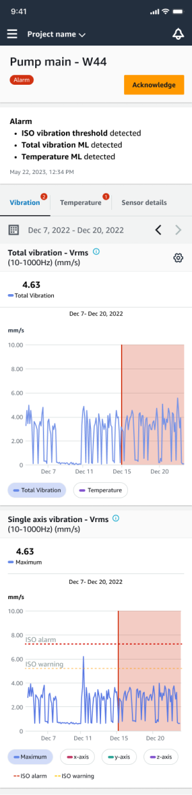
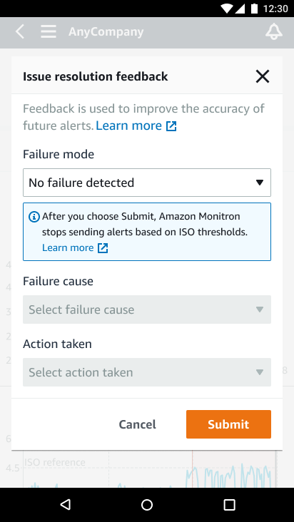

Amazon Monitron is no longer open to new customers. Existing customers can
continue to use the service as normal. For capabilities similar to Amazon
Monitron, see our [blog post](https://aws.amazon.com/blogs/machine-learning/maintain-access-and-consider-alternatives-for-amazon-monitron "https://aws.amazon.com/blogs/machine-learning/maintain-access-and-consider-alternatives-for-amazon-monitron").

# Understanding warnings and alerts

###### Note

This section focuses on using the Amazon Monitron mobile app. To learn about the Amazon Monitron web app, see
[Understanding sensor measurements](../user-guide/anom-monitoring-chapter.md "../user-guide/anom-monitoring-chapter.md") in the _Amazon Monitron User Guide_.

After a sensor is paired to an asset, Amazon Monitron starts monitoring the asset's condition. When it
detects an abnormal machine condition, it sends you a notification (

) and changes the asset state. The alert notification is generated using a
combination of machine learning and ISO 20816 standards for machine vibration.

To monitor the data and respond to alerts about abnormalities, you use the Amazon Monitron mobile app.

Your administrator will send you an email with information about how to log in for the first
time and connect to your project.

###### Topics

- [Step 1: Understanding asset health](#gsg-asset-list "#gsg-asset-list")
- [Step 2: Viewing asset conditions](#gsg-monitoring "#gsg-monitoring")
- [Step 3: Viewing and acknowledging a machine
  abnormality](#gsg-acknowledging "#gsg-acknowledging")
- [Step 4: Resolving a machine abnormality](#gs-resolving-anomalies "#gs-resolving-anomalies")
- [Step 5: Muting alerts](#gs-muting-alerts "#gs-muting-alerts")

## Step 1: Understanding asset health

To monitor assets using the Amazon Monitron mobile app, start with the **Assets**
list. This list is displayed when you open the mobile app.

Each asset in your project or site is listed in the **Assets** list.

On the **Assets** list page, each asset shows an icon indicating its
health. The following table describes these icons.

| Icon                                                                                                                             | Health state                                                                                                                                                                                                                                                                                                                                                                                                                                                                                                                                               |
| -------------------------------------------------------------------------------------------------------------------------------- | ---------------------------------------------------------------------------------------------------------------------------------------------------------------------------------------------------------------------------------------------------------------------------------------------------------------------------------------------------------------------------------------------------------------------------------------------------------------------------------------------------------------------------------------------------------- | ------------------------------------------------------------------------------------------------------------------------------------------------------------------------------------------------------------------------------------------------------------------------------------------------------------------------------------------------------------------------------------------------------------------------------------------------------------------------------------------------------------------------------------------------------------------------------------------------------------------------------------------------------------------------------------------------------------------------------------------------------------------------------------------------------------------------------------------------------------------------------------------------------------------------------------------------------------------------------------------------------------------------------------------------------------------------------------------------------------------------------------------------------------------------------------------------------------------------------------------------------------------------------------------------------------------------------------------------------------------------------------------------------------------------------------------------------------------------------------------------------------------------------------------------------------------------------------------------------------------------------------------------------------------------------------------------------------------------------------------------------------------------------------------------------------------------------------------------------------------------------------------------------------------------------------------------------------------------------------------------------------------------------------------------------------------------------------------------------------------------------------------------------------------------------------------------------------------------------------------------------------------------------------------------------------------------------------------------------------------------------------------------------------------------------------------------------------------------------------------------------------------------------------------------------------------------------------------------------------------ |
| Green circular icon with a white checkmark symbol inside.                                                                        | **Healthy state**: The status of all sensor positions on the asset is healthy.                                                                                                                                                                                                                                                                                                                                                                                                                                                                             |
| Yellow warning triangle with exclamation mark, indicating caution or alert.                                                      | **Warning state**: A warning has been triggered for one of the positions of this asset, indicating that Amazon Amazon Monitron has detected early signs of potential failure. Amazon Amazon Monitron identifies warning conditions by analyzing equipment vibration and temperature, using a combination of machine learning and ISO vibration standards.                                                                                                                                                                                                  |
| Red hexagonal warning sign with exclamation mark indicating caution or alert.                                                    | **Alarm state**: Once an asset has been placed in a warning state, Amazon Monitron will continue to monitor it. Again, Amazon Monitron is using a combination of machine learning and vibration ISO standards. If the condition of the asset gets significantly worse, Amazon Amazon Monitron will escalate by sending an **Alarm** notification when it detects that the equipment condition has significantly worsened. We recommend investigating the issue at the earliest opportunity. An equipment failure might occur if the issue isn't addressed. |
| Wrench icon on a blue square background, representing a tool or settings symbol.                                                 | **Maintenance state**: One of the asset's sensors is in the maintenance state. The alarm state of the asset has been acknowledged by a technician, but not yet addressed.                                                                                                                                                                                                                                                                                                                                                                                  |
| No sensor                                                                                                                        | **No sensor**: At least one position on the asset doesn't have a sensor paired to it.                                                                                                                                                                                                                                                                                                                                                                                                                                                                      | When you choose an asset, the app displays the health status of each underlying sensor position.  The following table describes the position status indicators.                                                                                                                                                                                                                                                                                                                                                                                                                                                                                                                                                                                                                                                                                                                                                                                                                                                                                                                                                                                                                                                                                                                                                                                                                                                                                                                                                                                                                                                                                                                                                                                                                                                                                                                                                                                                                                                                                                                                                                                                                                                                                                                                                                                                                                                                                                                       |
| Status                                                                                                                           | State                                                                                                                                                                                                                                                                                                                                                                                                                                                                                                                                                      |
| ---                                                                                                                              | ---                                                                                                                                                                                                                                                                                                                                                                                                                                                                                                                                                        |
| Green oval button with the text "Healthy" indicating a positive status.                                                          | The position is healthy: All measured values are within their normal range.                                                                                                                                                                                                                                                                                                                                                                                                                                                                                |
| Yellow warning label with black text saying "Warning".                                                                           | A warning has been triggered for this position indicating early signs of a potential failure condition. We recommend that you monitor the equipment closely and initiate an investigation during an upcoming planned maintenance.                                                                                                                                                                                                                                                                                                                          |
| Red oval button labeled "Alarm" indicating an alert or warning notification.                                                     | An alarm has been triggered for this position, indicating that the machine vibration or temperature is out of the normal range at this position. We recommend investigating the issue at the earliest opportunity. An equipment failure might occur if the issue isn't addressed.                                                                                                                                                                                                                                                                          |
| Blue button labeled "Maintenance" indicating a system or service status.                                                         | The alarm state of the position has been acknowledged by a technician, but not yet addressed.                                                                                                                                                                                                                                                                                                                                                                                                                                                              |
| No sensor                                                                                                                        | The position doesn't have a sensor paired to it.                                                                                                                                                                                                                                                                                                                                                                                                                                                                                                           | When an issue is raised for an individual position, the status changes for that position and for the asset as a whole. ## Step 2: Viewing asset conditions Viewing assets is more than simply understanding the icons that show the asset and position health status. It is often useful to see the data collected by the sensors yourself. ###### To view sensor data in the Amazon Monitron mobile app 1. In the **Assets** list, choose the asset you want to view. 2. Choose the position with the data that you want to view. 3. Under the **Vibration and Temperature** tabs, choose the chart of recent sensor data and the level of detail that you want to see. You can choose separate versions for different time periods (1 day, 1 week, 2 weeks, 1 month, and so on).                                                                                                                                                                                                                                                                                                                                                                                                                                                                                                                                                                                                                                                                                                                                                                                                                                                                                                                                                                                                                                                                                                                                                                                                                                                                                                                                                                                                                                                                                                                                                                                                                                                                                                                                                                                                                                 |
|                                                                                                                                  |                                                                                                                                                                                                                                                                                                                                                                                                                                                                                                                                                            |
| ---                                                                                                                              | ---                                                                                                                                                                                                                                                                                                                                                                                                                                                                                                                                                        |
| Two graphs showing total vibration and single axis vibration measurements over time with ISO warning and alarm levels indicated. | Pump monitoring interface showing vibration and temperature alarms with graphical data.                                                                                                                                                                                                                                                                                                                                                                                                                                                                    | ## Step 3: Viewing and acknowledging a machine abnormality The longer Amazon Monitron monitors a position, the more it fine-tunes its baseline and increases its accuracy. When an **Alarm** or a **Warning** is triggered, Amazon Monitron sends a notification to the mobile app that is displayed as an icon in the upper right of your screen (  ). Choosing the notification icon opens the **Notifications** page, which lists all pending notifications.  When you receive a notification, you must view and acknowledge it. This doesn't fix the issue with the asset, it just lets Amazon Monitron know that you are aware of it. ###### To view and acknowledge an abnormality 1. On the **Assets** list, choose the asset with the alarm.  2. Choose the position with the alarm to view the issue.                                                                                                                                                                                                                                                                                                                                                                                                                                                                                                                                                                                                                                                                                                                                                                                                                                                                                                                                                                                                                                                                                                                                                                                                                                                                                                                                                                                                                                                            |
|                                                                                                                                  |                                                                                                                                                                                                                                                                                                                                                                                                                                                                                                                                                            |
| ---                                                                                                                              | ---                                                                                                                                                                                                                                                                                                                                                                                                                                                                                                                                                        |
| Sorter 2 interface showing positions, warnings, and asset details for AnyCompany.                                                | Sorter 1 interface showing positions with alarm, warning, and healthy statuses.                                                                                                                                                                                                                                                                                                                                                                                                                                                                            | 3. To confirm that you are aware of the issue, choose **Acknowledge**. Note that the text on the following screens also indicates whether the alert notification was triggered based on the equipment's vibration or temperature, or by the vibration ISO thresholds or machine learning models. This information can be used by technicians to investigate and fix the issue. After an abnormality has been acknowledged and repaired, resolve the issue in the mobile app.  The status of the asset changes to:  After the alarm has been acknowledged, the abnormality can be examined and fixed as appropriate. ## Step 4: Resolving a machine abnormality Resolving an abnormality returns the sensor to healthy status and provides information about the issue to Amazon Monitron so it can better determine when a failure might occur in the future. For information about failure modes and causes, and how to resolve abnormalities, see [Resolving a Machine Abnormality](../user-guide/anom-monitoring-chapter.md#anom-resolve-anom "../user-guide/anom-monitoring-chapter.md#anom-resolve-anom") in the _Amazon Monitron User Guide_. ###### To resolve an abnormality 1. In the **Assets** list, choose the asset with the issue. 2. Choose the position with the resolved abnormality. 3. Choose **Resolve**. 4. For **Failure mode**, choose one of the available types. 5. For **Failure cause**, choose the cause. 6. For **Action taken** choose the action taken. 7. Choose **Submit**. In the **Assets** list, the asset status returns to **Healthy**. ## Step 5: Muting alerts ISO thresholds apply broadly to large classes of equipment. Therefore, when detecting the potential failure of a specific asset, you may consider other factors as well. For example, you can mute a notification generated by ISO vibration thresholds if you assess that your equipment is still healthy when the alert is raised. You also can mute alerts by providing the ‘No failure detected’ feedback for the ‘Failure mode’ while closing the alert. Note that Amazon Monitron will continue to notify users of potential failures detected based on Machine Learning, even when notifications based on ISO thresholds are muted.  |
