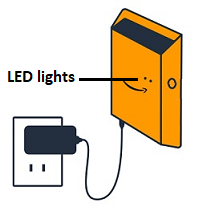

Amazon Monitron is no longer open to new customers. Existing customers can
continue to use the service as normal. For capabilities similar to Amazon
Monitron, see our [blog post](https://aws.amazon.com/blogs/machine-learning/maintain-access-and-consider-alternatives-for-amazon-monitron "https://aws.amazon.com/blogs/machine-learning/maintain-access-and-consider-alternatives-for-amazon-monitron").

# Reading the LED lights on a Wi-Fi gateway

The LED lights on the top of your Amazon Monitron gateway indicate the status
of the gateway. Each LED light has one orange light and one blue light. The orange
light indicates that the gateway is connected to a Wi-Fi network. The blue light
indicates that the gateway's Bluetooth is connected to the sensors.

The sequence that the lights display indicates the status of the gateway, as
described in the following table.

|     | LED sequence                              | Description                                                                                                                                                                                                    |
| --- | ----------------------------------------- | -------------------------------------------------------------------------------------------------------------------------------------------------------------------------------------------------------------- |
| 1   | Solid green light                         | The Wi-Fi gateway is powered on.                                                                                                                                                                               |
| 2   | Solid orange light                        | The gateway is connected to the Wi-Fi network and the Amazon Monitron backend system.                                                                                                                          |
| 3   | Flashing orange light (slow)              | The gateway is attempting to connect to the Wi-Fi network.                                                                                                                                                     |
| 4   | Flashing orange light (1 fast/ 1 slow)    | The gateway is connected to the Wi-Fi network and is attempting to connect to the Amazon Monitron backend system.                                                                                              |
| 5   | Solid blue light                          | At least one sensor is communicating with the gateway.                                                                                                                                                         |
| 6   | No blue light                             | No sensors are currently communicating with the gateway.                                                                                                                                                       |
| 7   | Orange and blue lights flashing (slowly)  | The gateway is powered on, unconfigured (not commissioned), and not in commissioning mode (that is, not discoverable or configurable by the mobile app).                                                       |
| 8   | Orange and blue lights flashing (rapidly) | The gateway is on and in commissioning mode, but not yet linked to any sensors. In commissioning mode, the gateway is discoverable and configurable by Amazon Amazon Monitron, but no sensors can connect yet. |
| 9   | No lights                                 | The gateway is not connected to a power source or a firmware update is in progress.                                                                                                                            |
| 10  | Solid orange and blue lights              | The gateway is starting up.                                                                                                                                                                                    |
