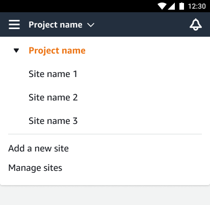

Amazon Monitron is no longer open to new customers. Existing customers can
continue to use the service as normal. For capabilities similar to Amazon
Monitron, see our [blog post](https://aws.amazon.com/blogs/machine-learning/maintain-access-and-consider-alternatives-for-amazon-monitron "https://aws.amazon.com/blogs/machine-learning/maintain-access-and-consider-alternatives-for-amazon-monitron").

# Creating a site

To add a site to a project, you must be a project-level admin user. You can create up
to 50 sites within a project, and add up to 100 assets and 200 gateways to each site.
You can make up to 20 users into admin users or technicians for a site.

###### Topics

- [To add a site using the mobile app](#w2aac17c21b7 "#w2aac17c21b7")
- [To add a new site using the web app](#w2aac17c21b9 "#w2aac17c21b9")

## To add a site using the mobile app

1. Log into the Amazon Monitron mobile app on your smartphone.

Make sure that the project name is shown in the upper left of the screen.
It is visible on all screens in the mobile app. 2. Choose the menu icon (☰). 3. Choose **Sites**. 4. Choose **Add site**. 5. For **Site name**, enter a name. 6. Choose **Add**.

The **Sites** list displays the new site.

## To add a new site using the web app

1. Open the project selector dropdown menu from the upper left part of the
   app window.
2. Choose **Add a new site**

The project-level admin user who creates a site is automatically a site-level admin
user for that site. To learn more about adding users, see [Adding a user](adding-user.md "adding-user.md").
