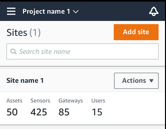
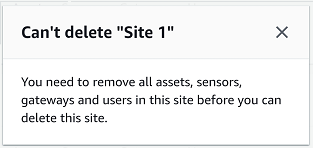
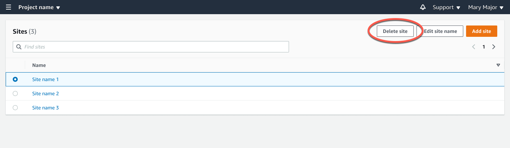

Amazon Monitron is no longer open to new customers. Existing customers can
continue to use the service as normal. For capabilities similar to Amazon
Monitron, see our [blog post](https://aws.amazon.com/blogs/machine-learning/maintain-access-and-consider-alternatives-for-amazon-monitron "https://aws.amazon.com/blogs/machine-learning/maintain-access-and-consider-alternatives-for-amazon-monitron").

# Deleting a site

Before you can delete a site, you must delete all of the site's assets. The
**Sites** list displays all of the devices and users associated
with a site.

###### Topics

- [To delete a site using the mobile app](#w2aac17c29b7 "#w2aac17c29b7")
- [To delete a site using the web app](#w2aac17c29b9 "#w2aac17c29b9")

## To delete a site using the mobile app

1. Log into the Amazon Monitron mobile app using your smartphone.

Make sure that the project name is shown in the upper left of the
screen.

 2. Choose the menu icon (☰). 3. Choose **Sites**. 4. Next to the site that you want to delete, choose
**Actions**. 5. Choose **Delete site**. 6. If assets, sensors, gateways, or users are associated with the site,
choose **X**. Then delete those resources before
proceeding.

If there are no resources associated with the site, skip to the next step.

 7. Choose **Delete**.

The site is no longer listed in the **Sites**
list.

## To delete a site using the web app

1. Choose **Sites** from the left pane.
2. Select the site that you want to delete.
3. Choose **Delete site**.

