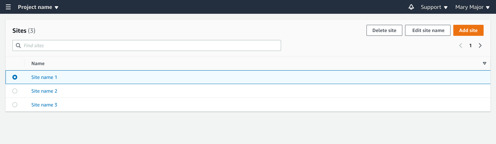

Amazon Monitron is no longer open to new customers. Existing customers can
continue to use the service as normal. For capabilities similar to Amazon
Monitron, see our [blog post](https://aws.amazon.com/blogs/machine-learning/maintain-access-and-consider-alternatives-for-amazon-monitron "https://aws.amazon.com/blogs/machine-learning/maintain-access-and-consider-alternatives-for-amazon-monitron").

# Changing a site name

You can change only a site's name. When you change the name, nothing else (such as
historical data or user permissions) changes.

###### Topics

- [To change a site name using the mobile app](#w2aac17c25b7 "#w2aac17c25b7")
- [To change a site name using the web app](#w2aac17c25b9 "#w2aac17c25b9")

## To change a site name using the mobile app

1. Log into the Amazon Monitron mobile app on your smartphone.

Make sure that the project name is shown in the upper left of the
screen. 2. Choose the menu icon (☰). 3. Choose **Sites**. 4. Next to the site that you want to rename, choose
**Actions**. 5. Choose **Edit site name**. 6. Change the site name.

The new name is displayed in the **Sites** list.

## To change a site name using the web app

1. Choose **Sites** from the left pane.
2. Select the site that you want to rename.
3. Choose the **Edit site name** button.

