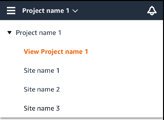
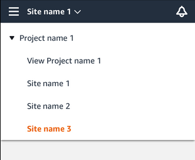

Amazon Monitron is no longer open to new customers. Existing customers can
continue to use the service as normal. For capabilities similar to Amazon
Monitron, see our [blog post](https://aws.amazon.com/blogs/machine-learning/maintain-access-and-consider-alternatives-for-amazon-monitron "https://aws.amazon.com/blogs/machine-learning/maintain-access-and-consider-alternatives-for-amazon-monitron").

# Navigating between projects and sites in

the mobile app

Project-level admin users and project-level technicians can access and manage either
project-level or site-level resources. Project-level admin users can add resources and
users at either the project or site level.

Site admins and site-level technicians have access only to their site.

To tell whether you're at the project level or in a specific site, note the name at
the top of the app screen.

or

Project-level admin users and technicians can switch between the project level and the
site level or between individual sites.

###### Topics

- [Switching from project level to site level](#project-to-site "#project-to-site")
- [Switching from site level to project level](#site-to-project "#site-to-project")

## Switching from project level to site level

###### To change from project level to site level

1. Log into the Amazon Monitron mobile app on your smartphone.

Navigate to the project you want.

 2. Choose the project name.

 3. Choose the site that you want to view.

## Switching from site level to project level

###### To change from site level to project level

1. Log into the Amazon Monitron mobile app on your smartphone.

The site name indicates that you are at the site level in the mobile app.

 2. Choose the site name.

 3. Choose the project name.

To change to a different site, choose the site name.
