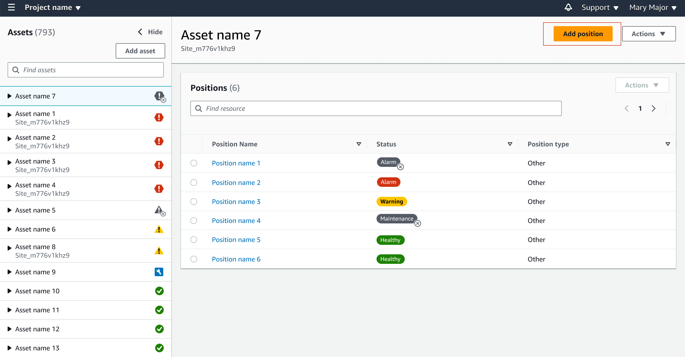
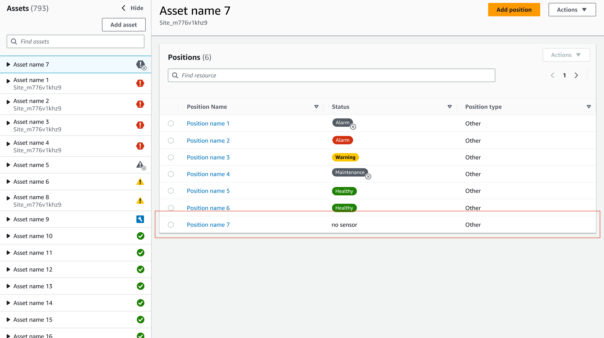
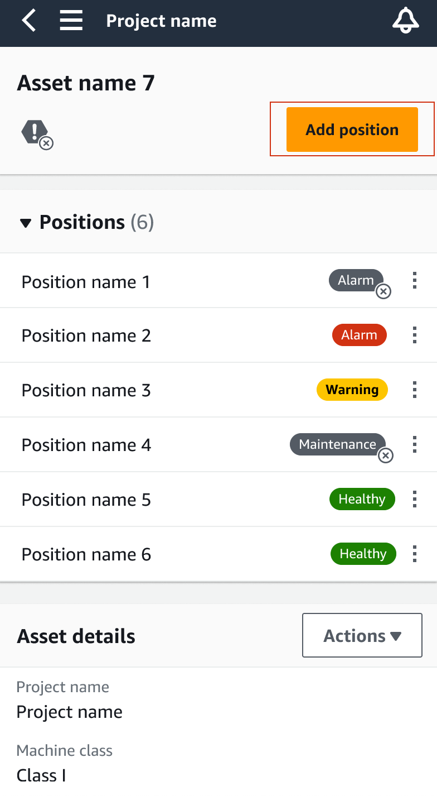
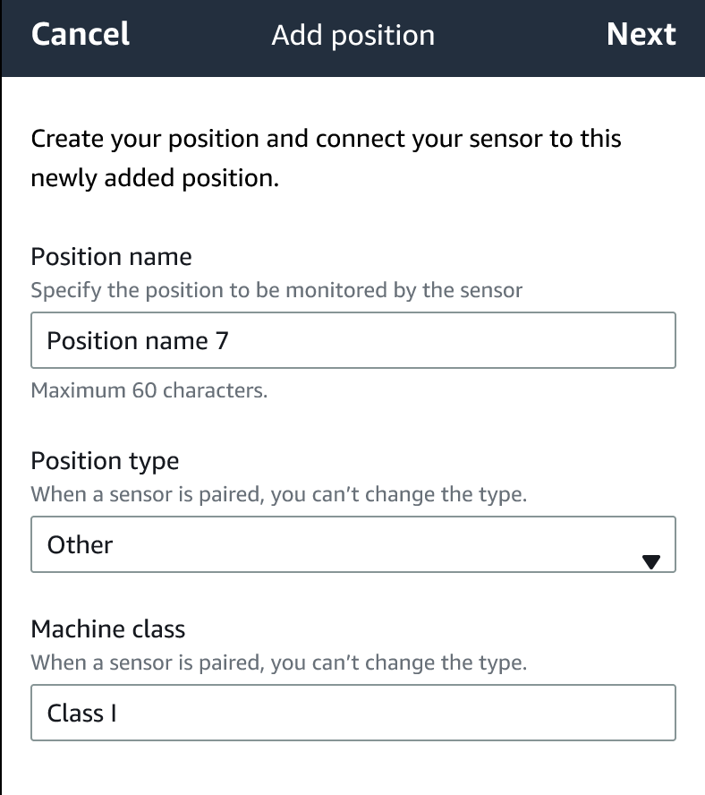
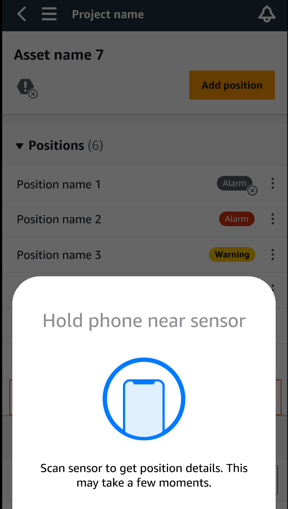
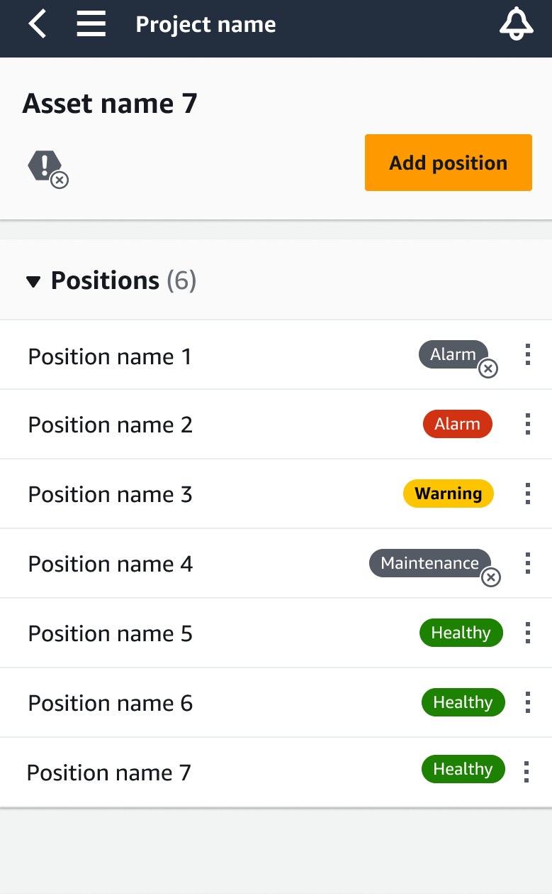

Amazon Monitron is no longer open to new customers. Existing customers can
continue to use the service as normal. For capabilities similar to Amazon
Monitron, see our [blog post](https://aws.amazon.com/blogs/machine-learning/maintain-access-and-consider-alternatives-for-amazon-monitron "https://aws.amazon.com/blogs/machine-learning/maintain-access-and-consider-alternatives-for-amazon-monitron").

# Adding a sensor position

When you pair a sensor to an asset, you record the type of position. The type of
position tells Amazon Monitron how to assess the position when it analyzes the data
from that sensor.

You can create and update asset positions from both the Amazon Monitron web app and
the Amazon Monitron mobile app. Using the apps, you can:

- Add a new position to an existing asset
- Add a new position to new asset
- Pair a new sensor with an existing position
- Add a new position to an existing asset without assigned position

###### Topics

- [To add a sensor position on the web
  app](#adding-position-web "#adding-position-web")
- [To add a sensor position on the mobile
  app](#adding-position-mobile "#adding-position-mobile")

## To add a sensor position on the web

app

1. Choose the sensor whose position you want to create or edit from the
   **Assets** list.
2. Select the **Add position** button.

 3. In the dialog box that opens, enter your **Position
name**, **Position type** and
**Machine class**.

|                                                                       |                                                                       |
| --------------------------------------------------------------------- | --------------------------------------------------------------------- |
| Form to add a position with fields for name, type, and machine class. | Form to add a position with fields for name, type, and machine class. |

4. Choose **Save**.
5. Your position is added to the asset.

## To add a sensor position on the mobile

app

1. Choose the sensor whose position you want to create or edit from the
   **Assets** list.
2. Select the **Add position** button.

 3. In the dialog box that opens, enter your **Posion name**,
**Position type**, and **Machine
class**.

 4. Choose **Next**. 5. Re-scan your sensor with your mobile device to save the position.

 6. Your position is added to the asset.

