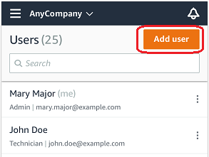
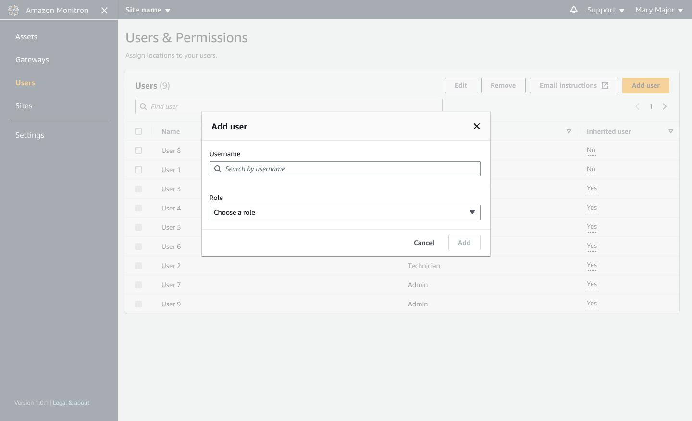
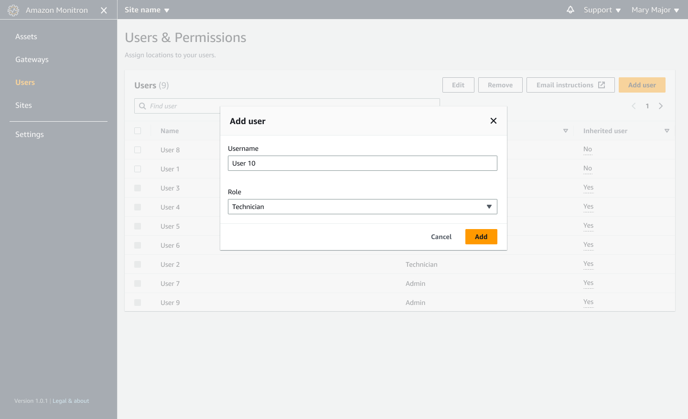
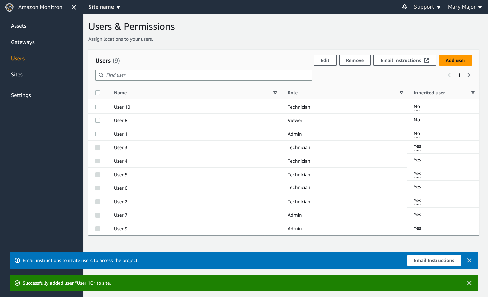

Amazon Monitron is no longer open to new customers. Existing customers can
continue to use the service as normal. For capabilities similar to Amazon
Monitron, see our [blog post](https://aws.amazon.com/blogs/machine-learning/maintain-access-and-consider-alternatives-for-amazon-monitron "https://aws.amazon.com/blogs/machine-learning/maintain-access-and-consider-alternatives-for-amazon-monitron").

# Adding a user

When you add a new user, the role you choose determines the permissions that user
has.

Users can have the following roles:

- **Admin**. An admin user has full access to
  all resources within the project or site to which they've been added. They
  can add other users, create assets, pair sensors to assets, and so on. They
  can also monitor assets and acknowledge and resolve abnormalities. If they
  are added at the project level, these permissions extend through the entire
  project. If they are added at the site level, these permissions are limited
  to only that site.
- **Technician**. A technician user has
  read-only permissions to the project or site to which they've been added and
  permissions for monitoring assets and acknowledging and resolving
  abnormalities. If they are added at the project level, these permissions
  extend through the entire project. If they are added at the site level,
  these permissions are for only that site.
- **Read only**. A user with read-only
  permissions has permission to read (but not add, change, or delete) details
  of all resources within the project or site to which they've been
  added.
  You use the same procedure to add a new user to a project or to a site.

###### Topics

- [To add a user using the mobile app](#w2aac28c19c15c13 "#w2aac28c19c15c13")
- [To add a user using the web app](#w2aac28c19c15c15 "#w2aac28c19c15c15")

## To add a user using the mobile app

1. Log into the Amazon Monitron mobile app on your smartphone.
2. Navigate to the project or site that you want to add a user to, and
   then to the **Users** list.
3. Choose **Add user**.

 4. Enter a user name.

Amazon Monitron searches the user directory for the user. 5. Choose the user from the list. 6. Choose the role that you want to assign the user:
**Admin**, **Technician**, or
**Viewer**. 7. Choose **Add**.

The new user appears on the **Users** list. 8. Send the new user an email invitation with a link for accessing the
project and downloading the Amazon Monitron mobile app. For more information,
see [Sending an email invitation](resending-email.md "resending-email.md").

## To add a user using the web app

1. Navigate to the project or site that you want to add a user to, and
   then to the **Users** list.

 2. Enter a user name. Amazon Monitron searches the user directory for the
user.

Choose the user from the list and the role you want to assign to the
user: **Admin**, **Technician**, or
**Viewer**.

Then, choose **Add user**.

 3. The new user appears on the **Users** list.

Send the new user an email invitation with a link for accessing the
project and downloading the Amazon Monitron mobile app. For more information,
see [Sending an email invitation](resending-email.md "resending-email.md").
