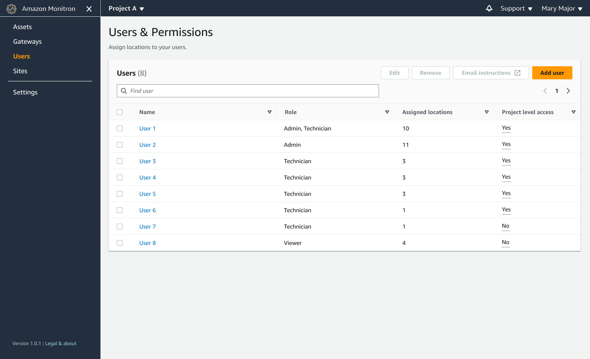

Amazon Monitron is no longer open to new customers. Existing customers can
continue to use the service as normal. For capabilities similar to Amazon
Monitron, see our [blog post](https://aws.amazon.com/blogs/machine-learning/maintain-access-and-consider-alternatives-for-amazon-monitron "https://aws.amazon.com/blogs/machine-learning/maintain-access-and-consider-alternatives-for-amazon-monitron").

# Adding users as an admin

As an admin, you can add other users (including other admin users) in the
Amazon Monitron web app.

1. Navigate to the project or site that you want to add a user to, and then
   to the **Users** list.

 2. Enter a user name. Amazon Monitron searches the user directory for the
user.

Choose the user from the list and the role you want to assign to the user:
**Admin**, **Technician**, or
**Viewer**.

Then, choose **Add user**.

 3. The new user appears on the **Users** list.

Send the new user an email invitation with a link for accessing the
project and downloading the Amazon Monitron mobile app. For more information, see
[Sending an email invitation](resending-email.md "resending-email.md").
