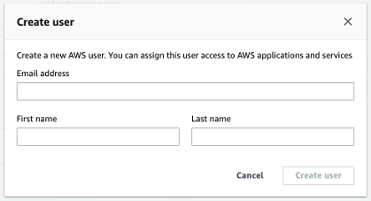

Amazon Monitron is no longer open to new customers. Existing customers can
continue to use the service as normal. For capabilities similar to Amazon
Monitron, see our [blog post](https://aws.amazon.com/blogs/machine-learning/maintain-access-and-consider-alternatives-for-amazon-monitron "https://aws.amazon.com/blogs/machine-learning/maintain-access-and-consider-alternatives-for-amazon-monitron").

# Step 3: Create admin users

Give access to one or more people in your organization (such as reliability
managers) as _admin users_. An _admin user_ is a person who belongs to an Amazon Monitron project
and who can add other users to the project.

When you add an admin user, Amazon Monitron creates an account for that user in AWS IAM Identity Center.
IAM Identity Center is a service that helps you manage SSO access to AWS accounts and
applications in your organization. Amazon Monitron uses IAM Identity Center to authenticate users for the
Amazon Monitron mobile app.

If you haven't enabled IAM Identity Center in your AWS account, Amazon Monitron enables it for you when
you create your first Amazon Monitron admin user. If you are already using IAM Identity Center in your
account, then your IAM Identity Center users are shown in the Amazon Monitron console.

Complete the steps in this section to add yourself to your project as an admin
user. Repeat them for each additional admin user that you want to create.

###### To create an admin user

Unless you already use IAM Identity Center in your AWS account, use Amazon Monitron to create admin
users. If these users are already in IAM Identity Center, you can skip creating the users, and
you are ready to assign the admin role to them.

1. Open the Amazon Monitron console at [https://console.aws.amazon.com/monitron](https://console.aws.amazon.com/monitron/ "https://console.aws.amazon.com/monitron/").
2. On the **Add project admin user** page, choose
   **Create user**.
3. In the **Create user** section, enter the admin user's
   email address and name.

 4. Choose **Create user**.

Amazon Monitron creates a user in IAM Identity Center. IAM Identity Center sends the user an email that contains
a link to activate the account. The link is valid for up to seven days.
Within this time, each user must open the email and accept the
invitation.

###### To assign the admin role to the admin users

1. On the **Add project admin user** page, select the
   checkbox for each admin user that you created.
2. Choose **Add**.

You can add admin users to your project even if those people have not yet
accepted the invitations to their IAM Identity Center accounts.
