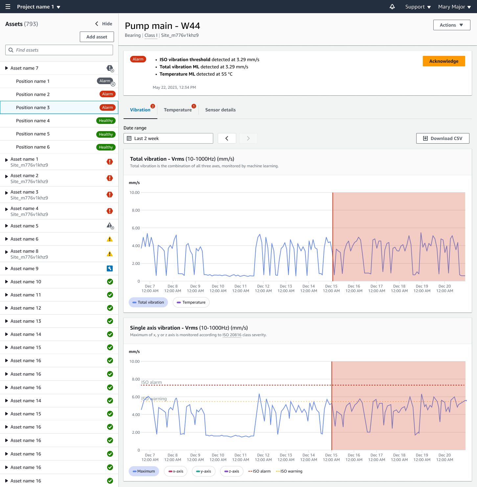

Amazon Monitron is no longer open to new customers. Existing customers can
continue to use the service as normal. For capabilities similar to Amazon
Monitron, see our [blog post](https://aws.amazon.com/blogs/machine-learning/maintain-access-and-consider-alternatives-for-amazon-monitron "https://aws.amazon.com/blogs/machine-learning/maintain-access-and-consider-alternatives-for-amazon-monitron").

# Acknowledging a machine abnormality

After receiving a notification, the admin user or technician must acknowledge it.
Acknowledging the notification lets other users know that the issue has been noted and
that action will be taken.

###### Topics

- [To view and acknowledge a machine
  abnormality](#anom-acknowledge "#anom-acknowledge")

## To view and acknowledge a machine

abnormality

1. From the **Assets** list, choose the asset that is
   reporting an abnormality.
2. To view the issue, choose the position with the abnormality.

Sensor measurements that show the anomaly are displayed.

 3. Choose **Acknowledge**.

The status of the asset changes to **Maintenance**.
