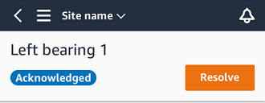
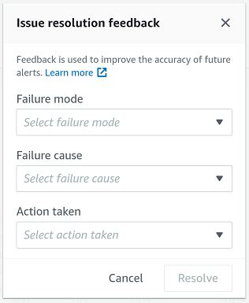

Amazon Monitron is no longer open to new customers. Existing customers can
continue to use the service as normal. For capabilities similar to Amazon
Monitron, see our [blog post](https://aws.amazon.com/blogs/machine-learning/maintain-access-and-consider-alternatives-for-amazon-monitron "https://aws.amazon.com/blogs/machine-learning/maintain-access-and-consider-alternatives-for-amazon-monitron").

# Resolving an abnormality

After an abnormality has occurred and been acknowledged, it must be addressed. You
might fix it yourself, or call in a specialist. After the machine that reported the
abnormality has been fixed, resolve the abnormality in the Amazon Monitron app.

Resolving an abnormality returns the sensor to a healthy state. It also sends Amazon Monitron information about the problem so it can better predict similar
abnormalities.

You can choose from among many common types of failure (called failure modes) and
causes of failures. If none of the modes or causes apply to your situation, choose
**Other**.

###### Topics

- [Failure modes](#failure-modes "#failure-modes")
- [Failure causes](#failure-causes "#failure-causes")
- [To resolve a machine abnormality using the mobile
  app](#anom-resolve "#anom-resolve")

## Failure modes

The following are the Amazon Monitron failure modes or types:

- **No failure detected (mute alert)**: Alert
  won't trigger if same abnormal condition is detected
- **Blockage**: Obstruction that causes
  restrictive operation
- **Cavitation**: Loss of pump suction pressure
- **Corrosion**: Moist corrosion, fretting
  corrosion, false brinelling
- **Deposit**: Build up of particles
- **Imbalance**: Rotating component out of
  balance
- **Lubrication**: Insufficient lubrication or
  improper lubrication
- **Misalignment**: Rotating assembly is not
  aligned
- **Other**
- **Resonance**: External vibration sources
- **Rotating looseness**: Rotating components
  like fan blade or pulley loose
- **Structural looseness**: Mounting of
  component is loose
- **Transmitted fault**: Caused by external
  forces
- **Undetermined (keep monitoring)**: Alert
  will trigger if same abnormal condition is detected.

## Failure causes

The following are the Amazon Monitron failure causes:

- **Administrtion**: Operator error
- **Design**: Manufacturer design insufficient
- **Fabrication**: Asset was modified from
  original state
- **Maintenance**: Lack of maintenance
  performed on asset
- **Operation**: Operation state change
- **Other**: Storage, transportation
  (vibration/shock), bearing selection. manufacturing concerns, material
  concerns
- **Quality**: Manufacturer quality
  insufficient
- **Undetermined**: No root cause
  determined
- **Wear**: Breakdown/Degradation over
  time

## To resolve a machine abnormality using the mobile

app

1. From the **Assets** list, choose the asset that had an
   abnormality that you resolved.
2. Choose the position with the abnormality.
3. Choose **Resolve**.

 4. For **Failure mode**, choose the type of failure that
occurred.

 5. For **Failure cause**, choose the cause of the failure. 6. For **Action taken**, choose which action you took. 7. Choose **Submit**.
