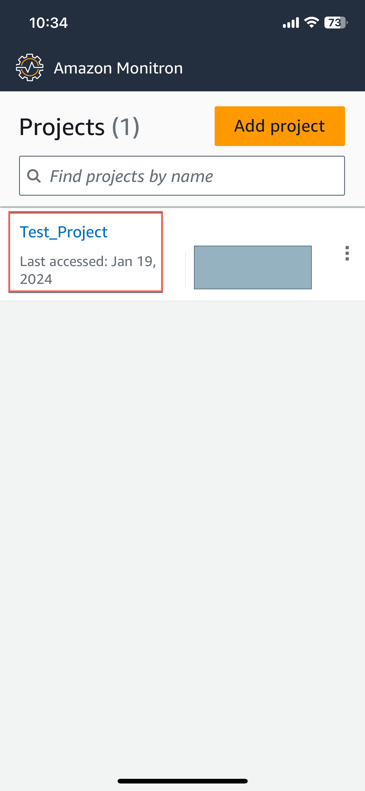
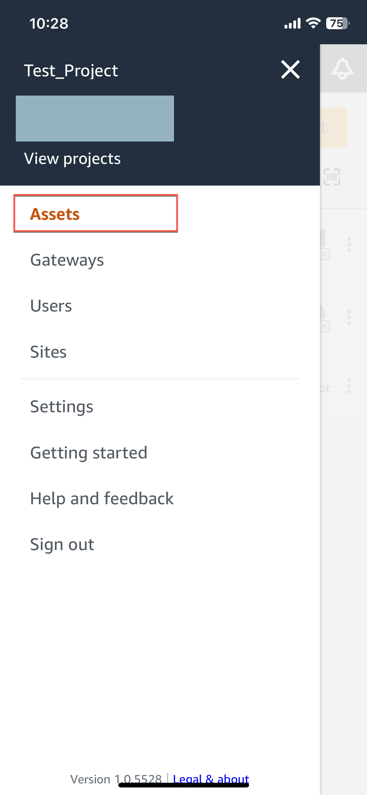
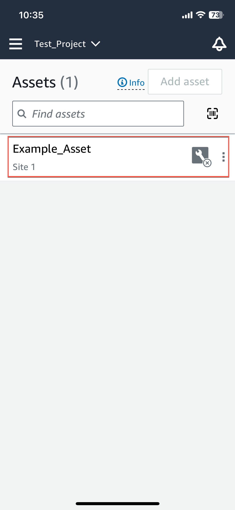
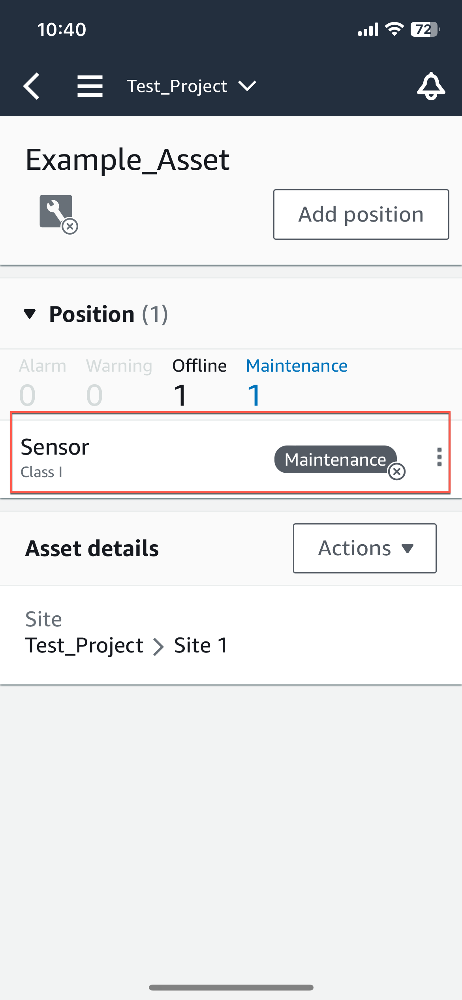
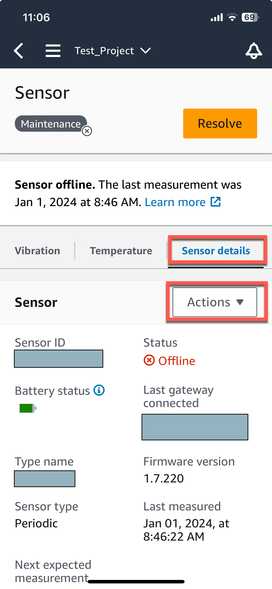
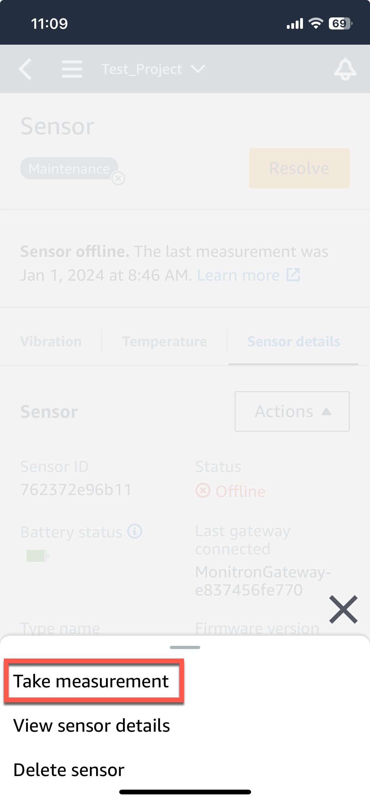
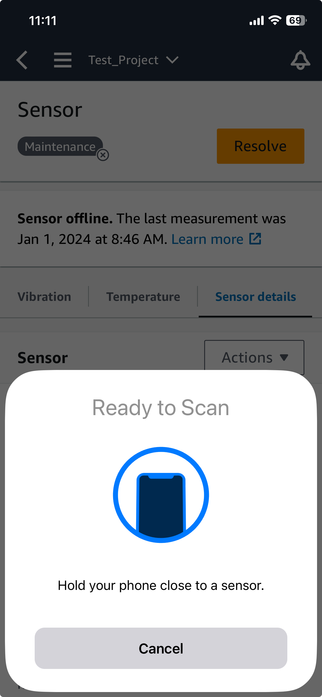
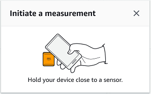
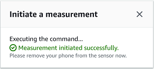

Amazon Monitron is no longer open to new customers. Existing customers can
continue to use the service as normal. For capabilities similar to Amazon
Monitron, see our [blog post](https://aws.amazon.com/blogs/machine-learning/maintain-access-and-consider-alternatives-for-amazon-monitron "https://aws.amazon.com/blogs/machine-learning/maintain-access-and-consider-alternatives-for-amazon-monitron").

# Taking a one-time measurement

In addition to viewing the measurements that a sensor normally makes, you can take a
one-time measurement with a sensor at any time.

###### Important

You can only take a sensor meaurement using the Amazon Monitron mobile app. Both admins and
technicians can take this action.

###### Topics

- [To take a one-time measurement (mobile app
  only)](#take-measure "#take-measure")

## To take a one-time measurement (mobile app

only)

1. From the Amazon Monitron mobile app, select your project.

 2. From the Amazon Monitron projects menu, select **Assets** .

 3. From the list of assets, choose the asset that is paired to the sensor
whose measurement you want to take.

 4. Then, select the sensor you want to take the measurement with.

 5. On the sensor page, from **Sensor details**, choose
**Actions**.

 6. From **Actions**, choose **Take
measurement**.

 7. Hold your smartphone close to the sensor.

 8. When the measurement has been taken, move your smartphone away from the
sensor.

The new measurement is added to the data that the sensor has already
collected.
