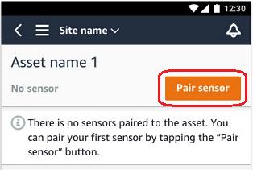
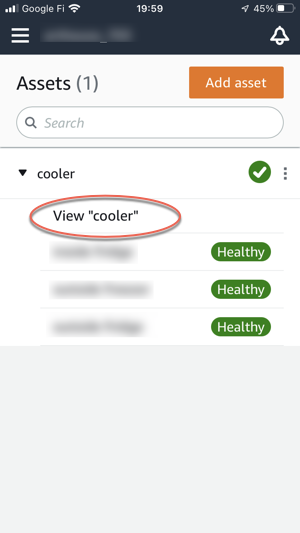
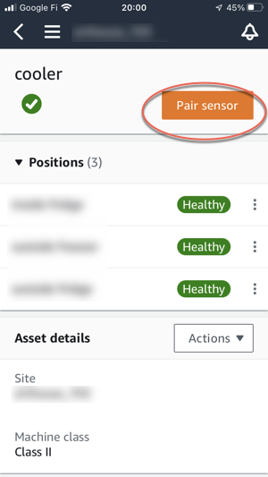
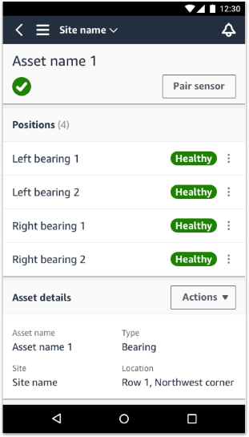

Amazon Monitron is no longer open to new customers. Existing customers can
continue to use the service as normal. For capabilities similar to Amazon
Monitron, see our [blog post](https://aws.amazon.com/blogs/machine-learning/maintain-access-and-consider-alternatives-for-amazon-monitron "https://aws.amazon.com/blogs/machine-learning/maintain-access-and-consider-alternatives-for-amazon-monitron").

# Pairing a sensor to an asset

After you've added an asset, pair it to one or more of the sensors to monitor its
health. Each sensor is mounted on the asset in its own position. Each sensor mounted on
the asset can be assigned its own machine class.

When you pair a sensor to an asset, you record the type of position. The type of
position tells Amazon Monitron how to assess the position when it analyzes the data
from that sensor. Each position can give a very different view of the asset. You will
often need to monitor multiple locations on a large asset to get a clear picture of its
health. You can place up to 20 sensors at different positions on an asset. Less complex
assets might require only one or two sensors.

Each sensor measures the temperature and vibration at its position. You can name a
position anything you like, and you can change the name later if necessary. For example,
a sensor set up to monitor the pump in the previous example might have a position of
_Left Position_, with a position type of `Pump`. The
position name identifies the location, whereas the position type tells Amazon Monitron which part of the asset it's monitoring. You can also edit the machine class assigned
to each sensor.

For more information about where to place sensors, see [Positioning a sensor](as-where-sensors.md "as-where-sensors.md").

###### Important

After you pair a sensor to an asset, Amazon Monitron establishes a baseline for
that position. The baseline tells Amazon Monitron how the asset performs under
normal conditions. Amazon Monitron uses this information to identify abnormal
conditions. During this time, Amazon Monitron assumes that conditions are normal
and won't produce any alarms.

###### Topics

- [To pair a sensor to an asset](#pair-sensor-asset "#pair-sensor-asset")

## To pair a sensor to an asset

1. Ensure that near field communication (NFC) is turned on for your
   smartphone.

###### Tip

For many smartphone models, NFC is turned on by default. The following
resources might help you determine whether you need to turn on NFC, and
how to do so:

    * [About
     NFC (Samsung)](https://www.samsung.com/hk_en/nfc-support/ "https://www.samsung.com/hk_en/nfc-support/")
    * [Models that support NFC Tag Reader (iPhone)](https://support.apple.com/guide/iphone/aside/asd-nfc-reader/14.0/ios/14.0 "https://support.apple.com/guide/iphone/aside/asd-nfc-reader/14.0/ios/14.0")

2. From the **Assets** list, choose the asset.
   - If you just created the asset:

   Choose **Add position**.

   
   - If you created the asset earlier, and have already paired more
     than one sensor to it:
     1. After you choose the asset, you will see a dropdown list
        of sensors associated with that asset.

     Choose the **View** option at the top of
     that list.

      2. Choose **Pair sensor**.

     

3. Place your sensor on the machine in the correct location. For more
   information about placing sensors, see [Positioning a sensor](as-where-sensors.md "as-where-sensors.md") and [Mounting a sensor](as-how-sensors.md "as-how-sensors.md").
4. Name the position that the sensor will monitor.

We recommend that you use a name that is clear and easy for you to work
with. 5. For **Position type**, choose the position type.

Valid values:

    * Bearing
    * Compressor
    * Fan
    * Gearbox
    * Motor
    * Pump
    * Other

###### Note

After you pair a sensor to an asset, you can't change the position
type. If you need to change the type, you must delete the sensor and
re-add it. 6. For **Machine class**, choose the machine class of the
asset part you are positioning the sensor on. Valid options are based on the
ISO 20816 standards.

**Class I**

Individual parts of engines and machines, integrally connected
to the complete machine in its normal operating condition, for
example, production electrical motors of up to 15 kilowatts (kW)
or 20 horsepower (hp).

**Class II**

Medium-sized machines (typically electrical motors with 15 to
75 kW (20 to 101 hp) output) without special foundations,
rigidly mounted engines or machines (up to 300 kW or 402 hp) on
special foundations.

**Class III**

Large prime-movers and other large machines with rotating
masses mounted on rigid and heavy foundations that are
relatively stiff in the direction of vibration.

**Class IV**

Large prime-movers and other large machines with rotating
masses mounted on rigid and heavy foundations that are
relatively soft in the direction of vibration measurement, for
example, turbo-generator sets and gas turbines with outputs
greater than 10 megawatt (MW) or 13,404 hp. 7. Choose **Next**. 8. Hold your smartphone close to the sensor to commission it. Don't move your
smartphone while you are commissioning the sensor.

It can take a few moments for Amazon Monitron to commission the sensor
and pair with it. While it's connecting, you will see the following
message.

###### Note

The appropriate way to hold your mobile device while pairing depends on the
type of mobile device you have. For more information, see [Troubleshooting Amazon Monitron device issues](troubleshooting.md "troubleshooting.md").

When more than one sensor is paired with a given asset, the
**Assets** page shows each sensor position and its health
status, but not the specific details about each position. To display the details,
choose the position from the list. For more information about the data you can
monitor with each asset, see [Understanding sensor measurements](anom-sensor-measure.md "anom-sensor-measure.md").

Positions are displayed in status order. For example, a position that's in an
alarm state is displayed above a position that's in an acknowledged state. Positions
that are in a healthy state follow those in an acknowledged state.
