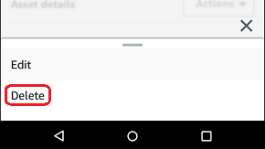
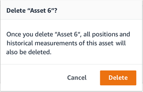
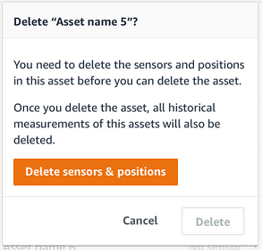
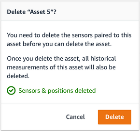

Amazon Monitron is no longer open to new customers. Existing customers can
continue to use the service as normal. For capabilities similar to Amazon
Monitron, see our [blog post](https://aws.amazon.com/blogs/machine-learning/maintain-access-and-consider-alternatives-for-amazon-monitron "https://aws.amazon.com/blogs/machine-learning/maintain-access-and-consider-alternatives-for-amazon-monitron").

# Deleting an asset

Deleting an asset removes all associated sensors and their positions, in addition to
any historical data associated with them.

###### Topics

- [To delete an asset](#asset-delete "#asset-delete")

## To delete an asset

1. From the app's main menu, choose **Assets**.
2. Choose the asset that you want to delete.
3. For **Asset details**, choose
   **Actions**.
4. Choose **Delete asset**.

 5. Choose one of the following options.

    * If there are no sensors paired with the asset, choose
     **Delete** and go to the next step.

    
    * If there are sensors paired with the asset, delete them.

    Choose **Delete sensors and positions**. When you
     delete a sensor or position, all historical measurements taken at
     this position will also be deleted.

    

    It can take some time for Amazon Monitron to delete all the
     paired sensors and positions.

6. Choose **Delete**.

