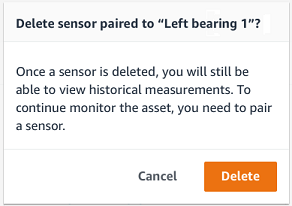
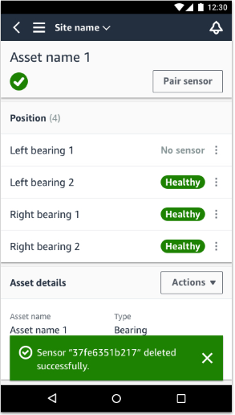
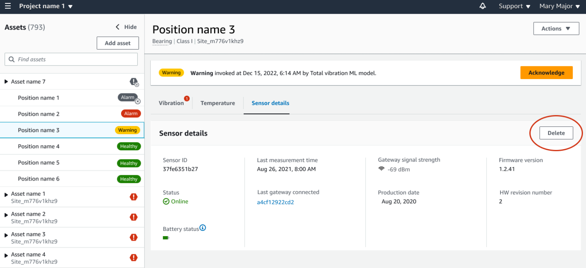

Amazon Monitron is no longer open to new customers. Existing customers can
continue to use the service as normal. For capabilities similar to Amazon
Monitron, see our [blog post](https://aws.amazon.com/blogs/machine-learning/maintain-access-and-consider-alternatives-for-amazon-monitron "https://aws.amazon.com/blogs/machine-learning/maintain-access-and-consider-alternatives-for-amazon-monitron").

# Deleting a sensor

Deleting a sensor prevents Amazon Monitron from collecting more data with it. It
doesn't delete the data that it has already collected.

###### Topics

- [To delete a sensor in the mobile app](#delete-sensor-mobile "#delete-sensor-mobile")
- [To delete a sensor in the web app](#delete-sensor-web "#delete-sensor-web")

## To delete a sensor in the mobile app

1. From the **Assets** list, choose the asset that is paired
   to the sensor that you want to delete.
2. Choose the sensor.
3. Under **Sensor**, choose
   **Actions**.
4. Choose **Delete sensor**.
5. Choose **Delete**.

After a sensor has been deleted, the status for that position says
**No sensor**.

## To delete a sensor in the web app

- Choose **Delete** from the **Sensor
  details** tab.

