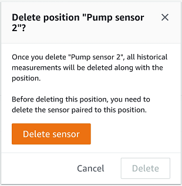

Amazon Monitron is no longer open to new customers. Existing customers can
continue to use the service as normal. For capabilities similar to Amazon
Monitron, see our [blog post](https://aws.amazon.com/blogs/machine-learning/maintain-access-and-consider-alternatives-for-amazon-monitron "https://aws.amazon.com/blogs/machine-learning/maintain-access-and-consider-alternatives-for-amazon-monitron").

# Deleting a sensor position

Deleting a sensor position removes that data collection point from the asset. If a
sensor is still paired to this position, you need to remove it before you can delete the
position.

###### Topics

- [To delete a sensor position in the
  mobile app](#delete-sensorposition-mobile "#delete-sensorposition-mobile")
- [To delete a sensor position in the web
  app](#delete-sensorposition-web "#delete-sensorposition-web")

## To delete a sensor position in the

mobile app

1. From the **Assets** list, choose the asset that has the
   sensor position that you want to delete.
2. Under **Sensors**, choose
   **Actions**.
3. Choose **Delete position**.
4. If the position has a sensor paired to it, delete the sensor by choosing
   **Delete sensor**. Otherwise, skip to the next
   step.

 5. Choose **Delete**.

## To delete a sensor position in the web

app

1. Select the position.
2. Choose the **Actions** button in the
   **Positions** table.
3. Choose **Delete position**.
4. If the position has a sensor paired to it, delete the sensor by choosing
   **Delete sensor**. Otherwise, skip to the next
   step.

 5. Choose **Delete**.
