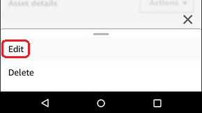
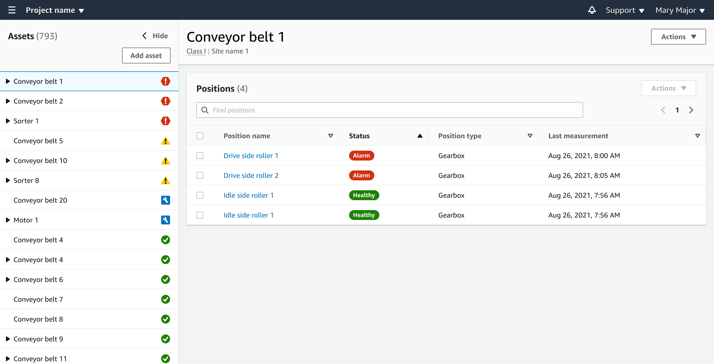

Amazon Monitron is no longer open to new customers. Existing customers can
continue to use the service as normal. For capabilities similar to Amazon
Monitron, see our [blog post](https://aws.amazon.com/blogs/machine-learning/maintain-access-and-consider-alternatives-for-amazon-monitron "https://aws.amazon.com/blogs/machine-learning/maintain-access-and-consider-alternatives-for-amazon-monitron").

# Changing an asset name

After you add an asset, you can change both its name and machine class.

###### Topics

- [To change an asset's name in the mobile
  app](#asset-edit-mobile "#asset-edit-mobile")
- [To change an asset's name in the web app](#asset-edit-web "#asset-edit-web")

## To change an asset's name in the mobile

app

1. From the app's main menu, choose **Assets**.
2. For **Asset details**, choose
   **Actions**.
3. Choose **Edit asset**.

 4. Enter a new name. 5. Choose **Save**.

## To change an asset's name in the web app

1. Select the asset.
2. In the large tab, choose the **Actions** button from the
   right end of the row containing the asset name.

 3. Enter a new name. 4. Choose **Save**.
