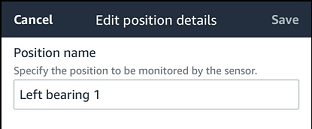
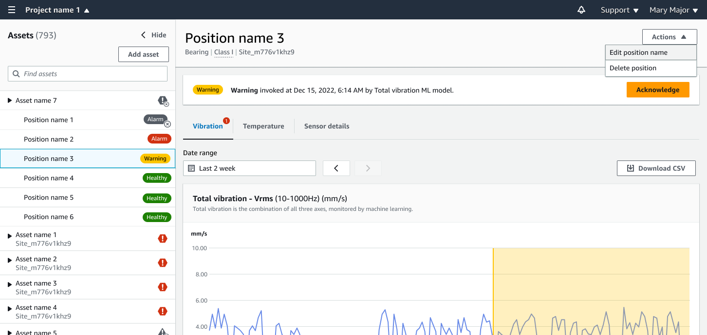

Amazon Monitron is no longer open to new customers. Existing customers can
continue to use the service as normal. For capabilities similar to Amazon
Monitron, see our [blog post](https://aws.amazon.com/blogs/machine-learning/maintain-access-and-consider-alternatives-for-amazon-monitron "https://aws.amazon.com/blogs/machine-learning/maintain-access-and-consider-alternatives-for-amazon-monitron").

# Renaming a sensor position

###### Topics

- [Renaming a sensor position on the mobile
  app](#rename-position-mobile "#rename-position-mobile")
- [Renaming a sensor position on the web
  app](#rename-position-web "#rename-position-web")

## Renaming a sensor position on the mobile

app

1. From the **Assets** list, choose the asset with the
   sensor position whose name you want to change.
2. Choose the sensor with the position whose name you want to change.
3. Choose the **Sensor details** tab.
4. Under **Position details**, choose
   **Actions**.
5. Choose **Edit position details**.
6. For **Position name**, enter a new name.

 7. Choose **Save**.

## Renaming a sensor position on the web

app

1. Select the position.

Choose the **Actions** button in the
**Positions** table.

 2. Choose **Edit position name**. 3. For **Position name**, enter a new name. 4. Choose **Save**.
