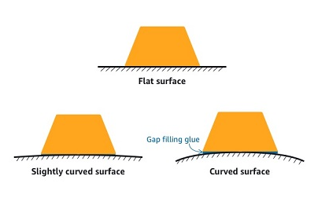

Amazon Monitron is no longer open to new customers. Existing customers can
continue to use the service as normal. For capabilities similar to Amazon
Monitron, see our [blog post](https://aws.amazon.com/blogs/machine-learning/maintain-access-and-consider-alternatives-for-amazon-monitron "https://aws.amazon.com/blogs/machine-learning/maintain-access-and-consider-alternatives-for-amazon-monitron").

# Mounting a sensor

###### Warning

Before you install and use sensors, see the [Amazon Monitron Sensor Device Safety and Compliance Guide](https://aws.amazon.com/monitron/terms/safety-and-compliance-information/ "https://aws.amazon.com/monitron/terms/safety-and-compliance-information/"). Before you install and
use Ex-rated sensors, see the Ex Safety and Compliance Guide for all warnings and
instructions.

The temperature and vibration detectors are located on the base of the Amazon Monitron sensors. Any area of the base is effective as a target contact area, but
the contact area must be at least 30 x 25 mm for reliable detection. Center the target
contact area over the mounting location for the most reliable results. The circular
aluminum sensor (in the center of the target contact area) conducts heat directly from
the asset's surface to the temperate sensing mechanism inside the Amazon Monitron
sensor.

Determine the place and orientation where you can most effectively monitor the asset,
and then mount sensor at that spot. To mount the sensor, you need to purchase an
industrial adhesive. We recommend using cyanoacrylate epoxies like Loctite 454 and
Loctite 3090 or Loctite 4070 or something similar. If the surface on which you mount the
sensor is flat and relatively smooth, only a thin layer of adhesive such as Loctite 454
is needed. If the surface is rounded or somewhat uneven, apply a slightly thicker layer
of adhesive such as Loctite 3090 or Loctite 4070.

If you are uncertain of where to mount your sensor, see [Positioning a sensor](as-where-sensors.md "as-where-sensors.md").

###### Warning

When installing sensors, check and obey applicable safety regulations. You are
solely responsible for safely installing the sensor on any equipment or machine
part. To mount a sensor, you use industrial adhesive. Always consult and obey the
adhesive manufacturer's safety and handling instructions.

For more information about the recommended adhesive, see [Loctite 454 Technical Information](https://www.henkel-adhesives.com/us/en/product/instant-adhesives/loctite_454.html "https://www.henkel-adhesives.com/us/en/product/instant-adhesives/loctite_454.html"), or [Loctite 3090 Technical Information](https://www.henkel-adhesives.com/us/en/product/instant-adhesives/loctite_3090.html "https://www.henkel-adhesives.com/us/en/product/instant-adhesives/loctite_3090.html"), or [Loctite 4070 Technical Information](https://next.henkel-adhesives.com/us/en/products/industrial-adhesives/central-pdp.html/loctite-hy-4070/201200004WPN.html "https://next.henkel-adhesives.com/us/en/products/industrial-adhesives/central-pdp.html/loctite-hy-4070/201200004WPN.html"), as appropriate.

###### To mount a sensor

1. Remove all oil and grease from the position on the asset where you want to
   mount the sensor.
2. If the surface that you're mounting the sensor to is flat and relatively
   smooth, apply a thin layer of adhesive such as Loctite 454 to the bottom of the
   sensor, maximizing the area that will be in contact with the asset.

If the surface is rounded or somewhat uneven, apply a slightly more liberal
layer of adhesive such as Loctite 3090 or Loctite 4070 to the bottom of the
sensor. The layer of adhesive can bridge distances of up to 5 mm between the
surface and the sensor if necessary. 3. Hold the sensor to the mounting location on the machine part for 30 seconds,
pressing firmly.

If you're mounting the sensor on a curved surface, put a small amount of
additional adhesive on each side for better contact between the sensor and the
surface. Based on the surface and the adhesive used, your results should look
similar to the following.

