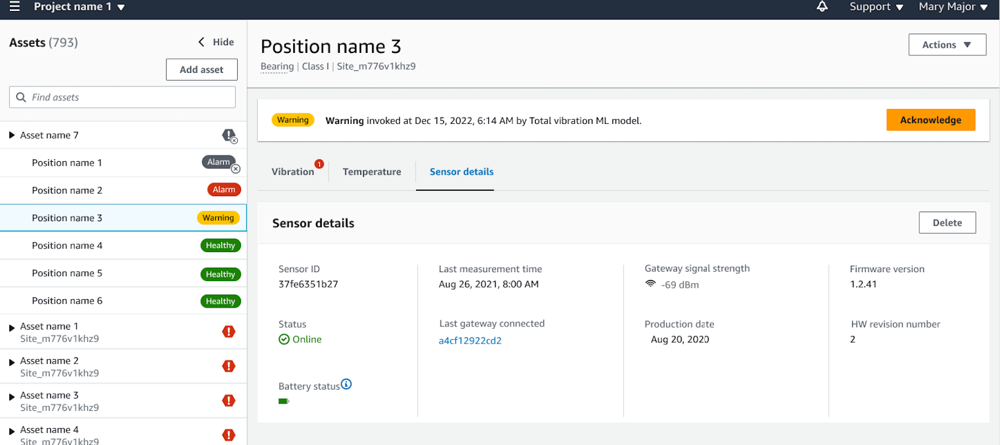

Amazon Monitron is no longer open to new customers. Existing customers can
continue to use the service as normal. For capabilities similar to Amazon
Monitron, see our [blog post](https://aws.amazon.com/blogs/machine-learning/maintain-access-and-consider-alternatives-for-amazon-monitron "https://aws.amazon.com/blogs/machine-learning/maintain-access-and-consider-alternatives-for-amazon-monitron").

# Understanding sensor details

To check that a sensor is performing as expected, check its details page. The
**Sensor details** page shows the following information:

- Sensor ID
- Sensor status
- Date the sensor was last commissioned
- Date of the last measurement
- Last gateway it connected to
- Current signal strength of the last gateway
- Sensor type
- Firmware version
- Sensor battery status

###### Topics

- [Viewing sensor details](#view-sensor-status "#view-sensor-status")
- [Sensor connectivity status](#sensor-connectivity-status "#sensor-connectivity-status")
- [Sensor battery status](#sensor-battery-status "#sensor-battery-status")

## Viewing sensor details

You can view sensor details on both the mobile and web app. The following section
shows you how.

### To view sensor details in the mobile

app

1. From the **Assets** list, choose the asset that is
   paired with the sensor that you want to view.
2. Choose the sensor.
3. Select the Position that is connected to the sensor you want to view.
4. Choose the **Sensor details** tab.
5. Choose the **Sensor Actions** button.
6. Choose **View sensor details**.

|                                                                                                        |                                                                                                            |
| ------------------------------------------------------------------------------------------------------ | ---------------------------------------------------------------------------------------------------------- |
| Menu options showing "View sensor details" and "Delete sensor" with "View sensor details" highlighted. | Sensor details interface showing vibration warning, sensor status, and position information for a gearbox. |

The **Sensor details** page is displayed.

### To view sensor details in the web

app

1. From the **Assets** list, choose the asset that is
   paired with the sensor that you want to view.
2. Information about the sensor will be shown automatically in the
   **Sensor details** tab on the lower right side of
   the app window.

## Sensor connectivity status

When you create a sensor, you can monitor its position and connectivity status on
the Amazon Monitron assets list. Sensor position states are
**healthy/maintenance/warning/alarm** and sensor connectivity
states are **online/offline**. A sensor's default state is
**online**. If it times out due to connectivity issues, its
state will change to **offline**. Once connectivity is restored,
the sensor will return to an **online** state. A sensor will
maintain its most recent states if it goes offline.

An asset's badge on the asset list shows its most severe position and connectivity
states. If its position includes both **warning** and
**healthy** states, it will have a **warning**
state on the asset list. If at least one asset is **offline**, it
will have an **offline** state in the asset list.

###### Note

If a sensor is **offline**, its status is prioritized in the
Amazon Monitron application asset list. The app does not support notifications if a
sensor goes offline, but the app will indicate if a device goes offline.

The following images show sensors that are offline.

|                                                                                         |                                                                                            |                                                                                  |
| --------------------------------------------------------------------------------------- | ------------------------------------------------------------------------------------------ | -------------------------------------------------------------------------------- |
| Asset monitoring interface showing positions with alarm, warning, and offline statuses. | Assets list in a project interface showing multiple asset entries with unique identifiers. | Sensor status interface showing offline warning and vibration measurement graph. |

## Sensor battery status

To help you keep track of your sensor health, each Amazon Monitron displays a
sensor battery life status. You can check your sensor battery life from both the
mobile app and the web app. You can use this battery status to decide when to buy
new sensors.

###### Note

Estimated remaining battery life is calculated based on 5 years sensor battery
life for a sensor taking measurements hourly.

###### Important

Battery life status is not available for sensors with a firmware version less
than 1.6.0. You need to wait until the sensor is updated to view battery life
status.

The following table shows the different sensor battery states:

| Battery status                                                   | Condition   | Time remaining                                  | Action                                                                                                                                                                                                                                                                                                                                                                              |
| ---------------------------------------------------------------- | ----------- | ----------------------------------------------- | ----------------------------------------------------------------------------------------------------------------------------------------------------------------------------------------------------------------------------------------------------------------------------------------------------------------------------------------------------------------------------------- |
| Battery status icon showing a green bar indicating charge level. | **Normal**  | Sensor battery is in healthy state.          | No sensor battery monitoring currently needed.                                                                                                                                                                                                                                                                                                                                   |
| Battery status icon showing a nearly empty battery level.        | **Low**     | Battery has less than 1 year of life left.   | Begin monitoring your sensor battery.                                                                                                                                                                                                                                                                                                                                            |
| Battery status indicator showing very low charge level.          | **Urgent**  | Battery has less than 3 months of life left. | Replace your sensor as soon as possible.                                                                                                                                                                                                                                                                                                                                         |
| Battery status indicator showing "Unknown" status.               | **Unknown** | Battery life status is unknown.                 | 1. If commissioning sensor for the first time, wait for a minute till the sensor sends its first measurement. 2. Then, make sure you have commisioned a gateway correctly and take a measurement using the mobile app. See [Gateways](gateways.md "gateways.md") and [Taking a one-time measurement](anom-take-measure.md "anom-take-measure.md") for details. |

###### Note

If you do not replace your sensor after its battery status is urgent, the
sensor's connectivity state will change to **Offline**.
