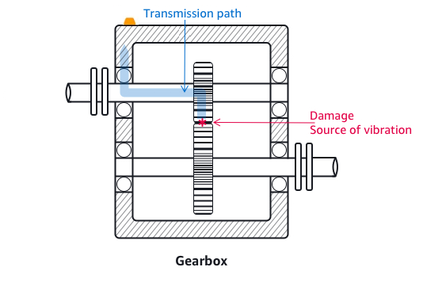
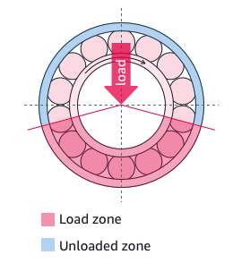
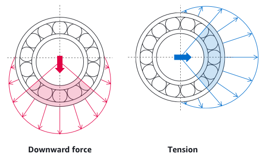

Amazon Monitron is no longer open to new customers. Existing customers can
continue to use the service as normal. For capabilities similar to Amazon
Monitron, see our [blog post](https://aws.amazon.com/blogs/machine-learning/maintain-access-and-consider-alternatives-for-amazon-monitron "https://aws.amazon.com/blogs/machine-learning/maintain-access-and-consider-alternatives-for-amazon-monitron").

# Positioning a sensor

To detect abnormalities in machine components, mount sensors in all locations where
temperature and vibrations can be measured effectively.

To achieve the greatest accuracy:

- Mount the sensor directly onto the housing of the target component.
- Minimize the length of the vibration transmission path (the distance between
  the source of vibration and sensor).
- Avoid mounting the sensor where its measurements may oscillate due to natural
  frequencies, such as on sheet metal covers.
  Vibration will attenuate up to 30-36" (75–90 cm) from the source.

Attributes of the vibration transmission path that can reduce the transmission path
length include:

- the number of mounting surfaces, which can cause signal reflection
- materials such as rubber or plastic, which can absorb vibration

###### Note

Amazon Monitron sensors are 3-axis vibration sensors. The X, Y, and Z marks
indicate the directions of the 3 three axes. These axes are marked on the sensor
body. Therefore, it is not necessary to align any particular axis with the direction
of the asset's vibration.

The following example of an electric motor pump set shows sensor locations, with four
positions: two on the motor and two on the pump.

The following example shows where you might mount sensors if your primary concern is
the motor rather than the pump.

Gearboxes and bearings are also examples of common locations where you might want to
place sensors.

For complex equipment with multiple moving parts (such as gearboxes), position the
sensor to minimize the length of the transmission path from the primary vibration
source. Note that vibration is reduced when it is transmitted between adjacent parts of
equipment, so the shortest distance between the sensor and the source of vibration is
not always the best option.

The following example of a gearbox shows how vibration can be transmitted through
equipment in this way, along with a potential location for a sensor to detect this
vibration.

For other types of equipment, the best position can be less obvious. For example, when
placing a sensor to monitor bearings, position it close to the bearing's load zone,
which is based on the direction of the load on the bearings as shown below.

Different types of loads on the bearings result in different load zones. Placing the
sensor as close as possible to the center of the load zone is most likely to provide the
best data.

For information about how to mount sensors, see [Mounting a sensor](as-how-sensors.md "as-how-sensors.md").
