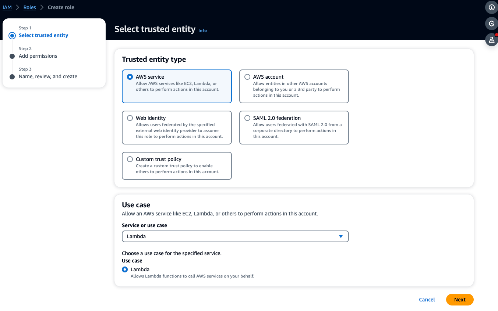
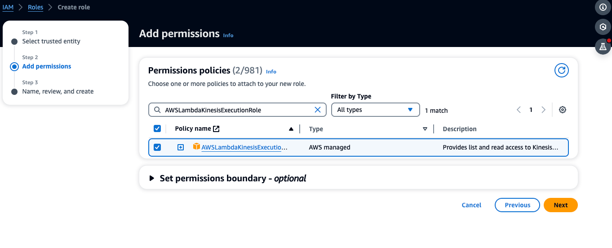
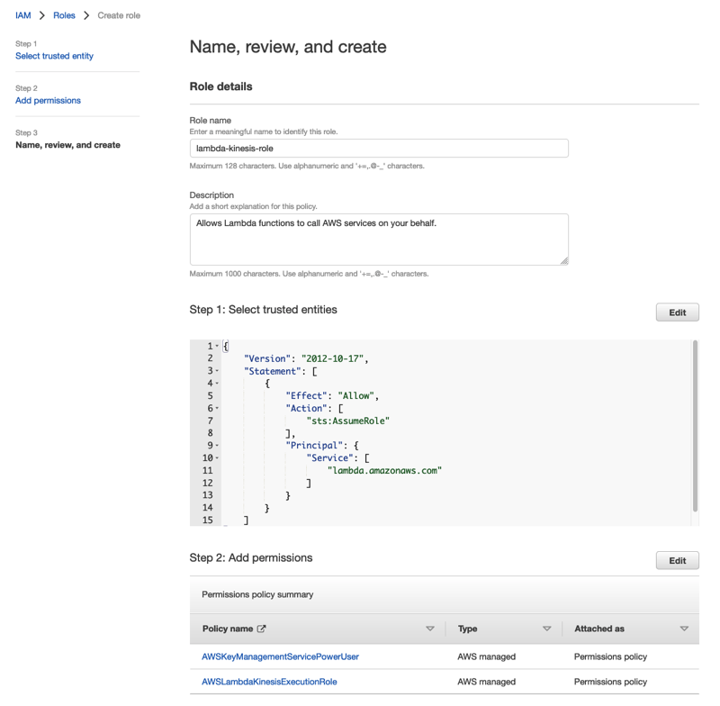
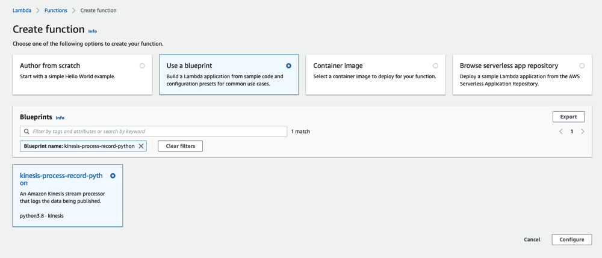
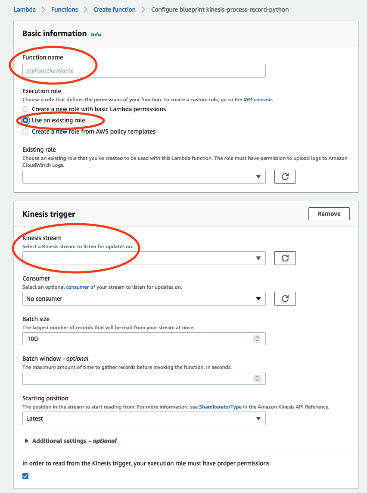
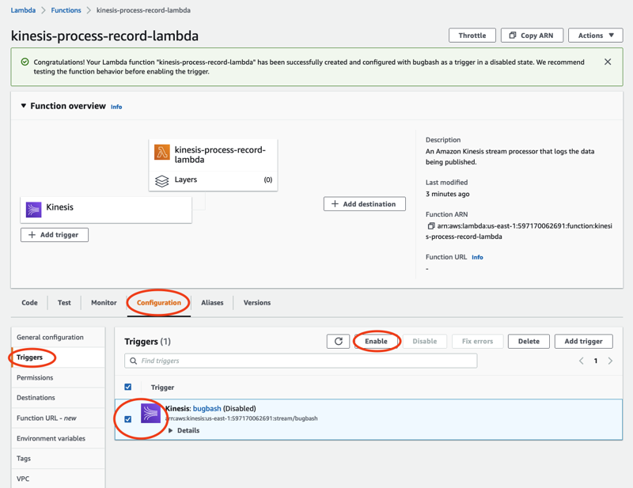

Amazon Monitron is no longer open to new customers. Existing customers can
continue to use the service as normal. For capabilities similar to Amazon
Monitron, see our [blog post](https://aws.amazon.com/blogs/machine-learning/maintain-access-and-consider-alternatives-for-amazon-monitron "https://aws.amazon.com/blogs/machine-learning/maintain-access-and-consider-alternatives-for-amazon-monitron").

# Processing data with Lambda

###### Topics

- [Step 1: Create the IAM
  role that gives your function permission to access AWS
  resources](#data-export-lambda-v2-1 "#data-export-lambda-v2-1")
- [Step 2: Create the Lambda function](#create-lambda-function-v2 "#create-lambda-function-v2")
- [Step 3: Configure the Lambda function](#configure-lambda-function-v2 "#configure-lambda-function-v2")
- [Step 4: Enable Kinesis trigger in AWS Lambda console](#configure-kinesis-trigger-v2 "#configure-kinesis-trigger-v2")

## Step 1: Create the [IAM

role](../../../lambda/latest/dg/lambda-intro-execution-role.md "../../../lambda/latest/dg/lambda-intro-execution-role.md") that gives your function permission to access AWS
resources

1. Open the [roles
   page](https://console.aws.amazon.com/iam/home?#/roles "https://console.aws.amazon.com/iam/home?#/roles") in the IAM console.
2. Choose **Create role**.
3. On the **Select trusted entity** page, do the
   following:
   - In **Trusted entity type**, choose
     **AWS service**.
   - In **Use case**, for **Service or use
     case** choose **Lambda**.
   - Choose **Next**.

   

4. In the **Add permissions** page, do the following:
   - In **Permissions policies**, choose
     AWSLambdaKinesisExecutionRole (and
     AWSKeyManagementServicePowerUser if the Kinesis stream is
     encrypted).
   - Leave the configurations in **Set permissions
     boundary** as is.
   - Choose **Next**.

   

5. In the **Name, review, and create** page, do the
   following:
   - In **Role details**, for **Role
     name**, enter a name for your role. For example
     `lambda-kinesis-role`. You can also
     choose to add an optional
     **Description**.
   - Leave the settings for **Step 1: Select trusted
     entities** and **Step 2: Add
     permissions** as is. You can choost to add tags in
     **Step 3: Add tags** to keep track of your
     resources.

 6. Select **Create role**.

## Step 2: Create the Lambda function

1. Open the **Functions** page in the Lambda
   console.
2. Choose **Create function**.
3. Choose **Use a blueprint**.
4. In the **Blueprints** search bar, search and choose
   **kinesis-process-record (nodejs)** or
   **kinesis-process-record-python**.
5. Choose **Configure**.

## Step 3: Configure the Lambda function

1. Choose **Function name**
2. Choose the role created in the first step as the **Execution
   role**.
3. Configure Kinesis trigger.
   1. Choose your Kinesis stream.
   2. Click **Create function**.

## Step 4: Enable Kinesis trigger in AWS Lambda console

1. On the **Configuration** tab, choose
   **Triggers**.
2. Check the box next to the name of the Kinesis stream and choose
   **Enable**.

The blueprint used in this example only consumes log data from the selected
stream. You can further edit Lambda function code later to complete a more
complicated task.
