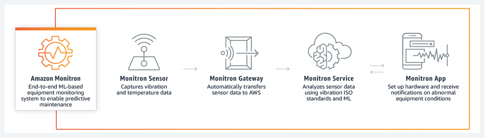

Amazon Monitron is no longer open to new customers. Existing customers can
continue to use the service as normal. For capabilities similar to Amazon
Monitron, see our [blog post](https://aws.amazon.com/blogs/machine-learning/maintain-access-and-consider-alternatives-for-amazon-monitron "https://aws.amazon.com/blogs/machine-learning/maintain-access-and-consider-alternatives-for-amazon-monitron").

# The Amazon Monitron workflow

The following diagram shows the basic workflow of Amazon Monitron.

1. An Amazon Monitron sensor captures temperature and vibration data from the
   equipment (the asset) and transmits it to the gateway.
2. An Amazon Monitron gateway transmits the data to the AWS
   Cloud using the factory's internet connection.
3. The Amazon Monitron ML-based service in the AWS Cloud
   analyzes the sensor data.
   1. Amazon Monitron looks for abnormalities in the data that could
      indicate developing faults.
   2. If Amazon Monitron finds potential failures, it notifies
      reliability managers and technicians through the Amazon Monitron app
      so they can take appropriate action.
   3. Technicians investigate based on the alerts, and resolve the
      developing fault. They enter feedback on the accuracy of the alerts, and
      report the failure mode, cause, and action taken in the app. Amazon Monitron learns from this feedback and continually improves.

4. The app displays current and past temperature and vibration data in charts
   that are easy to understand and can be used while investigating an issue.
