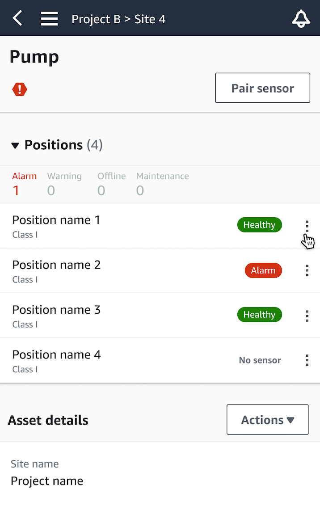
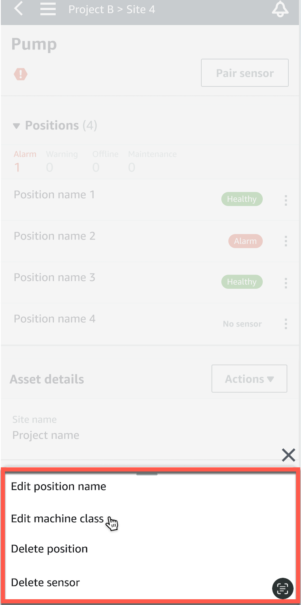
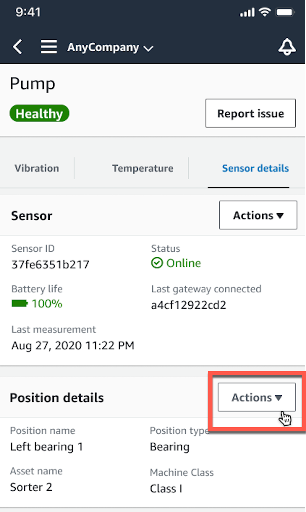
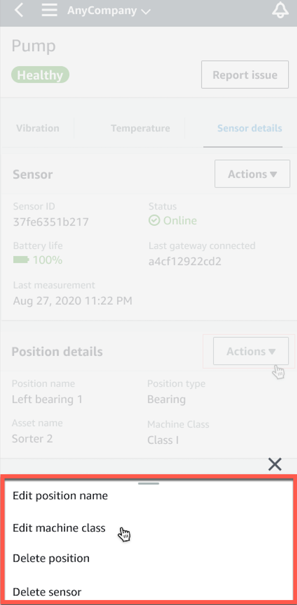
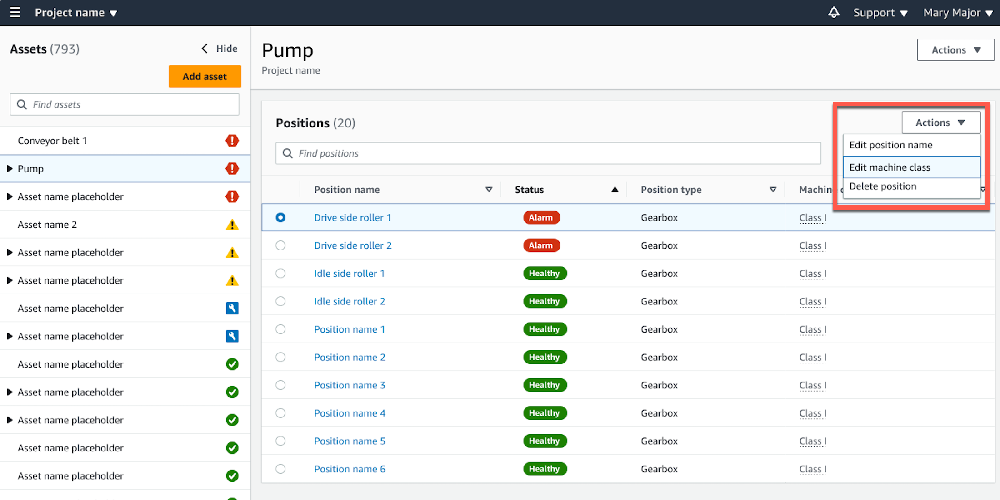
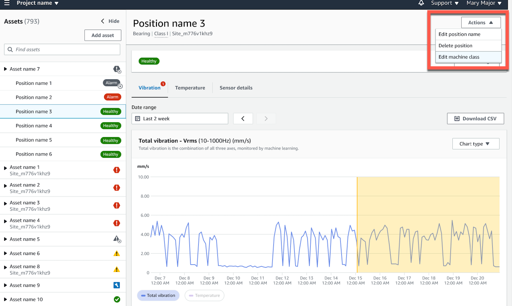

Amazon Monitron is no longer open to new customers. Existing customers can
continue to use the service as normal. For capabilities similar to Amazon
Monitron, see our [blog post](https://aws.amazon.com/blogs/machine-learning/maintain-access-and-consider-alternatives-for-amazon-monitron "https://aws.amazon.com/blogs/machine-learning/maintain-access-and-consider-alternatives-for-amazon-monitron").

# Editing machine class

You can edit the machine class of a sensor from both the mobile and web apps, from
either the **Asset detail** section or the **Position
detail** section.

When you edit a sensor's machine class, asset condition alerts based on the updated
machine class take effect from the next measurement after the update.

###### Important

You cannot edit a sensor's machine class if it has an unresolved alert. You must
resolve any alerts before editing machine class.

###### Topics

- [To edit machine class on the
  mobile app](#edit-sensor-machine-class-mobile "#edit-sensor-machine-class-mobile")
- [To edit machine class on the web
  app](#edit-sensor-machine-class-web "#edit-sensor-machine-class-web")
- [To edit machine class
  from the position detail page](#edit-sensor-machine-class-position-detail "#edit-sensor-machine-class-position-detail")

## To edit machine class on the

mobile app

1. From the **Assets** list, choose the asset with the
   sensor position you want to edit.
2. From the **Positions** list, choose the sensor with the
   position whose machine class you want to change.
3. Choose to see more sensor details.

 4. From the options that appear, choose **Edit machine
class**.

 5. From **Edit machine class** choose the new machine class
you want to assign to the sensor. Select **Save**.

###### Note

The new machine class will take effect at the next measurement
interval. The single-axis chart threshold will be updated.

###### To edit a machine class from the position detail page

1. From the **Position details** list, choose the
   **Actions** tab.

 2. From the options that appear, choose **Edit machine
class**.

 3. From the **Edit machine class** menu choose the new
machine class you want to assign to the sensor. Choose
**Next**.

###### Note

The new machine class will take effect at the next measurement
interval. The single-axis chart threshold will be updated.

## To edit machine class on the web

app

1. From the **Assets** table, choose the
   **Actions** button.
2. From the options, choose **Edit machine class**.

 3. From the **Edit machine class** menu choose the new
machine class you want to assign to the sensor and then select
**Save changes**.

###### Note

The new machine class will take effect at the next measurement
interval and impact position status. The single-axis chart threshold
will be updated.

## To edit machine class

from the position detail page

1. From the **Positions** table, choose the
   **Actions** button.
2. From the options, choose **Edit machine class**.

 3. From the **Edit machine class** menu choose the new
machine class you want to assign to the sensor and then select
**Save changes**.

###### Note

The new machine class will take effect at the next measurement
interval. The single-axis chart threshold will be updated.
