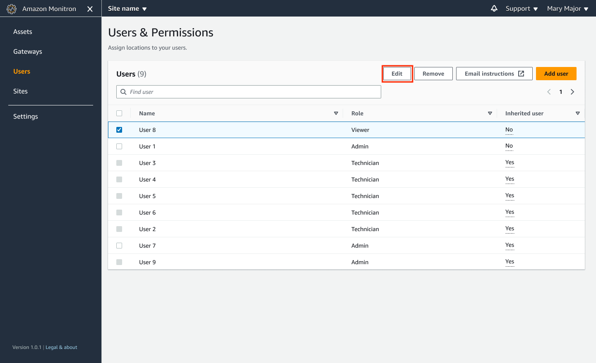
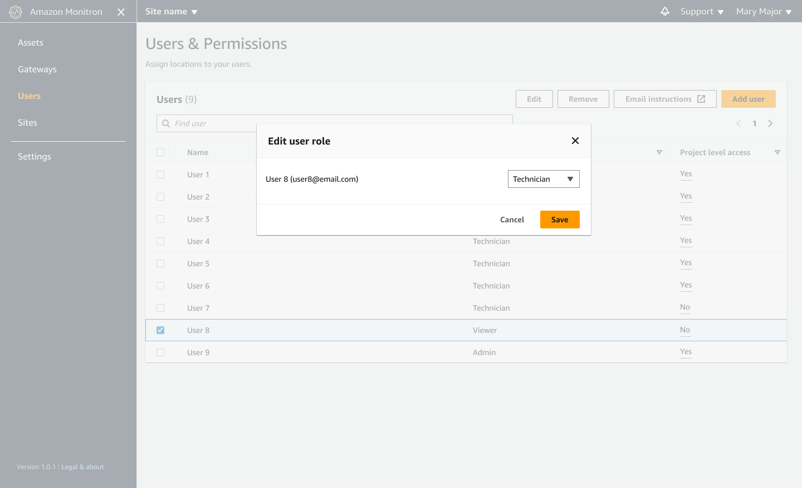

Amazon Monitron is no longer open to new customers. Existing customers can
continue to use the service as normal. For capabilities similar to Amazon
Monitron, see our [blog post](https://aws.amazon.com/blogs/machine-learning/maintain-access-and-consider-alternatives-for-amazon-monitron "https://aws.amazon.com/blogs/machine-learning/maintain-access-and-consider-alternatives-for-amazon-monitron").

# Changing a user role

You can change a user's role, but not a user's name. That's because the name is
linked to the user directory that is linked to by Amazon Monitron.

To change a project or site's users, you must remove the previous users and add
the new ones. For information on removing users from a project or site, see [To remove a user using the mobile app](deleting-user.md "deleting-user.md"). For information on
adding new users, see [Adding a user](adding-user.md "adding-user.md").

###### Topics

- [To change a user role using the mobile app](#w2aac28c19c19b9 "#w2aac28c19c19b9")
- [To change a user role using the web app](#w2aac28c19c19c11 "#w2aac28c19c19c11")

## To change a user role using the mobile app

1. Log into the Amazon Monitron mobile app on your smartphone.
2. Navigate to the project or site for the user whose role you want to
   change, and then to the **Users** list.
3. Choose the vertical ellipsis (
   
   ) next to the name of the user whose role you want
   to change.
4. Choose **Edit user**.
5. Choose a new role for the user: **Admin**,
   **Technician**, or **Read only**.
6. Choose **Save**.

## To change a user role using the web app

1. Choose **Users** from the navigation pane.

 2. Choose **Edit user role**. 3. Choose a new role for the user: **Admin**,
**Technician**, or **Viewer**.

 4. Choose **Save**.
