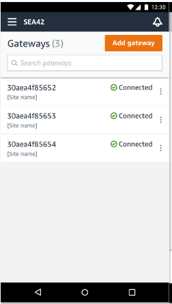
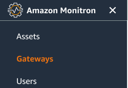
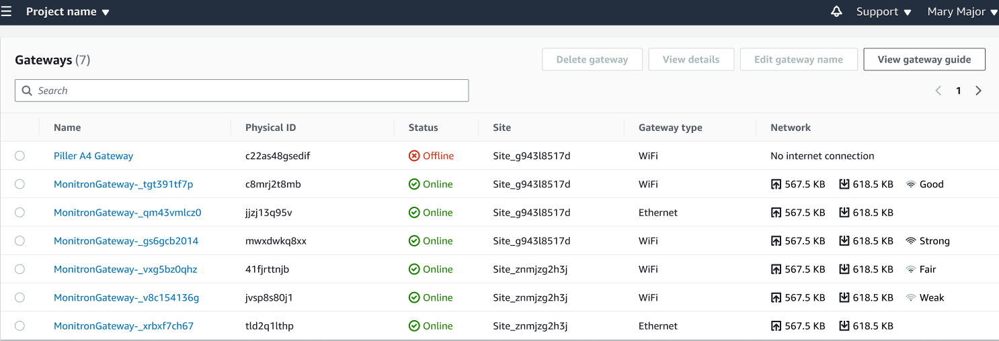

Amazon Monitron is no longer open to new customers. Existing customers can
continue to use the service as normal. For capabilities similar to Amazon
Monitron, see our [blog post](https://aws.amazon.com/blogs/machine-learning/maintain-access-and-consider-alternatives-for-amazon-monitron "https://aws.amazon.com/blogs/machine-learning/maintain-access-and-consider-alternatives-for-amazon-monitron").

# Viewing the list of gateways

This page describes how to list your gateways in the Amazon Monitron
app.

###### Topics

- [To list your gateways list using the mobile app](#w28aac19c13c39b7 "#w28aac19c13c39b7")
- [To list your gateways using the web app](#w28aac19c13c39b9 "#w28aac19c13c39b9")

## To list your gateways list using the mobile app

1. Use your smartphone to log in to the Amazon Monitron mobile
   app.
2. Choose the menu icon in the upper left of the screen.

 3. Choose **Gateways**.

A list of all gateways associated with the project is displayed.

## To list your gateways using the web app

1. Choose **Gateways** from the left nav.

 2. The gateway list appears in the right pane.

