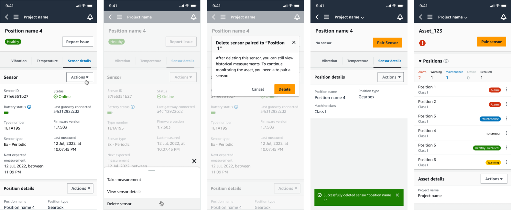
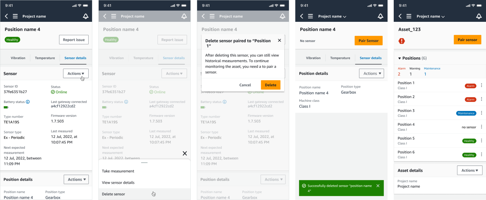
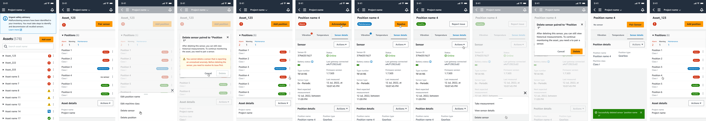
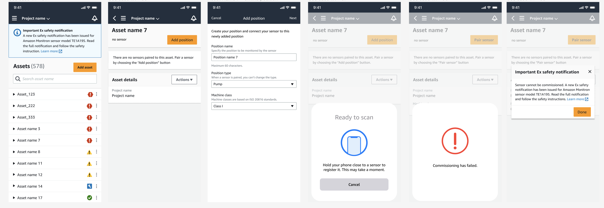

Amazon Monitron is no longer open to new customers. Existing customers can
continue to use the service as normal. For capabilities similar to Amazon
Monitron, see our [blog post](https://aws.amazon.com/blogs/machine-learning/maintain-access-and-consider-alternatives-for-amazon-monitron "https://aws.amazon.com/blogs/machine-learning/maintain-access-and-consider-alternatives-for-amazon-monitron").

# Ex-rated sensors

###### Warning

Before installing and using a sensor, see [Ex Safety and Compliance Guide](https://aws.amazon.com/monitron/terms/safety-and-compliance-information/ "https://aws.amazon.com/monitron/terms/safety-and-compliance-information/") for all warnings and instructions.

Amazon Monitron can notify you about product issues that could affect safety in explosive
and hazardous areas. You’ll receive these notifications in the web app if you’re an
existing customer with sensors installed.

If a sensor has an urgent safety advisory, you’ll receive a notification and
explanation when you log on to the web or mobile app. Before you can proceed, you'll be
required to acknowledge the advisory and perform the recommended actions in the safety
warning. For example, you may need to physically remove a sensor from a hazardous area,
as it could be a potential ignition source.

|                                                                                               |                                                                                    |
| --------------------------------------------------------------------------------------------- | ---------------------------------------------------------------------------------- |
| Project interface showing assets list with safety notification and various status indicators. | Asset management interface showing positions for Asset 123 with status indicators. |

When a sensor has a healthy position status, you can use the sensor to take
measurements, view sensor details, or delete the sensor.

If you need to delete a sensor, make sure it’s in a healthy state first. A sensor’s
position must be in a healthy state before you can delete it. If you do remove a sensor
that is under safety notification or not in a healthy state, you’ll receive a
notification explaining that you must clear the alert first.

###### To clear the alert:

1. In the asset list, select the unhealthy sensor.
2. Review the errors.
3. Select **Acknowledge** to confirm that you understand the
   active alerts related to the sensor.
4. Select **Resolve** to fix the anomaly that the sensor is
   reporting. After resolving the issue, the sensor should return to a healthy
   state.
5. Delete the sensor from either the **Asset list**
   or the **Position details** page.

If you try to commission a sensor under a safety notification, the commissioning
process will fail. You’ll receive a notification describing the reason for the failure.

