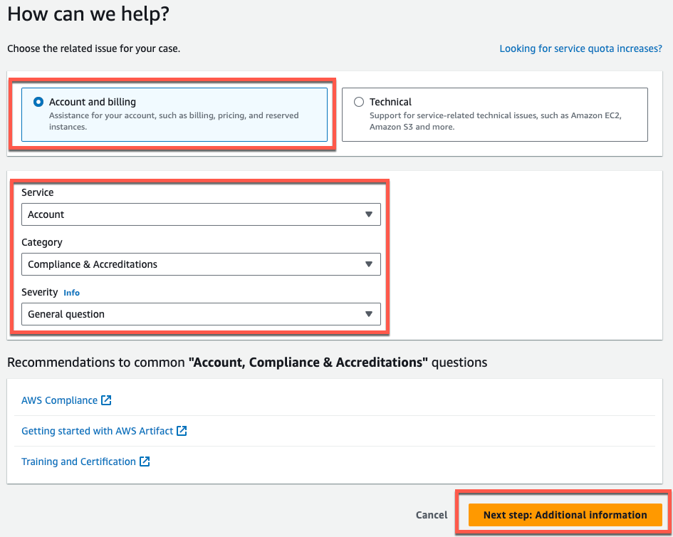

Amazon Monitron is no longer open to new customers. Existing customers can
continue to use the service as normal. For capabilities similar to Amazon
Monitron, see our [blog post](https://aws.amazon.com/blogs/machine-learning/maintain-access-and-consider-alternatives-for-amazon-monitron "https://aws.amazon.com/blogs/machine-learning/maintain-access-and-consider-alternatives-for-amazon-monitron").

# Exporting your data with CloudShell

###### Topics

- [Step 1: Creating an Amazon S3 bucket (with
  AWS CloudShell)](#create-s3-with-shell "#create-s3-with-shell")
- [Step 2: Granting Amazon Monitron access to your
  Amazon S3 bucket (with AWS CloudShell)](#create-policy-with-shell "#create-policy-with-shell")
- [Step 3: Creating your support
  ticket](#create-support-ticket "#create-support-ticket")

## Step 1: Creating an Amazon S3 bucket (with

AWS CloudShell)

1. Log in to the AWS Console.
2. Open AWS CloudShell

[AWS CloudShell](../../../cloudshell/latest/userguide/welcome.md "../../../cloudshell/latest/userguide/welcome.md") is
a command-line environment that operates inside your browser. Inside
AWS CloudShell, you can use the AWS Command Line Interface to launch and configure many AWS
services. 3. In AWS CloudShell, enter the following command, where bucketname is the name
of the bucket you are creating:

```
`$` `aws s3api create-bucket --bucket bucketname --region us-east-1`
```

This command creates an Amazon S3 bucket to store your raw data. You will
be able to easily access your bucket from the console, and download your
data at your convenience. For more information, see [Creating,
configuring, and working with Amazon S3 buckets](../../../AmazonS3/latest/userguide/creating-buckets-s3.md "../../../AmazonS3/latest/userguide/creating-buckets-s3.md").

###### Important

You are responsible for taking the appropriate steps to secure
your data. We strongly recommend using server-side encryption and
blocking public access to your bucket.

In the command above, the bucket is created in the US East (N.
Virginia) Region. You can optionally specify a different Region in the
request body. For more information, see [Regions, Availability Zones, and Local Zones](../../../AmazonRDS/latest/UserGuide/Concepts.md "../../../AmazonRDS/latest/UserGuide/Concepts.md").

You should see output that looks something like this:

```
{ "Location": "/bucketname" }
```

4. Identify the [Amazon
   Resource Name (ARN)](../../../general/latest/gr/aws-arns-and-namespaces.md "../../../general/latest/gr/aws-arns-and-namespaces.md") of the bucket you created, which will
   be:

```
arn:aws:s3:::bucketname
```

## Step 2: Granting Amazon Monitron access to your

Amazon S3 bucket (with AWS CloudShell)

1. Paste the code below into a text editor, and save it as:
   monitron-assumes-role.json. Do not use Microsoft Word, which will add
   extra characters. Use a simple text editor like Notepad or
   TextEdit.

This policy gives Amazon Monitron permission to assume the role that will allow
it to access your S3 bucket. For more information, see [Policies and
permissions in IAM.](../../../IAM/latest/UserGuide/access_policies.md "../../../IAM/latest/UserGuide/access_policies.md")

JSON

```
`{
 "Version":"2012-10-17",
 "Statement": [{
 "Effect": "Allow",
 "Principal": {
 "Service": ["monitron.amazonaws.com"]
 },
 "Action": "sts:AssumeRole"
 }]
}`

```

2. Paste the text below into a text editor, and save it as:
   monitron-role-accesses-s3.json

This policy will allow Amazon Monitron (using the role created above) to access
your Amazon S3 bucket.

JSON

```
`{
 "Version":"2012-10-17",

 "Statement": [
 {
 "Action": [
 "s3:GetBucketAcl",
 "s3:GetBucketLocation",
 "s3:ListBucket"
 ],
 "Effect": "Allow",
 "Resource": [
 "arn:aws:s3:::`bucketname`"
 ]
 },
 {
 "Action": [
 "s3:PutObject",
 "s3:GetBucketAcl"
 ],
 "Effect": "Allow",
 "Resource": [
 "arn:aws:s3:::`bucketname`/*"
 ]
 }
 ]
}`

```

3. In the text file you just created, replace every occurrence of
   `bucketname` with the name of your
   bucket.

For example, if the name of your bucket is relentless, then your file
will look like this:

JSON

```
`{
 "Version":"2012-10-17",

 "Statement": [
 {
 "Action": [
 "s3:GetBucketAcl",
 "s3:GetBucketLocation",
 "s3:ListBucket"
 ],
 "Effect": "Allow",
 "Resource": [
 "arn:aws:s3:::relentless"
 ]
 },
 {
 "Action": [
 "s3:PutObject",
 "s3:GetBucketAcl"
 ],
 "Effect": "Allow",
 "Resource": [
 "arn:aws:s3:::relentless/*"
 ]
 }
 ]
}`

```

4. Upload both of the json files that you just created to CloudShell in
   the home directory.

To upload a file, choose Actions from the upper right hand corner of
the CloudShell console page, then choose Upload file. 5. Enter the following on the command line in CloudShell:

**aws iam create-role --role-name role-for-monitron
--assume-role-policy-document "cat
monitron-assumes-role.json"**

This command creates the role and attaches the monitron-assumes-role
policy.

You should see output that looks something like this:

```
 {
	"Role": {
		"Path": "/",
		"RoleName": "role-for-monitron",
		"RoleId": "AROAT7PQQWN6BMTMASVPP",
		"Arn": "arn:aws:iam::273771705212:role/role-for-monitron",
		"CreateDate": "2021-07-14T02:48:15+00:00",
		"AssumeRolePolicyDocument": {
			"Version": "2012-10-17",
			"Statement": [{
				"Sid": "",
				"Effect": "Allow",
				"Principal": {
					"Service": [
						"monitron.amazonaws.com"
					]
				},
				"Action": "sts:AssumeRole"
			}]
		}
	}
}
```

Take note of the ARN value for the role you just created. You will
need it later.

In our example, the ARN value is:
`arn:aws:iam::273771705212:role/role-for-monitron` 6. Enter the following on the command line in CloudShell:

**aws iam create-policy --policy-name role-uses-bucket
--policy-document "cat role-uses-bucket.json"**

This command creates the monitron-role-accesses-s3 policy.

You should see output that looks something like this:

```
 {
	"Policy": {
		"PolicyName": "role-uses-bucket",
		"PolicyId": "ANPAT7PQQWN6I5KLORSDQ",
		"Arn": "arn:aws:iam::273771705212:policy/role-uses-bucket",
		"Path": "/",
		"DefaultVersionId": "v1",
		"AttachmentCount": 0,
		"PermissionsBoundaryUsageCount": 0,
		"IsAttachable": true,
		"CreateDate": "2021-07-14T02:19:23+00:00",
		"UpdateDate": "2021-07-14T02:19:23+00:00"
	}
}
```

Take note of the ARN value for the policy that you just created. You
will need it for the next step.

In our example, the ARN value is:

```
arn:aws:iam::273771705212:policy/role-uses-bucket
```

7. Enter the following on the command line in CloudShell, replacing
   the ARN with the ARN for your role-uses-bucket policy:

```
 `aws iam attach-role-policy --role-name role-for-monitron --policy-arn
 arn:aws:iam::273771705212:policy/role-uses-bucket`
```

This command attaches the monitron-role-accesses-s3 policy to the role
you just created.

Now you have created and provisioned an Amazon S3 bucket, a role that
Amazon Monitron can assume, a policy that will allow Amazon Monitron to assume that role,
and another policy that will allow the service using that role to use
your Amazon S3 bucket.

You are responsible for taking the appropriate steps to secure your
data. We strongly recommend using server-side encryption and blocking
public access to your bucket. For more information, see [Blocking public access](../../../AmazonS3/latest/userguide/access-control-block-public-access.md "../../../AmazonS3/latest/userguide/access-control-block-public-access.md").

## Step 3: Creating your support

ticket

1. From your AWS console, choose the question mark icon near the upper
   right corner of any page, then choose **Support
   Center**.

 2. On the next page, choose **Create case**.

 3. On the **How can we help?** page, do the
following:

    1. Choose **Account and billing support**.
    2. Under **Service**, choose
     **Account**.
    3. Under **Category**, choose
     **Compliance & Accreditations**.
    4. Choose **Severity**, if that option is
     available to you based on your support subscription.
    5. Choose **Next step: Additional information**.


    

4. In **Additional information** do the
   following:
   1. Under **Subject**, enter **Amazon Monitron data
      export request**.
   2. In the **Description** field, enter:
      1. your account ID
      2. the region of the bucket you created
      3. the ARN of the bucket you created (for example:
         "arn:aws:s3:::bucketname")
      4. the ARN of the role you created (for example:
         "arn:aws:iam::273771705212:role/role-for-monitron")

    3. Choose **Next step: Solve now or contact
   us**.

5. In **Solve now or contact us** do the
   following:
   1. In **Solve now**, select
      **Next**.

    2. In **Contact us**, choose your
   **Preferred contact language** and
   preferred method of contact. 3. Choose **Submit**. A confirmation screen with
   your case ID and details will be displayed.

   

An AWS customer support specialist will get back to you as soon as
possible. If there are any issues with the steps listed, the specialist may ask
you for more information. If all the necessary information has been provided,
the specialist will let you know as soon as your data has been copied to the
Amazon S3 bucket that you created above.
