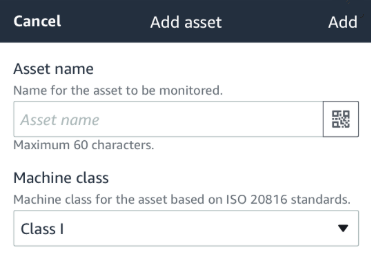

Amazon Monitron is no longer open to new customers. Existing customers can
continue to use the service as normal. For capabilities similar to Amazon
Monitron, see our [blog post](https://aws.amazon.com/blogs/machine-learning/maintain-access-and-consider-alternatives-for-amazon-monitron "https://aws.amazon.com/blogs/machine-learning/maintain-access-and-consider-alternatives-for-amazon-monitron").

# Step 4: Pairing Sensors to an Asset

Each sensor that you pair to an asset has a designated position and is set to
monitor a specific part of the asset. For example, a sensor set up to monitor
bearings on a conveyor belt might have the position of Left bearing 1 with a
position type of Bearing.

Amazon Monitron uses Near Field Communications (NFC), a short-range (4 cm or less) wireless
technology for communication between two electronic devices. To use Amazon Monitron, you need
an iOS or Android 8.0+ smartphone with NFC installed natively.

###### Important

The equipment that you want to monitor must be in a healthy state before you
pair it to a sensor. Amazon Monitron must establish a baseline for the equipment based on
its normal state so that it can later determine abnormalities.

###### To pair a sensor with an asset

1. Attach your sensor in the correct position, as described in [Step 3: Attach Sensors](gsg-sensors.md "gsg-sensors.md") . You can also attach
   the sensor after pairing it to the asset in this step 4.
2. Make sure that the NFC feature on your smartphone is on and
   functioning.
3. Open your Amazon Monitron mobile app, and select the **Project**
   you want to add the sensors to.
4. From the navigation menu, make sure you're in the correct
   **Site**, and then choose
   **Assets**.
5. From the **Assets** list, choose the asset that you just
   created.
6. On your **Asset** page, choose **Add
   position**.
7. On the **Add position** page, do the following:
   1. For **Name**, add a name for your
      position.
   2. For **Type**, choose the **Type of
      position** that best fits the location that you're
      going to monitor:
      - Bearing
      - Compressor
      - Fan
      - Gearbox
      - Motor
      - Pump
      - Other

   ###### Note

   After you pair the sensor, you can't change the position type. 3. For **Class**, choose the machine class of the
   asset from the four available.

   ###### Note

   Asset machine class is based on ISO 20816 Standards. Amazon Monitron
   administrators can also create custom machine asset classes for
   all positions within a project. For more information about
   machine classes and customizing them, see [Assets](assets-chapter.md "assets-chapter.md").

   

8. Choose **Next**. You'll be prompted to add sensors. For
   information on how to add sensors, see [Sensors](as-sensor-positions1.md "as-sensor-positions1.md").
9. Choose **Pair sensor**.
10. Hold your phone close to the sensor to register it. A progress bar shows
    when registration is complete.

It can take a few moments for the sensor to be commissioned. If you have
trouble pairing the sensor, see [Pairing Your Sensor](as-sensor-positions1.md#as-add-sensors "as-sensor-positions1.md#as-add-sensors") for more information.

###### Tip

If your smartphone fails to detect the sensor, try holding it so that
the NFC antenna is close to the sensor. For iPhone models, the antenna
is located at the top edge of the device. For Android models, the
antenna location varies. The following resources might help you locate
the NFC antenna on an Android device:

    * [NFC detection area (Samsung)](https://www.samsung.com/hk_en/nfc-support/#devicelist "https://www.samsung.com/hk_en/nfc-support/#devicelist")
    * [Pixel phone hardware diagram](https://support.google.com/pixelphone/answer/7157629 "https://support.google.com/pixelphone/answer/7157629")

On the **Assets** page, the sensor is now paired to the asset and
is identified by its position.
