Amazon Monitron is no longer open to new customers. Existing customers can
continue to use the service as normal. For capabilities similar to Amazon
Monitron, see our [blog post](https://aws.amazon.com/blogs/machine-learning/maintain-access-and-consider-alternatives-for-amazon-monitron "https://aws.amazon.com/blogs/machine-learning/maintain-access-and-consider-alternatives-for-amazon-monitron").

# Step 5: Muting and unmuting alerts

You can choose to mute and unmute alerts (alarms and warnings) for a
position.

###### Topics

- [Muting alerts](#muting-alerts "#muting-alerts")
- [Unmuting alerts](#unmuting-alerts "#unmuting-alerts")

## Muting alerts

ISO thresholds apply broadly to large classes of equipment. Therefore, when
detecting the potential failure of a specific asset, you may consider other
factors as well. For example, you can mute a notification generated by ISO
vibration thresholds if you assess that your equipment is still healthy when the
alert is raised.

You also can mute alerts (alarms and warnings) by providing the ‘No failure
detected’ feedback for the ‘Failure mode’ while closing the alert. Note that
Amazon Monitron will continue to notify users of potential failures detected based on
machine learning, even when notifications based on ISO thresholds are
muted.

The following images show you how to mute alerts on the Amazon Monitron mobile
app.

|                                                                                                              |                                                                                                         |                                                                                                   |
| ------------------------------------------------------------------------------------------------------------ | ------------------------------------------------------------------------------------------------------- | ------------------------------------------------------------------------------------------------- | ---------------------------------------------------------------------------------------------------------------------------------------------------------------------------------------------------------------------------------------------------------------------------------------------------------------------------------------------------------------------------------------------------------------------------------------------------------------------------------------------------------------------------------------------------------------------------------------------------------------------------------------------------------------------------------------------------------------------------------------------------------------------------------------------------------------------------------------------------------------------------------------------------------------------------------------------------------------------------------------------------------------------------------------------------------------------------------------------------------------------------------------- |
| Mobile app interface showing alarm details with "Acknowledge" button highlighted.                            | Project interface showing alarm details, vibration data, and a "Resolve" button.                        | Resolution feedback interface with failure mode, failure cause, and action taken fields.          | The following images show you how to mute alerts on the Amazon Monitron web app. 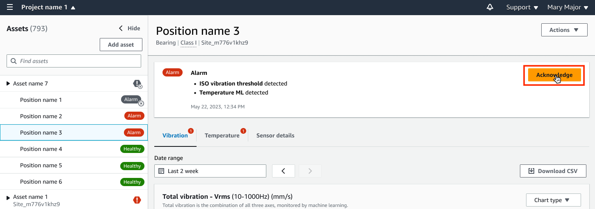 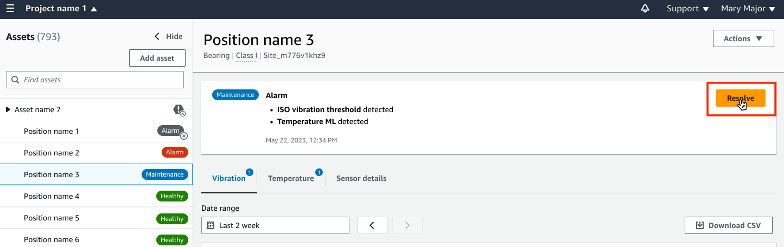 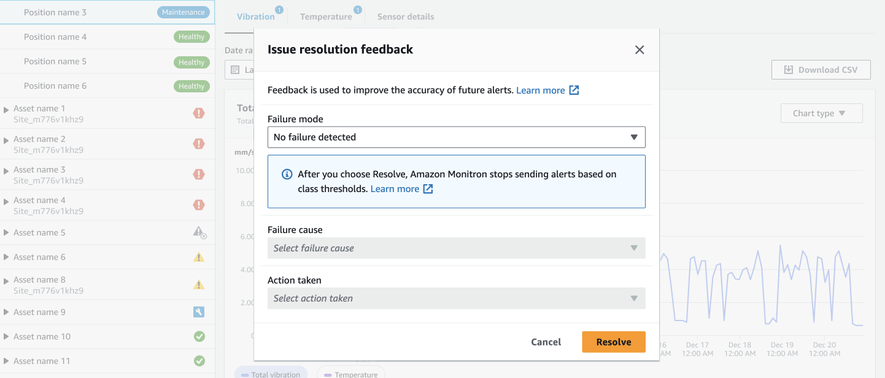 ## Unmuting alerts You can choose to unmute alerts (alarms and warnings) at any time. When unmuting alerts, you can choose from the following options. ###### Available options  • [Resume all alerts (alarms and warnings)](#unmuting-alerts "#unmuting-alerts")  • [Resume alarms but keep warnings muted](#unmuting-alarms-muting-warnings "#unmuting-alarms-muting-warnings")  • [Resume only alarms](#resume-alarms "#resume-alarms")  • [Resume only warnings](#resume-warnings "#resume-warnings") ### Resume all alerts (alarms and warnings) If you've muted both alarms and warnings, you can unmute them. |
|                                                                                                              |                                                                                                         |                                                                                                   |
| ---                                                                                                          | ---                                                                                                     | ---                                                                                               |
| Graph showing single axis vibration with maximum value of 4.63 mm/s and alarm thresholds.                    | Dialog box prompting to resume alarms and warnings for a position, with options to select.              | Graph showing single axis vibration with maximum value of 4.63 mm/s and alarm threshold exceeded. | 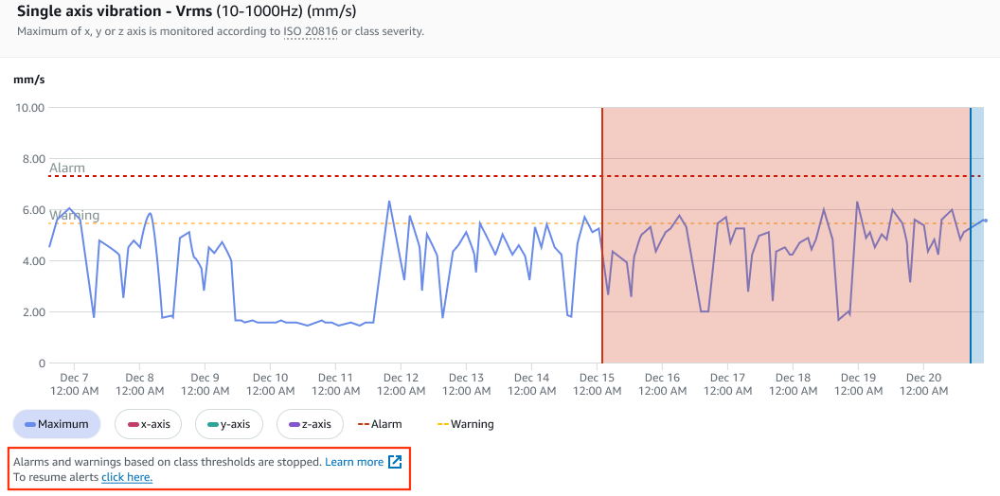 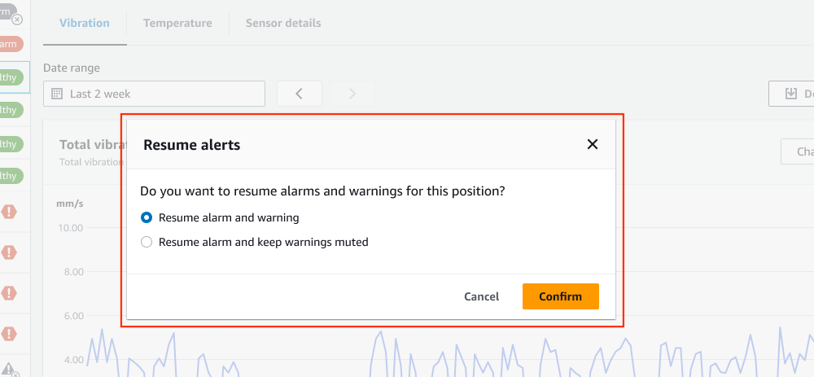 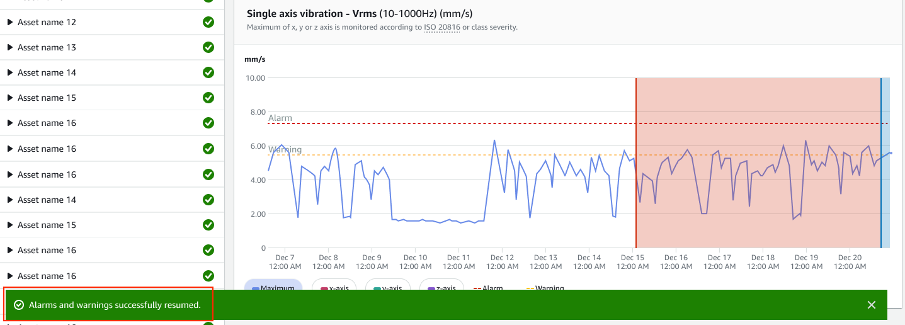 ### Resume alarms but keep warnings muted If you've muted both alarms and warnings, you can unmute alarms and keep warnings muted.                                                                                                                                                                                                                                                                                                                                                                                                                                                                                                                                                                                        |
|                                                                                                              |                                                                                                         |                                                                                                   |
| ---                                                                                                          | ---                                                                                                     | ---                                                                                               |
| Graph showing single axis vibration with maximum value of 4.63 mm/s, alarm and warning thresholds indicated. | Graph showing single axis vibration measurements over time with alarm and warning thresholds indicated. | Dialog box prompting to resume alarms with options to resume or keep warnings muted.              | 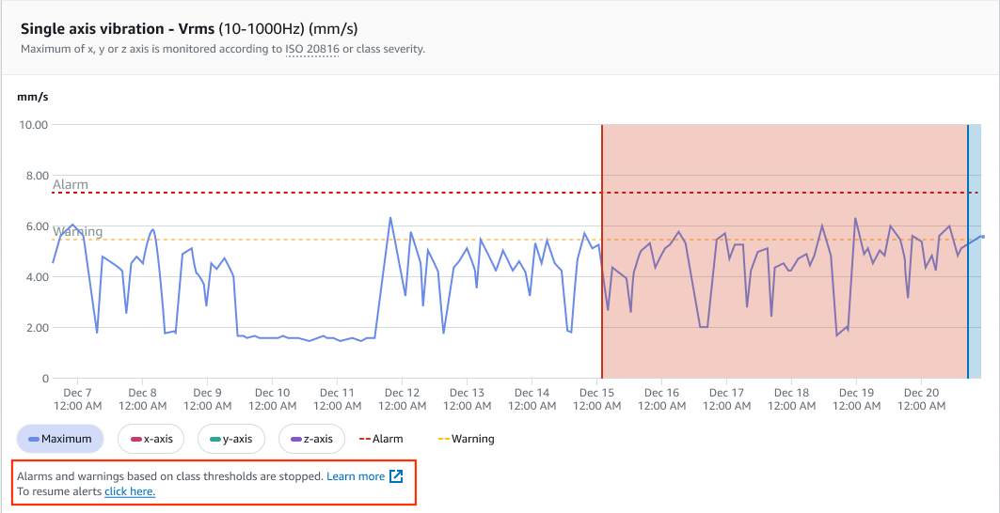 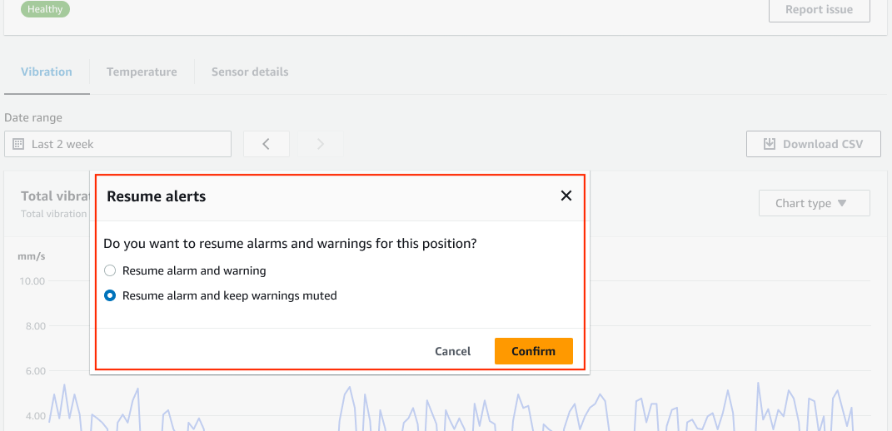 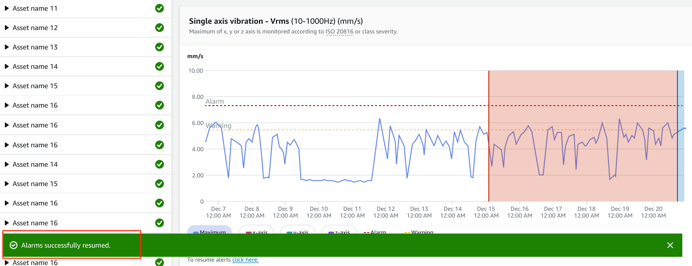 ### Resume only alarms If you've muted alarms, you can unmute them.                                                                                                                                                                                                                                                                                                                                                                                                                                                                                                                                                                                                                                                              |
|                                                                                                              |                                                                                                         |                                                                                                   |
| ---                                                                                                          | ---                                                                                                     | ---                                                                                               |
| Graph showing single axis vibration with maximum value of 4.63 mm/s, including alarm and warning thresholds. | Dialog box asking to resume threshold alarms for a position, with Cancel and Confirm options.           | Graph showing single axis vibration with a maximum of 4.63 mm/s and an alarm threshold exceeded.  | 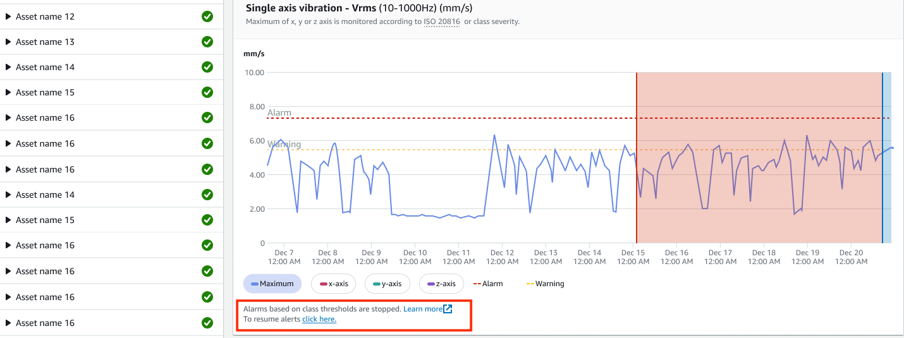 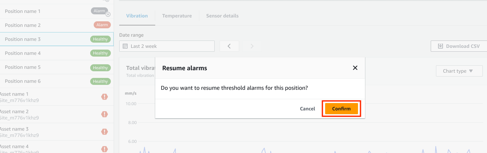 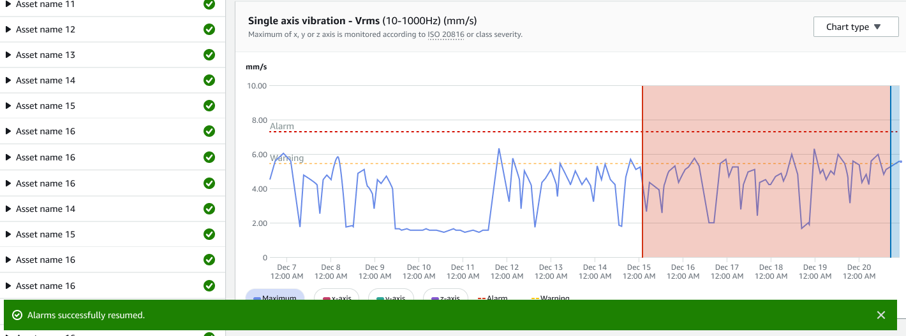 ### Resume only warnings If you've muted warnings, you can choose to resume them.                                                                                                                                                                                                                                                                                                                                                                                                                                                                                                                                                                                                                                            |
|                                                                                                              |                                                                                                         |                                                                                                   |
| ---                                                                                                          | ---                                                                                                     | ---                                                                                               |
| Graph showing single axis vibration with maximum value of 4.63 mm/s and alarm thresholds.                    | Dialog box asking to resume threshold warnings for a position, with Cancel and Confirm options.         | Graph showing single axis vibration measurements with spikes exceeding alarm threshold.           | 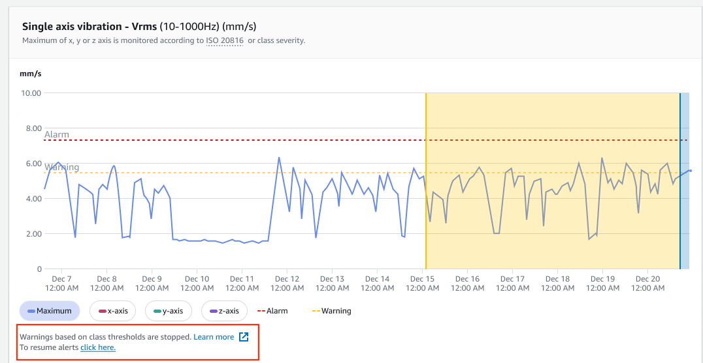 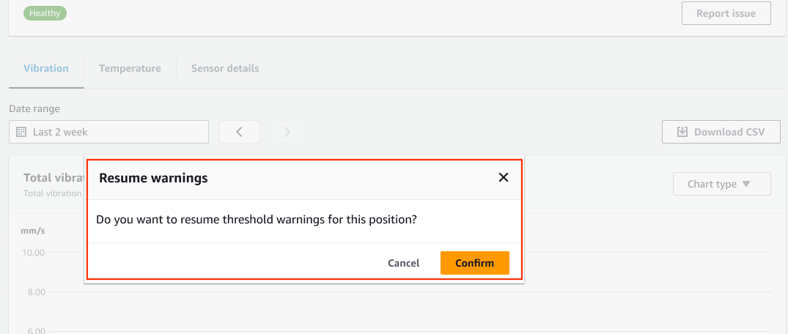 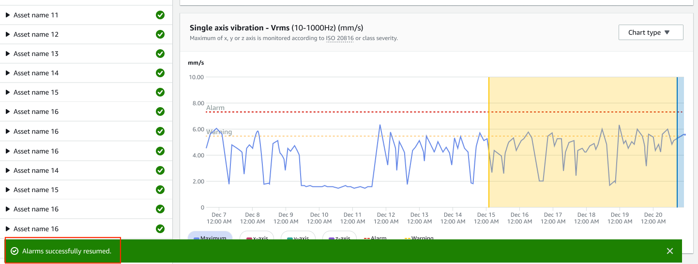                                                                                                                                                                                                                                                                                                                                                                                                                                                                                                                                                                                                                                                                                                                                |
