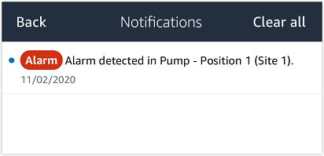

Amazon Monitron is no longer open to new customers. Existing customers can
continue to use the service as normal. For capabilities similar to Amazon
Monitron, see our [blog post](https://aws.amazon.com/blogs/machine-learning/maintain-access-and-consider-alternatives-for-amazon-monitron "https://aws.amazon.com/blogs/machine-learning/maintain-access-and-consider-alternatives-for-amazon-monitron").

# Step 3: Viewing and acknowledging a machine

abnormality

The longer Amazon Monitron monitors a position, the more it fine-tunes its baseline and
increases its accuracy.

When an **Alarm** or a **Warning** is triggered,
Amazon Monitron sends a notification to the mobile app that is displayed as an icon in the
upper right of your screen (

).

Choosing the notification icon opens the **Notifications** page,
which lists all pending notifications.

When you receive a notification, you must view and acknowledge it. This doesn't
fix the issue with the asset, it just lets Amazon Monitron know that you are aware of it.

###### To view and acknowledge an abnormality

1. On the **Assets** list, choose the asset with the alarm.

 2. Choose the position with the alarm to view the issue.

|                                                                                   |                                                                                 |
| --------------------------------------------------------------------------------- | ------------------------------------------------------------------------------- |
| Sorter 2 interface showing positions, warnings, and asset details for AnyCompany. | Sorter 1 interface showing positions with alarm, warning, and healthy statuses. |

3. To confirm that you are aware of the issue, choose
   **Acknowledge**.

Note that the text on the following screens also indicates whether the
alert notification was triggered based on the equipment's vibration or
temperature, or by the vibration ISO thresholds or machine learning models.
This information can be used by technicians to investigate and fix the
issue. After an abnormality has been acknowledged and repaired, resolve the
issue in the mobile app.

The status of the asset changes to:

After the alarm has been acknowledged, the abnormality can be examined and fixed
as appropriate.
