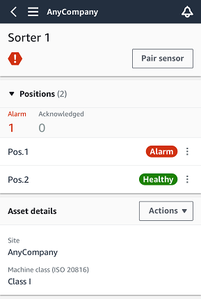

Amazon Monitron is no longer open to new customers. Existing customers can
continue to use the service as normal. For capabilities similar to Amazon
Monitron, see our [blog post](https://aws.amazon.com/blogs/machine-learning/maintain-access-and-consider-alternatives-for-amazon-monitron "https://aws.amazon.com/blogs/machine-learning/maintain-access-and-consider-alternatives-for-amazon-monitron").

# Step 1: Understanding asset health

To monitor assets using the Amazon Monitron mobile app, start with the
**Assets** list. This list is displayed when you open the
mobile app.

Each asset in your project or site is listed in the **Assets**
list.

On the **Assets** list page, each asset shows an icon indicating
its health. The following table describes these icons.

| Icon                                                                                      | Health state                                                                                                                                                                                                                                                                                                                                                                                                                                                                                                                                               |
| ----------------------------------------------------------------------------------------- | ---------------------------------------------------------------------------------------------------------------------------------------------------------------------------------------------------------------------------------------------------------------------------------------------------------------------------------------------------------------------------------------------------------------------------------------------------------------------------------------------------------------------------------------------------------- | -------------------------------------------------------------------------------------------------------------------------------------------------------------------------------------------------------------------------------------------------------------------------------------------- |
| Green circular icon with a white checkmark symbol inside.                                 | **Healthy state**: The status of all sensor positions on the asset is healthy.                                                                                                                                                                                                                                                                                                                                                                                                                                                                             |
| Yellow warning triangle with exclamation mark, indicating caution or alert.               | **Warning state**: A warning has been triggered for one of the positions of this asset, indicating that Amazon Amazon Monitron has detected early signs of potential failure. Amazon Amazon Monitron identifies warning conditions by analyzing equipment vibration and temperature, using a combination of machine learning and ISO vibration standards.                                                                                                                                                                                                  |
| Red hexagonal warning sign with exclamation mark indicating caution or alert.             | **Alarm state**: Once an asset has been placed in a warning state, Amazon Monitron will continue to monitor it. Again, Amazon Monitron is using a combination of machine learning and vibration ISO standards. If the condition of the asset gets significantly worse, Amazon Amazon Monitron will escalate by sending an **Alarm** notification when it detects that the equipment condition has significantly worsened. We recommend investigating the issue at the earliest opportunity. An equipment failure might occur if the issue isn't addressed. |
| Wrench icon on a blue square background, representing a tool or settings symbol.          | **Maintenance state**: One of the asset's sensors is in the maintenance state. The alarm state of the asset has been acknowledged by a technician, but not yet addressed.                                                                                                                                                                                                                                                                                                                                                                                  |
| No sensor                                                                                 | **No sensor**: At least one position on the asset doesn't have a sensor paired to it.                                                                                                                                                                                                                                                                                                                                                                                                                                                                      | When you choose an asset, the app displays the health status of each underlying sensor position.  The following table describes the position status indicators. |
| Status                                                                                    | State                                                                                                                                                                                                                                                                                                                                                                                                                                                                                                                                                      |
| ---                                                                                       | ---                                                                                                                                                                                                                                                                                                                                                                                                                                                                                                                                                        |
| Green oval button with the text "Healthy" indicating a positive status.                   | The position is healthy: All measured values are within their normal range.                                                                                                                                                                                                                                                                                                                                                                                                                                                                                |
| Yellow warning label with black text saying "Warning".                                    | A warning has been triggered for this position indicating early signs of a potential failure condition. We recommend that you monitor the equipment closely and initiate an investigation during an upcoming planned maintenance.                                                                                                                                                                                                                                                                                                                          |
| Red oval button labeled "Alarm" indicating an alert or warning notification.              | An alarm has been triggered for this position, indicating that the machine vibration or temperature is out of the normal range at this position. We recommend investigating the issue at the earliest opportunity. An equipment failure might occur if the issue isn't addressed.                                                                                                                                                                                                                                                                          |
| Blue rectangular button with white text "Maintenance" indicating a system status or mode. | The alarm state of the position has been acknowledged by a technician, but not yet addressed.                                                                                                                                                                                                                                                                                                                                                                                                                                                              |
| No sensor                                                                                 | The position doesn't have a sensor paired to it.                                                                                                                                                                                                                                                                                                                                                                                                                                                                                                           | When an issue is raised for an individual position, the status changes for that position and for the asset as a whole.                                                                                                                                                                       |
