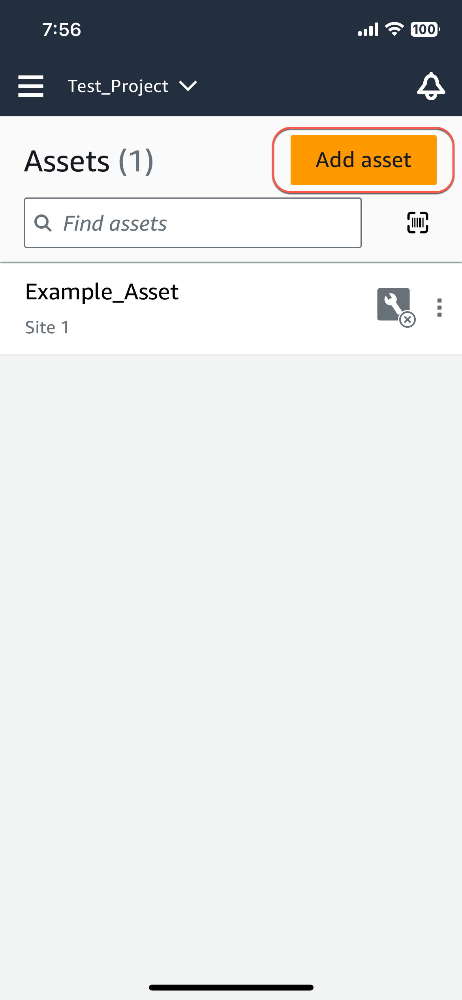
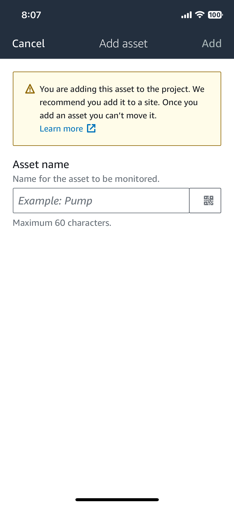
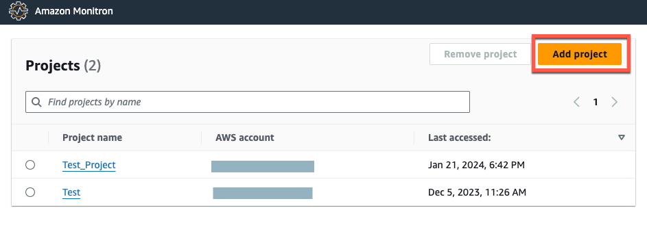
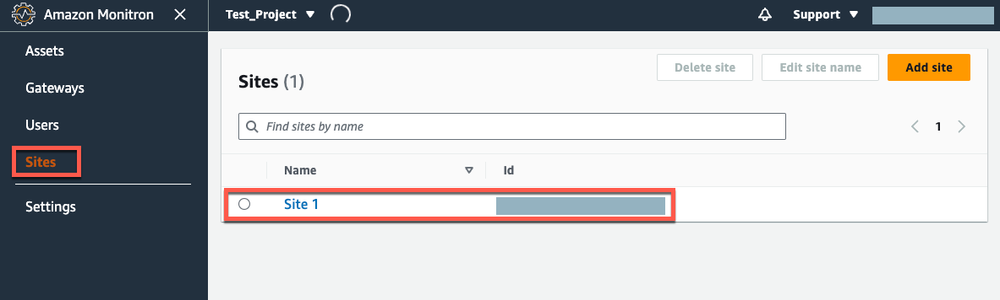
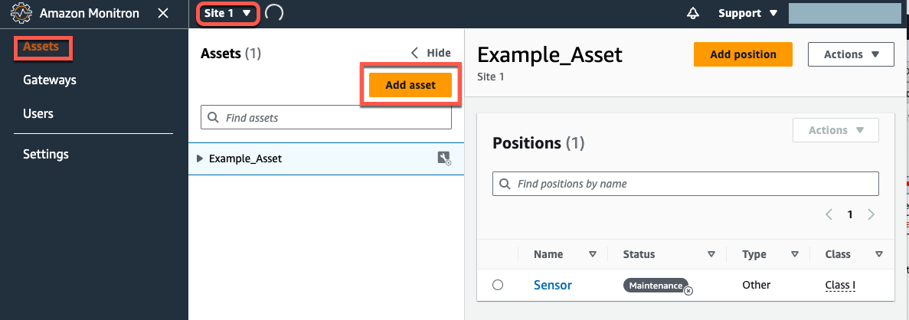
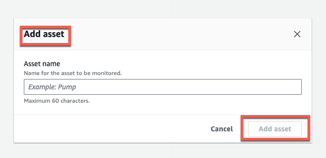

Amazon Monitron is no longer open to new customers. Existing customers can
continue to use the service as normal. For capabilities similar to Amazon
Monitron, see our [blog post](https://aws.amazon.com/blogs/machine-learning/maintain-access-and-consider-alternatives-for-amazon-monitron "https://aws.amazon.com/blogs/machine-learning/maintain-access-and-consider-alternatives-for-amazon-monitron").

# Step 2: Adding Assets

In Amazon Monitron, the machines you monitor are known as _assets_.
Assets are usually individual machines, but they can also be specific sections of
equipment. Assets are paired to sensors, which directly monitor temperature and
vibration to check for potential failures. You can add assets using both the Amazon Monitron
web app and the Amazon Monitron mobile app.

###### Topics

- [Adding assets using the mobile app](#assets-mobile "#assets-mobile")
- [Adding assets using the web app](#assets-web "#assets-web")

## Adding assets using the mobile app

###### To add an asset using the mobile app

1. Sign in to your mobile app and select the project you want to add an
   asset to.

 2. Make sure you're on the correct site your project that you want to add
the asset to. The project or site name indicates that you are at that
level in the app.

For more information about changing from site level to project level
and vice versa, see [Navigating between projects and sites in
the mobile app](SM-working-project-and-site.md "SM-working-project-and-site.md"). 3. From the **Assets** page, choose **Add
asset**. 4. On the **Add asset** page, for **Asset
name**, add a name for the asset you want to create and
then select **Add**.

###### Note

If you have a QR code identifying the asset name, you can scan it
by selecting the QR code.

When you've added your first asset, it's displayed on the **Assets
list** page.

## Adding assets using the web app

###### To add an asset using the web app

1. Sign in to your web app and select the project you want to add an
   asset to.

 2. From the left navigation menu, choose **Sites**, and
then select the site you want to the asset to.

###### Note

You can also add the asset directly to a project. 3. From the **Assets** page, choose **Add
asset**.

 4. On the **Add asset** page, for **Asset
name**, add a name for the asset you want to create and
then select **Add asset**.

When you've added your first asset, it's displayed on the **Assets
list** page.
