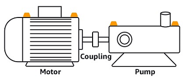

Amazon Monitron is no longer open to new customers. Existing customers can
continue to use the service as normal. For capabilities similar to Amazon
Monitron, see our [blog post](https://aws.amazon.com/blogs/machine-learning/maintain-access-and-consider-alternatives-for-amazon-monitron "https://aws.amazon.com/blogs/machine-learning/maintain-access-and-consider-alternatives-for-amazon-monitron").

# Step 3: Attach Sensors

Assets are paired to sensors, which directly monitor an asset's health. You place
each sensor on the asset in a position that you want to monitor. You can place one
or more sensors on each asset. Each sensor takes vibration and temperature
measurements at the position to which it is paired and sends it to the AWS Cloud for
analysis of machine health using the gateway.

## Where to Place Sensors

When placing a sensor, choose a location where it can accurately detect the
machine's temperature or vibration.

To achieve the greatest accuracy:

- Mount the sensor directly onto the housing of the target component.
- Minimize the length of the vibration transmission path, the distance
  between the source of vibration and sensor.
- Avoid mounting the sensor in a location that can oscillate due to
  natural frequencies, such as sheet metal covers.

Vibration will attenuate up to 30-36"/75-90 cm) from the source. Attributes of
the vibration transmission path length that can reduce the transmission path
length include:

- The number of mounting surfaces, causing signal reflection
- Materials such as rubber and plastic that can absorb vibration

The following examples show where to place sensors. For more information and
examples, see [Where to Place Your Sensors](as-sensor-positions.md#as-where-sensors "as-sensor-positions.md#as-where-sensors") in the _Amazon Monitron User
Guide_.

## How to Place Sensors

When you've decided where to place a sensor on an asset, make sure that a
minimum of one-third of the sensor base is fixed to the asset. The sensors can
pick up vibration and temperature measurements across the entire base of the
sensor, but it's important to have the asset target area centered as much as
possible on the sensor as shown in the following image.

Attach the sensor with an industrial adhesive. We recommend a
cyanoacrylate-type epoxy. For additional information about attaching the sensor
to your asset, see [How to Place the Sensors](as-sensor-positions1.md#as-how-sensors "as-sensor-positions1.md#as-how-sensors") in the _Amazon Monitron User's
Guide_.

###### Warning

Amazon Monitron sensors can be attached to the equipment using industrial adhesive.
We suggest you check the surface before selecting the adhesive. For surfaces
up to 5 mm roughness/gaps, you can select an adhesive that fills the gap,
such as LOCTITE® 3090 or LOCTITE® 4070. For flat surfaces (<0.1mm
roughness), you can select a more generic adhesive, such as LOCTITE® 454.
Always check and follow the processing guidelines outlined by the adhesive
vendor.

For more information about safely using the adhesive, see [Loctite 454 Technical Information](https://www.henkel-adhesives.com/us/en/product/instant-adhesives/loctite_454.html "https://www.henkel-adhesives.com/us/en/product/instant-adhesives/loctite_454.html"), [Loctite 3090 Technical Information](https://www.henkel-adhesives.com/us/en/product/instant-adhesives/loctite_3090.html "https://www.henkel-adhesives.com/us/en/product/instant-adhesives/loctite_3090.html"), or [Loctite 4070 Technical Information](https://next.henkel-adhesives.com/us/en/products/industrial-adhesives/central-pdp.html/loctite-hy-4070/201200004WPN.html "https://next.henkel-adhesives.com/us/en/products/industrial-adhesives/central-pdp.html/loctite-hy-4070/201200004WPN.html"), as appropriate.

###### To attach the Amazon Monitron sensor

1. Apply a thin layer of the adhesive on the bottom of the sensor,
   maximizing the contact area.
2. Hold the sensor to the mounting location on the machine part, pressing
   firmly for the length of time specified by the adhesive instructions.
