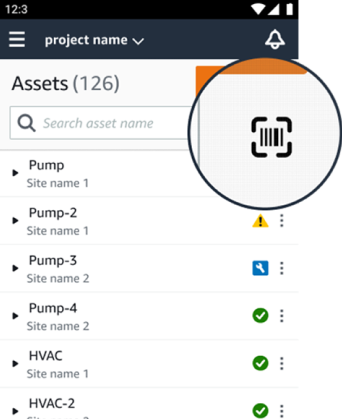
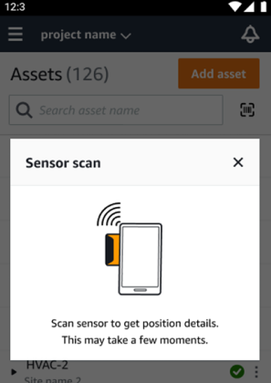
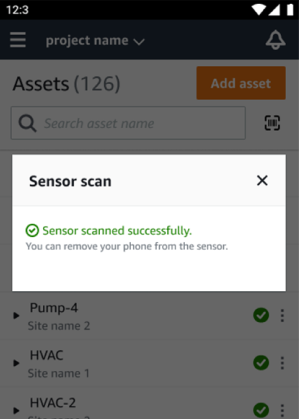
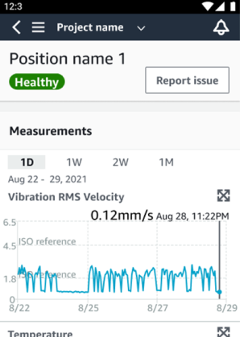
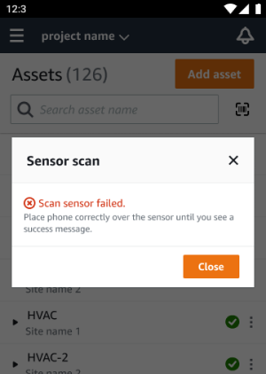
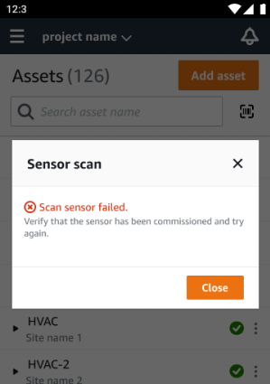
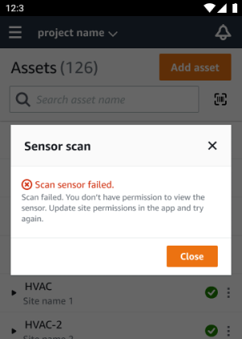
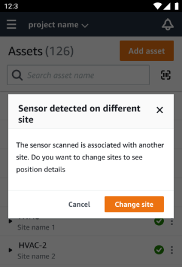

Amazon Monitron is no longer open to new customers. Existing customers can
continue to use the service as normal. For capabilities similar to Amazon
Monitron, see our [blog post](https://aws.amazon.com/blogs/machine-learning/maintain-access-and-consider-alternatives-for-amazon-monitron "https://aws.amazon.com/blogs/machine-learning/maintain-access-and-consider-alternatives-for-amazon-monitron").

# Identifying sensor position

Use the mobile app to find sensors in the factory or shop floor without searching
through your asset list.

###### Topics

- [Identifying paired sensor](#finding-paired-sensor "#finding-paired-sensor")
- [Missing or unread sensor](#missing-or-unread-sensor "#missing-or-unread-sensor")
- [Permissions and site commissioning
  issues](#sensor-permissions-issues "#sensor-permissions-issues")
- [Scanning sensor from another
  site](#scanning-sensor-from-another-site "#scanning-sensor-from-another-site")

## Identifying paired sensor

1. If the sensor has been [paired](as-add-sensors.md "as-add-sensors.md"),
   select the **scan sensor** icon from your asset page to
   scan any sensor affiliated with your project.

 2. Select a desired asset to scan. 3. Hold your phone near the sensor and scan it to read its position details.
It may take a few moments for the mobile app to generate results.

 4. After you've scanned your sensor successfully, your mobile app will show
the sensor's position and details.

## Missing or unread sensor

If the sensor is not read during the scan, place your phone correctly over the
sensor until you see a success message.

If no sensor was added, add an asset and try again.

## Permissions and site commissioning

issues

If the sensor hasn’t been commissioned for a site, commission the sensor and try
again.

If the sensor was commissioned for a site that you can't access, update site
permissions in the app and try again to read the sensor’s position details.

## Scanning sensor from another

site

If you scan a sensor that is commissioned for another site, and you're redirected
to that site, scan the sensor on that site.

